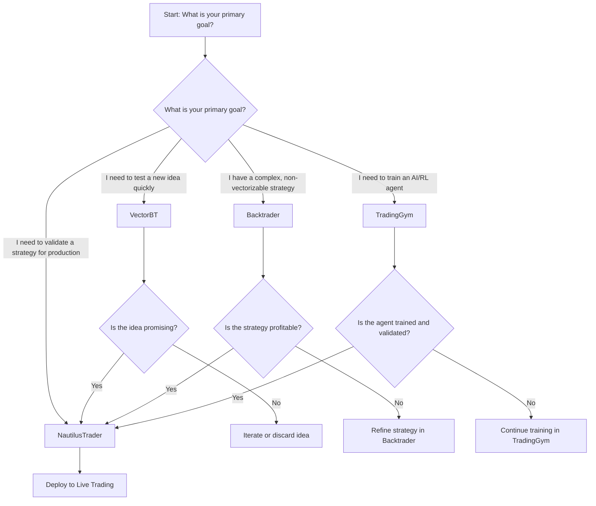

# Backtesting Tools Guide

## 1. Executive Summary: The "Best-of-Breed" Backtesting Strategy

This document outlines the four distinct backtesting tools integrated into the Nautilus Trader Engine, each chosen for its specific strengths to create a comprehensive and powerful strategy development ecosystem. This "best-of-breed" approach provides a complete workflow for quantitative researchers, AI developers, and strategy developers, from initial prototyping to production-level validation.

The four backtesting engines are:

*   **NautilusTrader**: The core, high-fidelity backtesting engine for production-level validation and the ultimate source of truth.
*   **VectorBT**: A high-performance, vectorized backtesting engine for rapid prototyping, large-scale research, and parameter optimization.
*   **TradingGym**: A specialized environment for training and validating Reinforcement Learning (RL) agents.
*   **Backtrader**: A flexible, event-driven backtesting engine for prototyping complex or custom strategies.

This guide details the roles, usage patterns, and integration points of each tool, enabling developers to select the right tool for their specific needs and understand how they complement each other in the strategy development lifecycle.

---

## 2. Detailed Tool Guides

### 2.1. NautilusTrader: The Core Engine & Source of Truth

**Role and Purpose:**
NautilusTrader is the primary, high-fidelity backtesting engine in the system. It is designed to be the ultimate source of truth for strategy validation before deployment to live trading. Its primary advantage is providing a reliable and consistent path from backtesting to live execution, minimizing discrepancies and ensuring that backtested performance is a realistic representation of potential live performance.

**When to Use:**
*   **Final Validation**: Before deploying a strategy to production.
*   **High-Fidelity Simulation**: When you need a precise, event-driven simulation that closely mimics live trading conditions.
*   **Production Candidates**: For strategies that have shown promise in VectorBT or Backtrader and are being considered for live trading.

**Performance Characteristics:**
*   **Accuracy**: High, with a focus on realistic simulation over speed.
*   **Speed**: Slower than vectorized engines like VectorBT, but more detailed and accurate.
*   **Fidelity**: High, with support for complex order types, realistic fills, and a detailed event-driven architecture.

**Integration Points:**
*   **Data Feeds**: Utilizes the same data feeds as the live trading engine to ensure consistency.
*   **Strategy Implementation**: Strategies are implemented using a consistent API that is shared with the live trading engine.
*   **API Endpoints**: Backtest results are exposed via the API for analysis and comparison.

---

### 2.2. VectorBT: The Research & Prototyping Powerhouse

**Role and Purpose:**
VectorBT is a high-performance, vectorized backtesting engine designed for rapid prototyping, large-scale research, and parameter optimization. Its GPU-accelerated capabilities make it the ideal tool for quantitative researchers and analysts who need to test thousands of parameter combinations or new signals across a large universe of assets.

**When to Use:**
*   **Rapid Prototyping**: For quickly testing new ideas and signals.
*   **Parameter Optimization**: When you need to find the optimal parameters for a strategy across a wide range of values.
*   **Large-Scale Research**: For testing a strategy across hundreds or thousands of assets simultaneously.

**Performance Characteristics:**
*   **Speed**: Extremely fast, especially with GPU acceleration.
*   **Scalability**: Excellent for large-scale analysis and research.
*   **Flexibility**: Highly flexible for vectorized operations, but may not be suitable for all types of path-dependent or complex strategies.

**Integration Points:**
*   **Data Feeds**: Can consume data from the system's data feeds for analysis.
*   **Workflow**: Used for initial research and prototyping before promising strategies are re-implemented and validated in NautilusTrader.

---

### 2.3. TradingGym: The AI Training Ground

**Role and Purpose:**
TradingGym is a specialized environment for training and validating Reinforcement Learning (RL) agents. It provides a standardized interface for RL algorithms to interact with the market, making it an essential tool for developing AI-driven trading strategies.

**When to Use:**
*   **Reinforcement Learning**: When developing and training RL-based trading agents.
*   **AI Strategy Validation**: For validating the performance of trained RL agents in a simulated environment.

**Performance Characteristics:**
*   **Specialization**: Highly specialized for RL applications.
*   **Compatibility**: Compatible with popular RL libraries like Stable Baselines3 and FinRL.
*   **Flexibility**: Provides a flexible environment for designing custom reward functions and observation spaces.

**Integration Points:**
*   **AI/ML Libraries**: Designed to integrate with popular RL and machine learning libraries.
*   **Workflow**: Used for training and validating RL agents, which can then be integrated into the live trading system.

---

### 2.4. Backtrader: The Flexible Swiss Army Knife

**Role and Purpose:**
Backtrader is a flexible, event-driven backtesting engine that serves as a "Swiss Army Knife" for strategy development. Its extensive feature set and large community make it ideal for quickly testing complex custom indicators or strategies that may be difficult to express in a vectorized way.

**When to Use:**
*   **Complex Strategies**: For strategies with complex, path-dependent logic that cannot be easily vectorized.
*   **Custom Indicators**: When you need to test custom indicators or non-standard data transformations.
*   **Prototyping**: For quickly prototyping and iterating on a strategy before committing to a full implementation in NautilusTrader.

**Performance Characteristics:**
*   **Flexibility**: Highly flexible and extensible.
*   **Speed**: Slower than VectorBT, but provides a detailed, event-driven simulation.
*   **Community Support**: Large and active community with a wealth of examples and extensions.

**Integration Points:**
*   **Workflow**: Used for prototyping and validating complex strategies before they are re-implemented for production in NautilusTrader.

---

## 3. Comparison Matrix

| Feature               | NautilusTrader                               | VectorBT                                   | TradingGym                              | Backtrader                                 |
| --------------------- | -------------------------------------------- | ------------------------------------------ | --------------------------------------- | ------------------------------------------ |
| **Primary Use Case**  | Production Validation                        | Rapid Prototyping & Research               | Reinforcement Learning                  | Complex/Custom Strategies                  |
| **Engine Type**       | Event-Driven                                 | Vectorized                                 | RL Environment                          | Event-Driven                               |
| **Speed**             | Moderate                                     | Very Fast (GPU Accelerated)                | Moderate                                | Moderate                                   |
| **Fidelity**          | High                                         | Moderate                                   | High (for RL)                           | High                                       |
| **Flexibility**       | Moderate                                     | High (for vectorized ops)                  | High (for RL)                           | Very High                                  |
| **Path to Production**| Direct                                       | Indirect (requires re-implementation)      | Indirect                                | Indirect (requires re-implementation)      |
| **Best For**          | Final Validation, Live Trading Parity        | Quants, Large-Scale Research, Optimization| AI/RL Developers                        | Complex logic, Custom Indicators, Prototyping |

---

## 4. Tool Selection Decision Tree



---

## 5. Code Examples & Usage Patterns

This section provides code examples for each backtesting engine to illustrate their typical usage patterns.

### 2.1. NautilusTrader: Conceptual Usage Example

Since the NautilusTrader engine is not yet implemented, this example provides a conceptual overview of its intended usage pattern. The API is designed to be clean, intuitive, and consistent with the live trading engine.

```python
# Conceptual Example for NautilusTrader Engine
from nautilus_trader.engine import NautilusTraderEngine
from nautilus_trader.strategies import MovingAverageCrossover
from nautilus_trader.data import DataFeed

# 1. Initialize the NautilusTrader Engine
engine = NautilusTraderEngine(
    initial_capital=100000.0,
    start_date="2023-01-01",
    end_date="2023-12-31",
)

# 2. Add Data Feeds
data_feed = DataFeed.from_source("yfinance", "AAPL", "1d")
engine.add_data(data_feed)

# 3. Add a Strategy
strategy = MovingAverageCrossover(fast_period=10, slow_period=30)
engine.add_strategy(strategy)

# 4. Run the Backtest
results = engine.run()

# 5. Print Performance Metrics
results.print_summary()

# 6. Plot the Results
results.plot()
```

### 2.2. VectorBT: Usage Example

This example demonstrates how to use VectorBT for a high-performance backtest of a moving average crossover strategy.

```python
# VectorBT Usage Example
import vectorbt as vbt
from nautilus_trader_engine.data_feeds import DataFeedManager

# 1. Fetch Data
data_manager = DataFeedManager()
response = data_manager.get_data("AAPL", start_date="2023-01-01", end_date="2023-12-31")
price = response.data['close']

# 2. Generate Signals
fast_ma = vbt.MA.run(price, 10, short_name='fast')
slow_ma = vbt.MA.run(price, 30, short_name='slow')
entries = fast_ma.ma_crossed_above(slow_ma)
exits = fast_ma.ma_crossed_below(slow_ma)

# 3. Run Backtest
portfolio = vbt.Portfolio.from_signals(price, entries, exits, init_cash=100000)

# 4. Print Results
print(portfolio.stats())
```

### 2.3. TradingGym: Usage Example

This example shows how to use TradingGym to train a Reinforcement Learning agent.

```python
# TradingGym Usage Example
from trading_gym import TradingEnv
from stable_baselines3 import PPO
from nautilus_trader_engine.data_feeds import DataFeedManager

# 1. Fetch Data
data_manager = DataFeedManager()
response = data_manager.get_data("AAPL", start_date="2023-01-01", end_date="2023-12-31")
df = response.data

# 2. Create Trading Environment
env = TradingEnv(df=df, **env_kwargs)

# 3. Train RL Agent
model = PPO("MlpPolicy", env, verbose=1)
model.learn(total_timesteps=20000)

# 4. Evaluate Agent
obs = env.reset()
for i in range(len(df)):
    action, _states = model.predict(obs)
    obs, rewards, done, info = env.step(action)
    env.render()
```

### 2.4. Backtrader: Usage Example

This example demonstrates how to use Backtrader for a flexible, event-driven backtest.

```python
# Backtrader Usage Example
import backtrader as bt
from nautilus_trader_engine.data_feeds import DataFeedManager
from nautilus_trader_engine.strategies.moving_average_crossover import MovingAverageCrossover

# 1. Initialize Cerebro Engine
cerebro = bt.Cerebro()

# 2. Add Data
data_manager = DataFeedManager()
response = data_manager.get_data("AAPL", start_date="2023-01-01", end_date="2023-12-31")
data = bt.feeds.PandasData(dataname=response.data)
cerebro.adddata(data)

# 3. Add Strategy
cerebro.addstrategy(MovingAverageCrossover, fast_period=10, slow_period=30)

# 4. Set Initial Capital and Commission
cerebro.broker.setcash(100000.0)
cerebro.broker.setcommission(commission=0.001)

# 5. Run Backtest
print('Starting Portfolio Value: %.2f' % cerebro.broker.getvalue())
cerebro.run()
print('Final Portfolio Value: %.2f' % cerebro.broker.getvalue())
```

---

## 6. Performance Benchmarks & Recommendations

This section provides performance benchmarks and recommendations for each backtesting tool.

### Performance Benchmarks

*   **VectorBT**: Blazing fast for vectorized operations, especially with GPU acceleration. Ideal for large-scale parameter sweeps and testing across hundreds of assets.
*   **Backtrader**: Moderate speed, suitable for detailed event-driven simulations of a single strategy.
*   **TradingGym**: Performance is dependent on the complexity of the RL agent and the environment. Not designed for high-speed backtesting, but for effective training.
*   **NautilusTrader (Conceptual)**: Expected to have moderate speed, with a focus on high-fidelity simulation rather than raw performance.

### Recommendations

*   **For rapid prototyping and research**: Use **VectorBT**.
*   **For training AI/RL agents**: Use **TradingGym**.
*   **For complex, non-vectorizable strategies**: Use **Backtrader**.
*   **For final, production-level validation**: Use **NautilusTrader** (when implemented).

---

## 7. Integration Points & Workflow

This section details how the four backtesting tools are integrated and the recommended workflow for strategy development.

### Integration Points

*   **Data Feeds**: All backtesting engines can consume data from the central `DataFeedManager`, ensuring consistency across all stages of development.
*   **API Endpoints**: Backtest results from all engines are exposed via a standardized set of API endpoints, allowing for consistent analysis and comparison.
*   **Standardized Metrics**: The `BacktestResult` data class provides a standardized structure for performance metrics, ensuring that results from different engines are comparable.

### Recommended Workflow

The recommended workflow for strategy development is as follows:

1.  **Idea Generation & Prototyping (VectorBT)**: Use VectorBT to quickly test new ideas, signals, and parameter combinations across a large universe of assets.
2.  **Complex Strategy Prototyping (Backtrader)**: For strategies with complex, path-dependent logic that cannot be easily vectorized, use Backtrader to create a more detailed, event-driven prototype.
3.  **AI/RL Development (TradingGym)**: For AI-driven strategies, use TradingGym to train and validate your Reinforcement Learning agents.
4.  **Production Validation (NautilusTrader)**: Once a strategy has shown promise in one of the prototyping engines, re-implement it for the NautilusTrader engine for final, high-fidelity validation before deploying to live trading.

This workflow allows you to leverage the strengths of each tool at the appropriate stage of the development process, from initial idea to production-ready strategy.