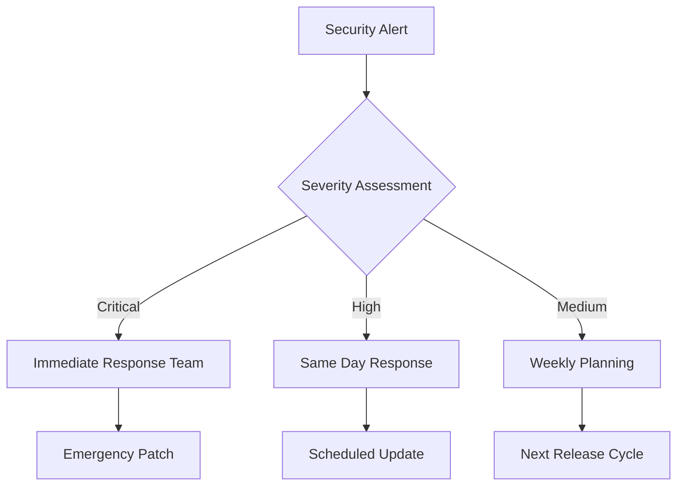

# Dependency Management System Documentation

## Executive Summary

The Algorithmic Trading System Dependency Management framework provides enterprise-grade oversight and automation for managing 60+ best-of-breed open-source components. This system ensures stability, security, and maintainability through automated monitoring, tiered management, and comprehensive integration testing.

## System Overview

### Key Objectives
- **Stability**: Prevent breaking changes from disrupting trading operations
- **Security**: Proactive vulnerability detection and mitigation
- **Maintainability**: Automated updates with minimal manual intervention
- **Compliance**: Audit trails and regulatory compliance
- **Performance**: Optimized dependency resolution and minimal overhead

### Architecture Principles
1. **Tiered Management**: Four-tier classification based on criticality
2. **Automated Monitoring**: Continuous surveillance of all dependencies
3. **Risk-Based Updates**: Controlled rollout based on impact assessment
4. **Zero-Trust Security**: All dependencies verified and validated
5. **Event-Driven Notifications**: Real-time alerts for critical issues

## Dependency Tiers

The system organizes all 60+ dependencies into four distinct tiers based on criticality and impact on system operations:

### Tier 1: Critical Dependencies (Daily Monitoring)
**Impact**: System-breaking if unavailable  
**Examples**: NautilusTrader, Apache Kafka, LangChain, FastAPI  
**SLA**: <2 hours response time for critical issues

Components essential to core trading operations:
- **Trading Engine**: NautilusTrader, nautilus_ibapi
- **Event Bus**: Apache Kafka, Schema Registry  
- **AI Framework**: LangChain, LangGraph, TradingAgents
- **API Layer**: FastAPI, gRPC, GraphQL

### Tier 2: Important Dependencies (Daily Monitoring)
**Impact**: Feature degradation if unavailable  
**Examples**: PyPortfolioOpt, TA-Lib, Transformers, FinRL  
**SLA**: <24 hours response time

Components supporting core functionality:
- **Technical Analysis**: TA-Lib, bukosabino/ta, OpenBB
- **Portfolio Management**: PyPortfolioOpt, Riskfolio-Lib
- **Machine Learning**: PyTorch, Transformers, SHAP, FinRL
- **Quantitative Finance**: QuantLib, VectorBT, TradingGym

### Tier 3: Supporting Dependencies (Weekly Monitoring)
**Impact**: UI/UX degradation if unavailable  
**Examples**: React, Next.js, Blockly, Lobe Chat  
**SLA**: <72 hours response time

Components enhancing user experience:
- **Frontend**: React, Next.js, TypeScript
- **Visualization**: react-financial-charts, Plotly Dash
- **No-Code**: Blockly, visual strategy builders
- **AI Interfaces**: Lobe Chat, RAGFlow

### Tier 4: Infrastructure Dependencies (Weekly Monitoring)
**Impact**: Operational overhead if unavailable  
**Examples**: Prometheus, Grafana, Docker, Kubernetes  
**SLA**: <1 week response time

Components supporting operations:
- **Monitoring**: Prometheus, Grafana, Jaeger, Loki
- **Databases**: PostgreSQL, ClickHouse, Redis, Qdrant
- **Infrastructure**: Docker, Kubernetes, Istio, NGINX
- **Security**: Bandit, vulnerability scanners

## Tier Classification

### Tier 1: Critical Dependencies (Daily Monitoring)
**Impact**: System-breaking if unavailable  
**Examples**: NautilusTrader, Apache Kafka, LangChain, FastAPI  
**SLA**: <2 hours response time for critical issues

Components essential to core trading operations:
- **Trading Engine**: NautilusTrader, nautilus_ibapi
- **Event Bus**: Apache Kafka, Schema Registry  
- **AI Framework**: LangChain, LangGraph, TradingAgents
- **API Layer**: FastAPI, gRPC, GraphQL

### Tier 2: Important Dependencies (Daily Monitoring)
**Impact**: Feature degradation if unavailable  
**Examples**: PyPortfolioOpt, TA-Lib, Transformers, FinRL  
**SLA**: <24 hours response time

Components supporting core functionality:
- **Technical Analysis**: TA-Lib, bukosabino/ta, OpenBB
- **Portfolio Management**: PyPortfolioOpt, Riskfolio-Lib
- **Machine Learning**: PyTorch, Transformers, SHAP, FinRL
- **Quantitative Finance**: QuantLib, VectorBT, TradingGym

### Tier 3: Supporting Dependencies (Weekly Monitoring)
**Impact**: UI/UX degradation if unavailable  
**Examples**: React, Next.js, Blockly, Lobe Chat  
**SLA**: <72 hours response time

Components enhancing user experience:
- **Frontend**: React, Next.js, TypeScript
- **Visualization**: react-financial-charts, Plotly Dash
- **No-Code**: Blockly, visual strategy builders
- **AI Interfaces**: Lobe Chat, RAGFlow

### Tier 4: Infrastructure Dependencies (Weekly Monitoring)
**Impact**: Operational overhead if unavailable  
**Examples**: Prometheus, Grafana, Docker, Kubernetes  
**SLA**: <1 week response time

Components supporting operations:
- **Monitoring**: Prometheus, Grafana, Jaeger, Loki
- **Databases**: PostgreSQL, ClickHouse, Redis, Qdrant
- **Infrastructure**: Docker, Kubernetes, Istio, NGINX
- **Security**: Bandit, vulnerability scanners

## Monitoring and Alerting

### Monitoring Schedule
```yaml
Tier 1 & 2: Daily at 06:00 UTC
Tier 3 & 4: Weekly on Monday at 06:00 UTC
Security Scans: Continuous
Health Checks: Every 15 minutes
```

### Alert Channels
1. **Critical Alerts** (Tier 1 security issues):
   - Microsoft Teams (immediate)
   - Discord (immediate)
   - GitHub Issues (automated)
   - Email escalation (after 30 minutes)

2. **Standard Notifications** (routine updates):
   - Weekly consolidated report
   - Dashboard updates
   - Slack notifications

3. **Summary Reports** (management):
   - Weekly executive summary
   - Monthly compliance report
   - Quarterly strategic review

## Security Framework

### Vulnerability Management
- **Continuous Scanning**: Bandit, Safety, Snyk integration
- **CVE Monitoring**: Real-time Common Vulnerabilities and Exposures tracking
- **Risk Assessment**: CVSS scoring and impact analysis
- **Patch Management**: Automated patching for non-breaking security fixes

### Access Control
- **Repository Security**: Private forks with restricted access
- **API Security**: Token-based authentication for all integrations
- **Audit Logging**: Complete trail of all dependency changes
- **Compliance**: SOX, GDPR, PCI DSS alignment

### Incident Response


## Integration Testing

### Test Environment Strategy
- **Isolated Containers**: Docker-based test environments for each tier
- **Dependency Simulation**: Mock external services for controlled testing
- **Performance Benchmarking**: Latency and throughput validation
- **Compatibility Matrix**: Cross-version testing for critical combinations

### Automated Test Suites
1. **Unit Tests**: Component-level functionality validation
2. **Integration Tests**: Service interaction verification
3. **Performance Tests**: Load and stress testing
4. **Security Tests**: Vulnerability and penetration testing
5. **Regression Tests**: Backward compatibility validation

### Test Scenarios
```yaml
Tier 1 Testing:
  - Trading engine functionality
  - Event bus message handling
  - AI model inference
  - API response times

Tier 2 Testing:
  - Portfolio optimization algorithms
  - Technical indicator calculations
  - ML model training/inference
  - Financial computations

Tier 3 Testing:
  - Frontend build processes
  - UI component rendering
  - No-code block execution
  - Visualization generation

Tier 4 Testing:
  - Infrastructure service startup
  - Monitoring data collection
  - Database connectivity
  - Network communication
```

## Customizations and Forks

### Customization Tracking
All modifications to upstream dependencies are tracked in `customization_tracking.json`:

```json
{
  "dependency": "TA-Lib",
  "customizations": [
    {
      "name": "Volume-Weighted Indicators",
      "description": "Custom VW-SMA, VW-EMA, VW-MACD, VW-MFI indicators",
      "files": ["indicators/volume_weighted_*.py"],
      "tracking_tags": ["// @PLACEHOLDER: VW indicator implementation"],
      "impact": "Enhanced technical analysis capabilities",
      "merge_strategy": "manual_review"
    }
  ]
}
```

### Merge Strategy
- **Automated Merges**: Non-customized dependencies with passing tests
- **Manual Review**: Dependencies with customizations or breaking changes
- **Deferred Updates**: Breaking changes requiring significant rework
- **Emergency Patches**: Security fixes with expedited review

## Operational Procedures

### Daily Operations
1. **06:00 UTC**: Automated monitoring runs for Tier 1 & 2
2. **06:30 UTC**: Security scan results processed
3. **07:00 UTC**: Critical alerts sent if issues detected
4. **09:00 UTC**: Team review of overnight alerts
5. **Continuous**: Health dashboard monitoring

### Weekly Operations
1. **Monday 06:00 UTC**: Tier 3 & 4 monitoring
2. **Tuesday**: Consolidated report generation
3. **Wednesday**: Dependency update planning
4. **Thursday**: Non-critical updates deployment
5. **Friday**: Weekly review and planning

### Monthly Operations
1. **First Monday**: Comprehensive security audit
2. **Second Tuesday**: Performance benchmarking
3. **Third Wednesday**: Customization review
4. **Fourth Thursday**: Strategic planning session

## Performance Metrics

### Key Performance Indicators (KPIs)
- **Update Latency**: Time from upstream release to integration
- **Security Response Time**: Time from CVE publication to patch deployment
- **Test Success Rate**: Percentage of updates passing automated tests
- **Availability**: Dependency service uptime
- **Alert Accuracy**: True positive rate for security alerts

### Monitoring Dashboard Metrics
```yaml
Real-time Metrics:
  - Dependency health status
  - Security alert count
  - Update queue depth
  - Test success/failure rates

Historical Trends:
  - Update frequency by tier
  - Security vulnerability trends
  - Performance impact analysis
  - Cost/benefit analysis
```

## Compliance and Governance

### Regulatory Compliance
- **SOX Compliance**: Immutable audit trails for all dependency changes
- **GDPR Compliance**: Data protection in dependency processing
- **PCI DSS**: Security standards for payment-related dependencies
- **Financial Regulations**: Compliance with trading system requirements

### Change Management
1. **Change Advisory Board (CAB)**: Weekly review of proposed updates
2. **Risk Assessment**: Impact analysis for all changes
3. **Approval Workflow**: Tiered approval based on risk level
4. **Rollback Procedures**: Automated and manual rollback capabilities

### Documentation Requirements
- **Change Records**: Complete documentation for all updates
- **Impact Assessments**: Business and technical impact analysis
- **Test Results**: Comprehensive test execution reports
- **Security Reviews**: Security impact analysis and mitigation

## Disaster Recovery

### Backup Strategies
- **Configuration Backups**: Daily backups of all configuration files
- **Dependency Snapshots**: Known-good version snapshots
- **Infrastructure Backups**: Complete infrastructure state preservation
- **Data Backups**: Monitoring data and audit log preservation

### Recovery Procedures
1. **Dependency Rollback**: Automated rollback to last known good versions
2. **Configuration Recovery**: Restoration from configuration backups
3. **Infrastructure Recovery**: Disaster recovery site activation
4. **Communication Plan**: Stakeholder notification procedures

## Future Enhancements

### Planned Improvements
- **AI-Powered Update Analysis**: Machine learning for update impact prediction
- **Automated Conflict Resolution**: Intelligent merge conflict resolution
- **Predictive Monitoring**: Proactive issue detection and prevention
- **Enhanced Visualization**: Advanced dependency relationship mapping

### Integration Roadmap
- **Q1**: Enhanced security scanning integration
- **Q2**: Advanced analytics and reporting
- **Q3**: Predictive maintenance capabilities
- **Q4**: Cross-platform dependency management

## Conclusion

The Dependency Management System provides a robust, secure, and automated framework for managing the complex ecosystem of dependencies in the Algorithmic Trading System. Through tiered management, continuous monitoring, and comprehensive testing, it ensures system stability while enabling rapid innovation and secure operations.

For additional support and documentation, refer to:
- [System Architecture Documentation](comprehensive_system_architecture.md)
- [Security Framework Documentation](security_framework.md)
- [Operational Runbooks](operational_runbooks.md)
- [API Documentation](api_documentation.md)