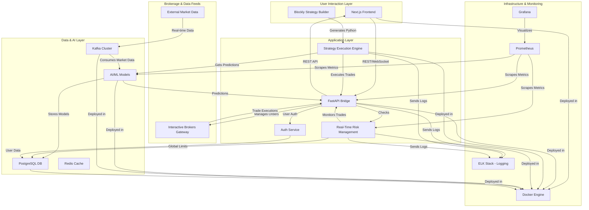

# Production Readiness Plan: Algorithmic Trading System

## 1. Introduction

This document outlines the comprehensive architecture and implementation plan to bring the Algorithmic Trading System to a production-ready state. It addresses the critical integration gaps identified in the Phase 4 Audit Report and provides a clear roadmap for the final implementation phase.

The plan is organized into the following sections:
- **Production-Ready Architecture**: A visual representation of the target architecture.
- **Gap Analysis and Prioritization**: A matrix detailing identified gaps, their severity, and a proposed prioritization for remediation.
- **Production Readiness Checklist**: A comprehensive checklist covering all aspects of production deployment, from security to performance.
- **Implementation Plan**: High-level guidance for the implementation teams who will execute this plan.

## 2. Production-Ready Architecture

This section will contain the Mermaid diagram illustrating the unified data flow and component interactions for the production environment.

## 3. Gap Analysis and Prioritization Matrix

This section provides a detailed analysis of the gaps identified during the Phase 4 audit, along with a prioritization matrix to guide the implementation effort.

| Gap ID | Description | Severity | Priority | Recommendation |
|---|---|---|---|---|
| **GAP-01** | **Data Pipeline Integration** | Critical | **P1** | Implement Kafka-to-AI model pipeline and prediction serving API. |
| **GAP-02** | **Risk Management System** | Critical | **P1** | Develop and integrate a real-time risk management service. |
| **GAP-03** | **Trading Engine Connection** | Critical | **P2** | Harden and validate the FastAPI to Interactive Brokers connection. |
| **GAP-04** | **Strategy Execution Backend** | High | **P2** | Build and deploy the no-code strategy execution engine. |
| **GAP-05** | **Production Infrastructure** | High | **P3** | Implement Docker, monitoring, logging, and security measures. |
| **GAP-06** | **User Authentication** | High | **P3** | Replace mock user store with a production-ready authentication service. |
| **GAP-07** | **RL Environment** | Medium | **P4** | Complete the reinforcement learning environment and data integration. |
| **GAP-08** | **Frontend-Backend Integration** | Medium | **P4** | Complete WebSocket/REST integration for live data updates. |

## 4. Production Readiness Checklist

This checklist provides a comprehensive set of tasks and verification steps to ensure the system is fully prepared for production deployment. It covers security, performance, monitoring, and operational readiness.

### Security Hardening
- [ ] Implement robust authentication and authorization.
- [ ] Secure all API endpoints with appropriate access controls.
- [ ] Encrypt sensitive data in transit and at rest.
- [ ] Conduct a full security audit and penetration testing.
- [ ] Regularly scan for vulnerabilities in all dependencies.

### Performance Optimization
- [ ] Optimize database queries and indexing.
- [ ] Implement caching strategies for frequently accessed data.
- [ ] Tune AI/ML model performance for real-time predictions.
- [ ] Profile and optimize critical code paths for low latency.

### Monitoring and Alerting
- [ ] Implement comprehensive logging across all services.
- [ ] Set up monitoring dashboards for key performance indicators (KPIs).
- [ ] Configure alerts for critical system events and failures.
- [ ] Monitor resource utilization (CPU, memory, disk).

### Backup and Disaster Recovery
- [ ] Implement regular database backups and a tested recovery process.
- [ ] Create a disaster recovery plan for critical system failures.
- [ ] Ensure high availability and failover for all essential services.

### Load Testing and Scalability
- [ ] Conduct load testing to determine system capacity.
- [ ] Test the scalability of all components under heavy load.
- [ ] Develop a plan for scaling the system as needed.

### Documentation and Runbooks
- [ ] Create detailed runbooks for common operational tasks.
- [ ] Document all system architecture and configurations.
- [ ] Ensure all code is well-documented and easy to understand.

## 5. High-Level Implementation Plan

This plan is designed to be executed by specialized teams. The following steps will be handed off to the appropriate modes for completion:

1.  **Infrastructure Setup**: Configure and deploy the Dockerized environment, including networking, storage, and secret management.
2.  **Data Pipeline Implementation**: Build and verify the Kafka-to-AI model data pipeline.
3.  **Risk Management System Integration**: Implement the real-time risk monitoring and control system.
4.  **Trading Engine Connection**: Validate and harden the FastAPI to Interactive Brokers gateway connection.
5.  **Strategy Execution Backend**: Deploy and test the no-code strategy execution engine.

---
*Document Version: 1.0*
*Status: Initial Draft*