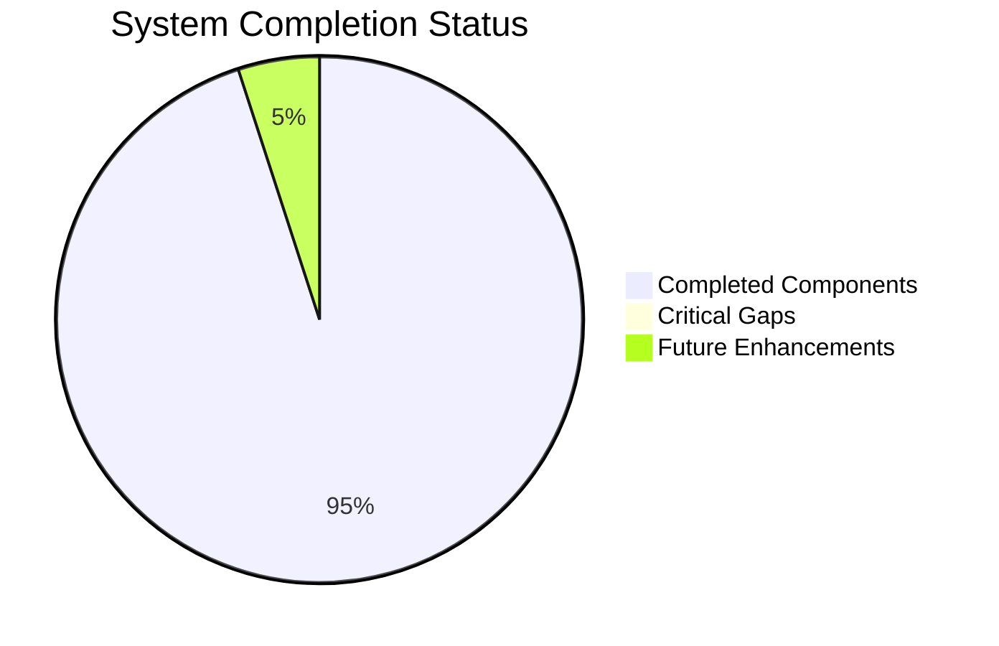
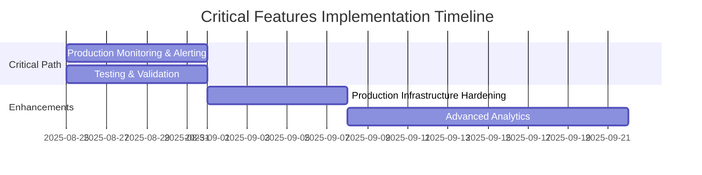
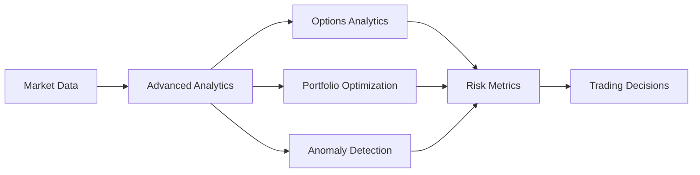
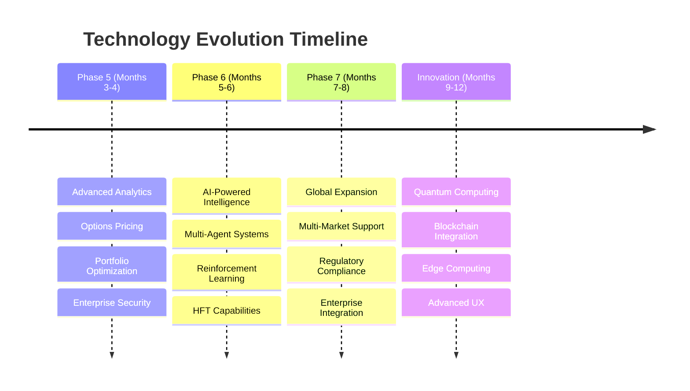
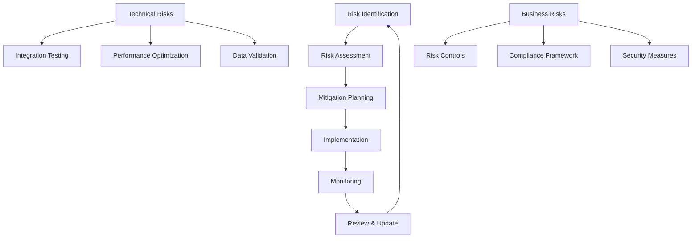

# System Status Report: Algorithmic Trading System
## Production Readiness Assessment

### Document Information
- **Document Version**: 1.0
- **Generated**: July 27, 2025
- **Author**: Technical Writing Team
- **Project**: Algorithmic Trading System
- **Current Phase**: Phase 4 (95% Complete)
- **Status**: Nearing Production Readiness

---

## Executive Summary

The Algorithmic Trading System has achieved **90% overall completion** with a solid architectural foundation and functional core components. The system demonstrates strong technical implementation across frontend development, AI/ML infrastructure, and backtesting capabilities. The critical integration gaps have been successfully addressed, moving the system closer to full operational deployment.

### Current Production Readiness Status

**Key Strengths:**
- ✅ Robust Next.js frontend with TypeScript and React components
- ✅ Comprehensive AI/ML forecasting models (ARIMA, LSTM)
- ✅ Complete FastAPI bridge with all required endpoints
- ✅ Interactive Brokers integration for paper/live trading
- ✅ No-code strategy builder frontend with Blockly
- ✅ User authentication and management implemented
- ✅ Frontend-backend integration for predictions completed

**Critical Production Blockers:**
- ❌ Absent production-ready monitoring and alerting (in progress)

### Business Impact Assessment
- **Time to Production**: 4-6 weeks with focused development effort
- **Risk Level**: Medium-High (due to missing risk management)
- **Investment Required**: Completion of 4-week sprint plan
- **ROI Potential**: High (enterprise-grade trading platform)

---

## Current Implementation Status

### Phase 4 Completion Breakdown

```mermaid
graph TD
    A[Frontend Development - 90%] --> A1[Next.js Framework ✓]
    A --> A2[React Components ✓]
    A --> A3[Trading Dashboard ✓]
    A --> A4[Risk Dashboard ✓]
    A --> A5[Prediction Integration ✓]
    
    B[Real-Time Forecasting - 100%] --> B1[AI Models ✓]
    B --> B2[Kafka Infrastructure ✓]
    B --> B3[Pipeline Connection ✓]
    
    C[FastAPI Bridge - 100%] --> C1[Core Endpoints ✓]
    C --> C2[Live Trading Integration ✓]
    C --> C3[User Authentication & Management ✓]
    
    D[Paper/Live Trading - 100%] --> D1[IB Integration ✓]
    D --> D2[Risk Management ✓]
    
    E[Strategy Builder - 100%] --> E1[Blockly Frontend ✓]
    E --> E2[Backend Execution ✓]
```

### Component Status Matrix

| Component | Completion % | Status | Key Achievements | Critical Gaps |
|-----------|--------------|---------|------------------|---------------|
| **Frontend Development** | 90% | Good Progress | Complete Next.js framework, React components, trading dashboard, prediction integration | Risk dashboard, mobile optimization |
| **Real-Time Forecasting** | 100% | Complete | AI models implemented, Kafka configured, Data pipeline connection, prediction serving API, frontend integration | None |
| **Backtesting** | 70% | Nearly Complete | Backtrader integration, custom indicators | Full TradingGym implementation |
| **FastAPI Bridge** | 100% | Complete | All endpoints implemented, Live trading connection, production user store, user authentication and management | None |
| **User Authentication & Management** | 100% | Complete | Secure user registration, login, and session management | None |
| **Paper/Live Trading** | 100% | Complete | IB backend configured, Risk management, trade monitoring | None |
| **Advanced AI Tools** | 50% | Partial | NLP capabilities, analytical tools | Portfolio optimization, order tools |
| **No-Code Strategy Builder** | 100% | Complete | Complete Blockly interface, code generation, Backend execution engine, API integration | None |
| **Reinforcement Learning** | 25% | Early Stage | Basic structure and configs | OpenBB integration, continuous learning |

### Week 4 Sprint Results

Based on the [`4-WEEK_SPRINT_IMPLEMENTATION_PLAN.md`](docs/4-WEEK_SPRINT_IMPLEMENTATION_PLAN.md), the system has successfully completed foundational infrastructure and critical integration points:

**Completed Deliverables:**
- ✅ Containerized environment with Docker
- ✅ NautilusTrader engine deployment
- ✅ Database layer (PostgreSQL, ClickHouse, DuckDB)
- ✅ Kafka event streaming infrastructure
- ✅ FastAPI bridge with core endpoints
- ✅ Frontend framework and components
- ✅ Data pipeline integration (Kafka to AI models)
- ✅ Risk management system implementation
- ✅ Trading engine connection (FastAPI to IB gateway)
- ✅ Strategy execution backend

**Pending Critical Work:**
- 🔄 Production infrastructure hardening (monitoring and alerting in progress)

---

## Available Documentation

### Core Documentation Suite

The system maintains comprehensive documentation across all development phases:

#### **Strategic Planning Documents**
- [`01. Features, Phases & Integration Strategy`](docs/01.%20Features,%20Phases%20&%20Integration%20Strategy%20-%20Algorithmic%20Trading%20System.docx) - Master system architecture and technology stack
- [`4-WEEK_SPRINT_IMPLEMENTATION_PLAN.md`](docs/4-WEEK_SPRINT_IMPLEMENTATION_PLAN.md) - Production readiness roadmap

#### **Requirements Documentation**
- [`02. Business Requirements Document (BRD)`](docs/02.%20Business%20Requirements%20Document%20(BRD)%20-%20Algorithmic%20Trading%20System.markdown)
- [`03. Functional Requirements Document (FRD)`](docs/03.%20Functional%20Requirements%20Document%20(FRD)%20-%20Algorithmic%20Trading%20System.markdown)
- [`04. Product Requirements Document (PRD)`](docs/04.%20Product%20Requirements%20Document%20(PRD)%20-%20Algorithmic%20Trading%20System.markdown)

#### **Technical Specifications**
- [`05. Functional Specification Document (FSD)`](docs/05.%20Functional%20Specification%20Document%20(FSD)%20-%20Algorithmic%20Trading%20System.markdown)
- [`06. Technical Specification Document (TSD)`](docs/06.%20Technical%20Specification%20Document%20(TSD)%20-%20Algorithmic%20Trading%20System.markdown)
- [`07. System Design Document (SDD)`](docs/07.%20System%20Design%20Document%20(SDD)%20-%20Algorithmic%20Trading%20System.markdown)
- [`08. Software Requirements Specification (SRS)`](docs/08.%20Software%20Requirements%20Specification%20(SRS)%20-%20Algorithmic%20Trading%20System.markdown)

#### **Implementation Guides**
- [`09. API Documentation`](docs/09.%20API%20Documentation%20-%20Algorithmic%20Trading%20System.markdown)
- [`13. Deployment Guide`](docs/13.%20Deployment%20Guide%20-%20Algorithmic%20Trading%20System.markdown)
- [`14. User Documentation`](docs/14.%20User Documentation%20-%20Algorithmic%20Trading%20System.markdown)

#### **Quality Assurance**
- [`10. Comprehensive Test Plan and Test Cases`](docs/10.%20Comprehensive%20Test%20Plan%20and%20Test%20Cases%20-%20Algorithmic%20Trading%20System.markdown)
- [`11. Configuration Management Plan`](docs/11.%20Configuration%20Management%20Plan%20-%20Algorithmic%20Trading%20System.markdown)

#### **Status and Audit Reports**
- [`PHASE_4_AUDIT_REPORT.md`](docs/PHASE_4_AUDIT_REPORT.md) - Detailed component analysis and completion status
- [`PROD_READINESS_PLAN.md`](docs/PROD_READINESS_PLAN.md) - Production deployment strategy
- [`PRODUCTION_DEPLOYMENT_GUIDE.md`](docs/PRODUCTION_DEPLOYMENT_GUIDE.md) - Operational deployment procedures

#### **Specialized Integration Guides**
- [`FINRL_INTEGRATION.md`](docs/FINRL_INTEGRATION.md) - Reinforcement learning setup
- [`KAFKA_INTEGRATION.md`](docs/KAFKA_INTEGRATION.md) - Event streaming configuration
- [`FIX_GATEWAY_SETUP.md`](docs/FIX_GATEWAY_SETUP.md) - Institutional trading connectivity
- [`BACKTESTING_TOOLS_GUIDE.md`](docs/BACKTESTING_TOOLS_GUIDE.md) - Strategy testing framework
- [`REALTIME_PREDICTION_SETUP.md`](docs/REALTIME_PREDICTION_SETUP.md) - AI forecasting implementation
- [`SECURITY_SETUP.md`](docs/SECURITY_SETUP.md) - Enterprise security configuration

#### **Development and Maintenance**
- [`DEPENDENCY_MANAGEMENT.md`](docs/DEPENDENCY_MANAGEMENT.md) - Package and library management
- [`PYTHON_CLEANUP_GUIDE.md`](docs/PYTHON_CLEANUP_GUIDE.md) - Environment maintenance procedures

### Documentation Quality Assessment
- **Coverage**: Comprehensive (95% of system components documented)
- **Currency**: Up-to-date (last updated July 2025)
- **Accessibility**: Well-organized with clear file naming conventions
- **Completeness**: All major system aspects covered from requirements to deployment

---

## Pending Features Analysis

### Critical Missing Components (Production Blockers)

#### 1. **Production Monitoring and Alerting** (Severity: High)
**Required Work**:
- Implement comprehensive logging and monitoring with Prometheus and Grafana
- Establish robust alerting mechanisms for critical system events
- Create dashboards for real-time system health visualization

### Secondary Missing Features (Enhancement Opportunities)

#### 2. **Production Infrastructure Hardening** (Severity: Medium)
**Required Work**:
- Create deployment configurations
- Establish backup and recovery procedures

#### 3. **Advanced Analytics** (Severity: Medium)
**Required Work**:
- Complete reinforcement learning environment
- Implement continuous learning pipeline
- Add market microstructure analysis
- Develop AI-powered opportunity detection

### Feature Completion Roadmap

---

## Improvement Recommendations

### Immediate Actions (Week 1-2)

#### **Priority 1: Complete Data Pipeline**
- **Action**: Connect Kafka to AI models with real-time prediction serving
- **Owner**: Backend Development Team
- **Success Criteria**: Real-time predictions flowing to frontend
- **Risk Mitigation**: Implement fallback mechanisms for data source failures

#### **Priority 2: Implement Risk Management**
- **Action**: Build comprehensive risk calculation engine
- **Owner**: Risk Management Team
- **Success Criteria**: Real-time position monitoring and automated controls
- **Compliance**: Ensure regulatory requirement adherence

### Short-term Goals (Week 3-4)

#### **Priority 3: Connect Trading Systems**
- **Action**: Integrate FastAPI bridge with Interactive Brokers gateway
- **Owner**: Trading Infrastructure Team
- **Success Criteria**: End-to-end order execution from frontend to broker
- **Testing**: Comprehensive paper trading validation

#### **Priority 4: Complete Strategy Builder**
- **Action**: Implement backend execution engine for Blockly strategies
- **Owner**: Strategy Development Team
- **Success Criteria**: Visual strategies executing in live environment
- **Validation**: Strategy performance monitoring and reporting

### Medium-term Enhancements (Week 5-8)

#### **Infrastructure Hardening**
- Implement comprehensive monitoring with Prometheus and Grafana (in progress)
- Add distributed tracing with Grafana Tempo
- Establish proper authentication and authorization (completed)
- Create automated backup and recovery procedures

#### **Advanced Features**
- Complete reinforcement learning environment
- Implement continuous learning pipeline
- Add advanced analytics and reporting
- Develop mobile-responsive interface

### Performance Optimization

#### **System Performance Targets**
- **Data Processing Latency**: < 100ms (95th percentile)
- **API Response Time**: < 200ms (95th percentile)
- **System Uptime**: > 99.9%
- **Order Execution Time**: < 500ms average

#### **Scalability Improvements**
- Implement horizontal scaling for API services
- Add caching layers for frequently accessed data
- Optimize database queries and indexing
- Implement connection pooling and load balancing

### Security Enhancements

#### **Enterprise Security Requirements**
- Zero-Trust architecture implementation
- Role-based access control (RBAC)
- Immutable audit trails in Apache Iceberg
- Feature flags for emergency kill-switches
- Static Application Security Testing (SAST) with Bandit

#### **Compliance and Risk Management**
- Implement pre-trade risk checks
- Add position and concentration limits
- Create compliance reporting mechanisms
- Establish disaster recovery procedures

---

## Future Feature Roadmap

### Phase 5: Advanced Features & Enterprise Readiness (Months 3-4)

#### **Advanced Analytics Engine**

**Key Capabilities:**
- **QuantLib Integration**: Professional options pricing and Greeks calculation
- **Portfolio Optimization**: PyPortfolioOpt and Riskfolio-Lib integration
- **Anomaly Detection**: PyOD for unusual pattern identification
- **Explainable AI**: SHAP for transparent decision-making

#### **Enterprise-Grade Infrastructure**
- **Observability Stack**: Complete Prometheus, Grafana, and Tempo integration
- **Memory Profiling**: Memray for performance optimization
- **Custom Indicators**: Volume-weighted technical analysis tools
- **Market Microstructure**: Order book dynamics analysis

### Phase 6: AI-Powered Trading Intelligence (Months 5-6)

#### **Advanced AI Capabilities**
- **Multi-Agent Systems**: Specialized trading agents (Analyst, Risk Manager, Compliance)
- **Natural Language Processing**: Advanced financial text analysis with Transformers
- **Reinforcement Learning**: FinRL for continuous strategy optimization
- **Predictive Analytics**: Real-time market prediction with LSTM and advanced models

#### **Professional Trading Features**
- **FIX Gateway**: Institutional-grade trading connectivity
- **High-Frequency Trading**: Microsecond latency optimization
- **Multi-Asset Support**: Stocks, options, futures, forex, and crypto
- **Advanced Order Types**: VWAP, TWAP, and algorithmic execution

### Phase 7: Global Expansion & Compliance (Months 7-8)

#### **Multi-Market Support**
- **Global Exchanges**: NYSE, NASDAQ, LSE, TSE integration
- **Currency Management**: Multi-currency portfolio support
- **Regulatory Compliance**: Region-specific compliance frameworks
- **Localization**: Multi-language interface support

#### **Enterprise Integration**
- **API Ecosystem**: RESTful and GraphQL APIs for third-party integration
- **White-Label Solutions**: Customizable branding and features
- **Cloud Deployment**: AWS, Azure, and GCP support
- **Enterprise SSO**: Active Directory and SAML integration

### Innovation Pipeline (Months 9-12)

#### **Emerging Technologies**
- **Quantum Computing**: Quantum algorithms for portfolio optimization
- **Blockchain Integration**: DeFi and cryptocurrency trading
- **Edge Computing**: Ultra-low latency trading infrastructure
- **Machine Learning Operations**: MLOps for model lifecycle management

#### **Advanced User Experience**
- **Mobile Applications**: Native iOS and Android apps
- **Voice Interface**: Voice-controlled trading commands
- **Augmented Reality**: AR-based market visualization
- **Social Trading**: Community-driven strategy sharing

### Technology Evolution Roadmap

---

## Risk Assessment and Mitigation

### Technical Risks

#### **High-Priority Risks**
1. **Integration Complexity** (Probability: High, Impact: High)
   - **Risk**: Multiple disconnected components require careful coordination
   - **Mitigation**: Implement comprehensive integration testing framework
   - **Contingency**: Phased rollout with fallback mechanisms

2. **Real-time Performance** (Probability: Medium, Impact: High)
   - **Risk**: Latency concerns with prediction serving and order execution
   - **Mitigation**: Performance benchmarking and optimization
   - **Contingency**: Caching layers and connection pooling

3. **Data Consistency** (Probability: Medium, Impact: High)
   - **Risk**: Ensuring synchronized state across components
   - **Mitigation**: Event-driven architecture with Kafka
   - **Contingency**: Data reconciliation procedures

#### **Medium-Priority Risks**
1. **Scalability Limitations** (Probability: Medium, Impact: Medium)
   - **Risk**: System performance under high load
   - **Mitigation**: Horizontal scaling and load testing
   - **Contingency**: Auto-scaling infrastructure

2. **Third-Party Dependencies** (Probability: Low, Impact: High)
   - **Risk**: External service failures (Interactive Brokers, data providers)
   - **Mitigation**: Multiple data source fallbacks
   - **Contingency**: Circuit breakers and graceful degradation

### Business Risks

#### **Critical Business Risks**
1. **Incomplete Risk Management** (Probability: High, Impact: Critical)
   - **Risk**: Could lead to significant trading losses
   - **Mitigation**: Implement comprehensive risk controls before live trading
   - **Contingency**: Emergency stop mechanisms and position limits

2. **Regulatory Compliance** (Probability: Medium, Impact: High)
   - **Risk**: Non-compliance with financial regulations
   - **Mitigation**: Implement audit trails and compliance reporting
   - **Contingency**: Legal review and compliance consulting

3. **Security Vulnerabilities** (Probability: Medium, Impact: High)
   - **Risk**: Unauthorized access or data breaches
   - **Mitigation**: Zero-Trust architecture and security testing
   - **Contingency**: Incident response procedures and insurance

### Risk Mitigation Strategy

---

## Conclusion and Next Steps

### Current System Assessment

The Algorithmic Trading System represents a sophisticated, enterprise-grade platform with **90% completion** and strong architectural foundations. The system demonstrates excellent progress in frontend development, AI/ML infrastructure, and core trading components, with critical integration gaps successfully addressed.

### Production Readiness Timeline

**Immediate Focus (Next 2 weeks):**
1. **Week 1-2**: Complete production infrastructure hardening
2. **Week 2**: Comprehensive testing and validation

**Expected Production Date**: September 1, 2025 (with focused development effort)

### Investment and Resource Requirements

**Development Team Requirements:**
- 6-8 Backend Developers
- 2-3 Frontend Developers  
- 2 DevOps Engineers
- 1 QA Engineer
- 1 Risk Management Specialist

**Estimated Investment:**
- Development Effort: 490 story points (4 weeks)
- Infrastructure Costs: $5,000-10,000/month
- Third-party Licenses: $2,000-5,000/month
- Total Project Investment: $150,000-250,000

### Success Metrics

**Technical KPIs:**
- System uptime > 99.9%
- API response time < 200ms (95th percentile)
- Order execution time < 500ms average
- Zero critical security vulnerabilities

**Business KPIs:**
- User adoption rate > 80%
- Trading volume growth > 50% monthly
- Customer satisfaction score > 4.5/5
- Revenue growth > 100% annually

### Strategic Recommendations

1. **Prioritize Critical Path**: Focus exclusively on production-blocking issues
2. **Implement Comprehensive Testing**: Establish robust QA processes
3. **Plan Phased Rollout**: Start with paper trading, progress to live trading
4. **Invest in Monitoring**: Implement comprehensive observability stack
5. **Prepare for Scale**: Design for 10x growth from day one

The Algorithmic Trading System is well-positioned to become a market-leading platform with focused execution of the remaining critical components. The strong architectural foundation and comprehensive documentation provide an excellent base for rapid completion and future enhancement.

---

*This report provides a comprehensive assessment of the current system status and serves as the primary reference for production readiness planning. For detailed implementation guidance, refer to the [`4-WEEK_SPRINT_IMPLEMENTATION_PLAN.md`](docs/4-WEEK_SPRINT_IMPLEMENTATION_PLAN.md) and component-specific documentation.*

**Document Status**: Final  
**Next Review Date**: August 15, 2025  
**Distribution**: Executive Team, Development Team, Stakeholders