# Complete Designs Document - Algorithmic Trading System

## Overview

This document consolidates all design specifications from phases 0-6 of the algorithmic trading system development. Each phase contains comprehensive architectural designs that build upon previous phases to create a world-class, enterprise-grade trading platform. The platform adopts a "Best-of-Breed" integration strategy, selecting leading open-source projects for each major component to ensure a modular, scalable, and high-performance foundation. It supports a diverse user base, from non-technical retail investors (via intuitive no-code tools and natural language interfaces) to professional quantitative analysts (via advanced Python-based development environments and enterprise-grade features). The system leverages AI Agents and Agentic AI extensively to provide intelligent, automated trading capabilities.

The architecture is composed of distinct microservices communicating through an Apache Kafka event bus, enabling asynchronous, event-driven processing. This design decouples services, ensures data replayability for robust testing and auditing, and scales to handle high-frequency data streams. Key highlights include a sophisticated Agentic AI Assistant as the platform's "brain," supporting natural language management of trading, research, and analysis. The core trading engine, NautilusTrader, is a high-performance Python-based platform with Rust components, supporting event-driven backtesting and live trading across all asset classes (stocks, ETFs, futures, options, forex, commodities, cryptocurrencies).

The system integrates advanced forecasting models (Stock-Prediction-Models, LSTM-Neural-Network-for-Time-Series-Prediction, Real-time-stock-market-prediction), GPU-accelerated backtesting (VectorBT), flexible strategy environments (TradingGym), portfolio optimization (PyPortfolioOpt, Riskfolio-Lib), anomaly detection (PyOD), no-code strategy building (Blockly), visualization tools (react-financial-charts, Plotly Dash), explainable AI (SHAP), reinforcement learning (FinRL), and advanced NLP (Transformers, PyTorch), alongside options analytics (QuantLib).

**Key Characteristics:**
- **High Performance:** Microsecond-level latency for trading operations, achieved through optimized code paths, lock-free data structures, cache-line alignment, and hardware accelerations like FPGAs/SmartNICs.
- **Scalable:** Horizontal scaling across multiple nodes, supporting 10,000+ concurrent users and >1M messages/second throughput.
- **Resilient:** Fault-tolerant with automatic failover, self-healing microservices, and multi-region deployments.
- **Secure:** Enterprise-grade security with zero-trust architecture, RBAC, MFA, AES-256 encryption at rest, TLS 1.3 in transit, SAST (Bandit), and UEBA for threat detection.
- **Observable:** Comprehensive monitoring and alerting with Prometheus, Grafana, Loki/ELK, Jaeger/Tempo, and Memray for profiling.

**Architecture Principles:**
1. **Microservices Architecture:** Service decomposition by business capability, independent deployment, technology diversity, fault isolation, and automated self-healing to minimize downtime and prevent cascading failures.
2. **Event-Driven Architecture:** Asynchronous communication via events, event sourcing for state changes, CQRS for command/query separation, and real-time event processing to support high-frequency trading.
3. **Cloud-Native Design:** Container-first with Docker, Kubernetes orchestration, adherence to 12-Factor App principles, and IaC for all infrastructure.
4. **API-First Design:** Standard REST interfaces, flexible GraphQL queries, real-time WebSocket streams, high-performance gRPC for internal communication, and FIX protocol for institutional connectivity.
5. **Security-First:** Zero-trust model with continuous verification, encryption, and threat modeling (STRIDE).
6. **Performance-Optimized:** Ultra-low latency through DMA, co-location, FPGAs/SmartNICs, and low-level optimizations.
7. **AI-Integrated:** Agentic AI for intelligent workflows, RAG for document analysis, and RLOps for continuous model improvement.

The designs ensure research-to-production parity, with seamless transitions from backtesting to live trading, and support advanced features like voice trading, AR interfaces, market microstructure analysis, and a Strategy Marketplace with copy trading capabilities.

---

## Phase 0: Dependency Management Setup Design

### Overview

Phase 0 establishes a comprehensive dependency management system for the algorithmic trading platform, managing over 60 external repositories and components (e.g., NautilusTrader, LangChain, PyPortfolioOpt, QuantLib, RAGFlow, etc.) through automated monitoring, tiered management strategies, and intelligent update integration. The design emphasizes proactive management, security, and system stability while minimizing manual overhead. It sets up a foundation for the entire platform by ensuring all dependencies are forked (where necessary), monitored, and integrated with CI/CD pipelines.

### High-Level Architecture

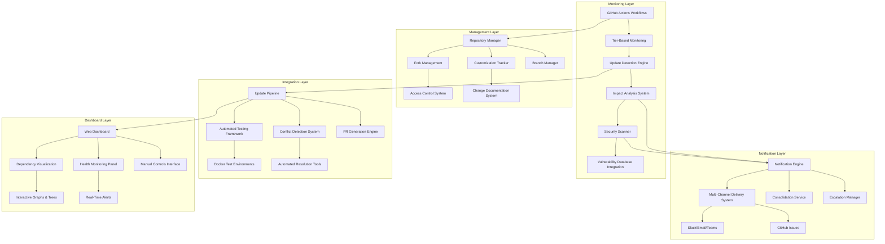

### Component Architecture

The system follows a microservices architecture with clear separation of concerns:

1. **Monitoring Layer**: Automated detection and analysis of dependency changes, including real-time vulnerability scanning and impact assessment for updates.
2. **Management Layer**: Repository and customization management, with automated forking, branch protection, and access controls for tiered dependencies.
3. **Integration Layer**: Automated testing and integration pipelines, including Docker-based environments for isolated testing and conflict resolution.
4. **Notification Layer**: Multi-channel communication and alerting, with consolidation for weekly reports and escalation for critical issues.
5. **Dashboard Layer**: Visualization and manual control interfaces, providing real-time status and interactive graphs for dependency health.

### Key Components

#### Repository Management System
- Fork Management Service: Automates forking of external repositories (e.g., NautilusTrader, LangGraph) with tier-based priority, creating private forks for customization.
- Customization Tracking System: Tracks changes in forked repos with Git diff tools and documentation in CHANGELOG.md, ensuring traceability for integrations like Trading Engine with NautilusTrader.
- Branch Manager: Creates and manages branches (e.g., `feature/update-nautilustrader-v2`), with protection rules requiring at least 2 approvals and code owner reviews.
- Access Control: RBAC with GitHub teams (e.g., `core-devs` for Tier 1, `support-devs` for Tier 3), integrated with Keycloak for SSO.

#### Monitoring and Detection System
- Update Detection Engine: Uses Renovate for automated scans, detecting updates in upstream repos with semantic versioning analysis.
- Security Vulnerability Scanner: Integrates with Dependabot and TruffleHog, scanning for CVEs with CVSS scoring and immediate alerts for high-severity issues.
- Tiered Monitoring: Real-time for Tier 1 (e.g., NautilusTrader), daily for Tier 2 (e.g., PyPortfolioOpt), weekly for Tier 3 (e.g., Lobe Chat), with configurable schedules in GitHub Actions.
- Workflow Orchestration: Parallel processing with failure handling, using GitHub Actions yaml workflows for scalability.

#### Integration Pipeline System
- Automated Testing Framework: Docker-based environments for isolated testing, running Pytest, integration tests, and performance benchmarks for each update.
- Update Integration Pipeline: Handles conflict detection with Git merge tools, generating PRs with detailed impact reports and migration guides.
- Performance Regression Testing: Baseline comparisons using Locust for load testing, ensuring no degradation in latency (<1ms for Trading Engine).
- Rollback and Recovery System: Automated rollback PRs for failed integrations, with detailed failure analysis reports.

#### Notification Layer
- Notification Engine: Multi-channel delivery (Slack, Email, Microsoft Teams, GitHub Issues) with configurable preferences per tier.
- Consolidation Service: Generates single weekly reports summarizing all updates, impacts, and actions, emailed to stakeholders.
- Escalation Manager: Triggers escalations for critical issues (e.g., Tier 1 vulnerability), notifying CCB via high-priority channels.

#### Dashboard Layer
- Web Dashboard: Built with React 18/Next.js, providing interactive visualization of dependency status.
- Dependency Visualization: Graphs showing tier hierarchies, update histories, and health metrics.
- Health Monitoring Panel: Real-time alerts and status indicators (green/yellow/red) based on scans.
- Manual Controls Interface: Buttons for manual PR approvals or forced updates.

**Mermaid Diagram: Dependency Update Pipeline**

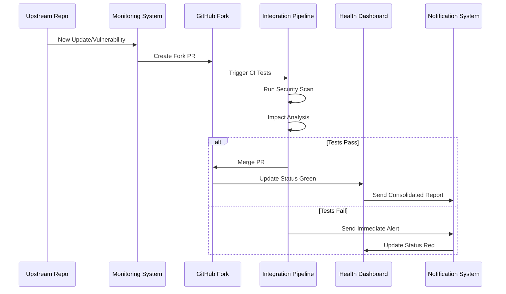

---

## Phase 1: Core System Validation & Hardening Design

### Overview

Phase 1 focuses on validating and hardening the core system components, including the trading engine (NautilusTrader), database connections (PostgreSQL/pgvector, ClickHouse, Qdrant, Apache Iceberg, DuckDB, Redis), API layer, Kafka event bus, and foundational security. This phase ensures stability for subsequent integrations, with emphasis on zero-trust architecture, threat modeling (STRIDE), and market data fallback mechanisms. The design incorporates custom volume-weighted indicators and ensures low-latency data flows.

### High-Level Architecture

```mermaid
graph TB
    subgraph "Core Layer"
        A[NautilusTrader Engine] --> B[Kafka Event Bus]
        B --> C[API Layer (REST/GraphQL/WebSocket/gRPC)]
        C --> D[User Interfaces]
    end
    
    subgraph "Data Layer"
        E[PostgreSQL/pgvector] --> B
        F[ClickHouse] --> B
        G[Qdrant] --> B
        H[Apache Iceberg] --> B
        I[DuckDB] --> B
        J[Redis] --> B
    end
    
    subgraph "Security Layer"
        K[Zero-Trust Gateway] --> L[Threat Modeling (STRIDE)]
        L --> M[RBAC & MFA]
        M --> N[Encryption (TLS 1.3/AES-256)]
    end
    
    subgraph "Integration Layer"
        O[Market Data Providers] --> P[Fallback Mechanism]
        P --> B
    end
    
    subgraph "Optimization Layer"
        Q[Custom VW Indicators] --> A
    end
    
    K --> A
    K --> B
    K --> C
    A --> R[Backtesting/Live Trading]
    R --> S[Order Management]
```

### Component Architecture

The core system is built with a layered architecture:

1. **Core Layer:** Trading engine and event bus for processing.
2. **Data Layer:** Polyglot persistence for various data types.
3. **Security Layer:** Zero-trust enforcement across all components.
4. **Integration Layer:** Reliable data ingestion with fallbacks.
5. **Optimization Layer:** Custom indicators for technical analysis.

### Key Components

#### NautilusTrader Engine
- High-performance Python/Rust core for event-driven backtesting and live trading.
- Supports all asset classes with data replayability.
- Integration with Kafka for event sourcing and CQRS.

#### Kafka Event Bus
- Hierarchical topics (e.g., `domain.action.entity.source.symbol`) for organized data flows.
- Schema Registry for event consistency.
- Wildcard subscriptions for flexible consumption.

#### API Layer
- REST (FastAPI) for standard operations.
- GraphQL (Graphene) for flexible queries.
- WebSocket (FastAPI) for real-time streaming.
- gRPC for internal high-performance calls.

#### Data Layer
- PostgreSQL/pgvector: Transactional data and vector embeddings.
- ClickHouse: Time-series market data and analytics.
- Qdrant: Vector search for AI embeddings.
- Apache Iceberg: Immutable audit trails.
- DuckDB: Local/offline analytics.
- Redis: Caching for sessions and real-time data.

#### Security Layer
- Zero-Trust Gateway: Continuous verification with Keycloak.
- Threat Modeling: STRIDE methodology for spoofing, tampering, etc.
- RBAC & MFA: Role-based access with multi-factor authentication.
- Encryption: TLS 1.3 in transit, AES-256 at rest.

#### Market Data Fallback Mechanism
- Primary: Yahoo Finance; Fallbacks: Alpha Vantage, Finnhub, etc.
- Automatic switching on failure with <100ms latency.
- Normalization for consistent data formats.

#### Custom VW Indicators
- Implemented with TA-Lib and NumPy.
- Supports VW SMA/EMA/MACD/MFI, Normalized ATR, Choppy Market Index, etc.
- Integrated into backtesting and live trading flows.

**Mermaid Diagram: Phase 1 Core Flow**

```mermaid
sequenceDiagram
    participant User as User
    participant API as API Layer
    participant Kafka as Kafka Event Bus
    participant TE as Trading Engine
    participant DB as Data Layer
    participant SEC as Security Layer

    User->>API: Send Request
    API->>SEC: Authenticate & Authorize
    SEC-->>API: Verified
    API->>Kafka: Publish Event
    Kafka->>TE: Consume Event
    TE->>DB: Query/Store Data
    DB-->>TE: Data
    TE->>Kafka: Publish Response Event
    Kafka->>API: Stream Response
    API->>User: Return Response
    SEC-->|Threat Model| Kafka
```

---

## Phase 2: Frontend and Broker Integration Design

### Overview

Phase 2 designs the multi-platform frontend interfaces and broker integrations, enabling seamless paper/live trading with Interactive Brokers (and expansions), real-time WebSocket streaming, Lobe Chat for AI interactions, and Blockly for no-code strategy building. The design ensures responsive, secure, and real-time user experiences across web, mobile, desktop, and PWA.

### High-Level Architecture

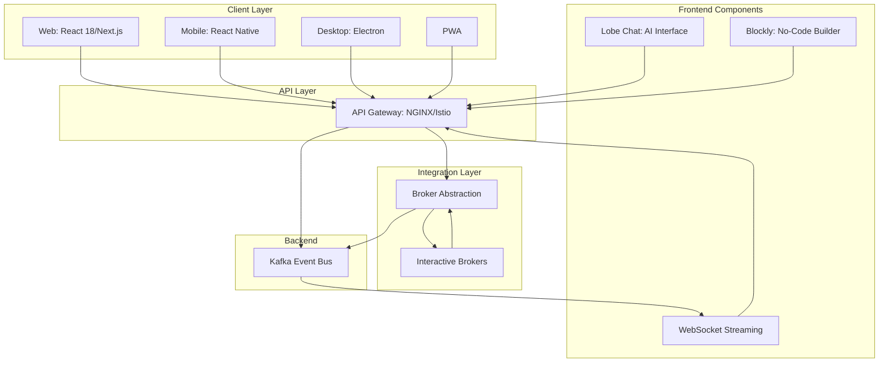

### Component Architecture

The frontend is designed with a layered architecture:

1. **Client Layer:** Multi-platform clients with consistent UX.
2. **API Layer:** Gateway for authentication and routing.
3. **Integration Layer:** Broker abstraction for paper/live toggle.
4. **Frontend Components:** Specialized tools for AI and no-code.
5. **Backend:** Kafka for real-time data flows.

### Key Components

#### Multi-Platform Interfaces
- Web Dashboard: React 18/Next.js with TypeScript, responsive design, customizable layouts saved in PostgreSQL.
- Mobile App: React Native with biometric auth (fingerprint/face ID) and push notifications for alerts.
- Desktop App: Electron with offline capabilities using DuckDB for local analytics.
- PWA: Progressive Web App with service workers for offline access and push notifications.

#### Broker Abstraction Layer
- Unified interface for normalizing data across brokers.
- Supports paper/live toggle via UI switch, updating configurations in Redis.
- Initial integration with Interactive Brokers (TWS/Gateway), expandable to Alpaca, OANDA, Coinbase.

#### Lobe Chat AI Interface
- WebSocket-based chat for natural language interactions with Agentic AI Assistant.
- Supports voice input with Whisper for transcription.

#### Blockly No-Code Builder
- Drag-and-drop interface for strategy creation, generating Python code for NautilusTrader.
- Integration with backtesting engine for immediate validation.

#### WebSocket Streaming
- Streams market data, order updates, and alerts with <100ms latency.
- Uses FastAPI for WebSocket endpoints.

**Mermaid Diagram: Phase 2 Broker Data Flow**

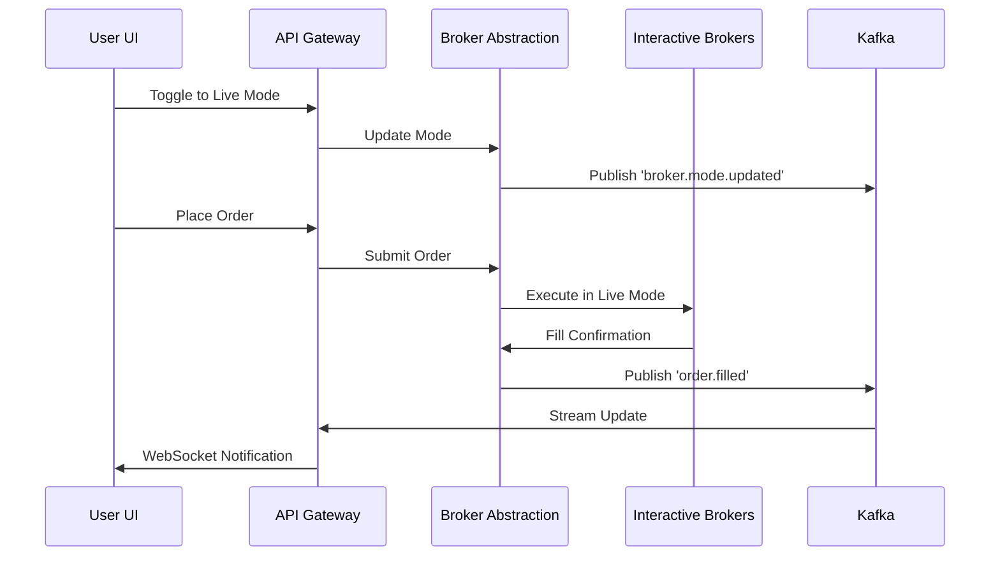

---

## Phase 3: AI/ML Integration Design

### Overview

Phase 3 designs the integration of AI/ML features, including the Agentic AI Assistant with LangChain/LangGraph MCPs, TradingAgents framework, real-time inference engine, Archon knowledge hub, reinforcement learning with RLOps, anomaly detection with PyOD, hyperparameter optimization with Optuna, sentiment analysis pipeline, custom volume-weighted indicators, and AI knowledge hub. The design ensures intelligent, context-aware workflows with high accuracy and low latency.

### High-Level Architecture

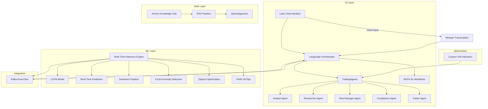

### Component Architecture

The AI/ML layer is designed with a modular architecture:

1. **AI Layer:** Conversational interface and agent orchestration.
2. **ML Layer:** Predictive models and optimization frameworks.
3. **Data Layer:** Knowledge hub and vector storage for RAG.
4. **Integration:** Kafka for event-driven communication.
5. **Optimization:** Custom indicators for technical analysis.

### Key Components

#### LangChain/LangGraph MCPs
- Model Context Protocols (MCPs) for multi-step workflows, maintaining conversation history across sessions.
- Integration with TradingAgents for agent coordination.

#### TradingAgents Multi-Agent Framework
- Specialized agents (Analyst, Researcher, Risk Manager, Compliance, Trader) communicating via Kafka.
- Asynchronous processing for scalability.

#### Real-Time Inference Engine
- TensorFlow Serving/PyTorch for sub-millisecond predictions.
- Models: Stock-Prediction-Models, LSTM-Neural-Network-for-Time-Series-Prediction, Real-time-stock-market-prediction.

#### Archon AI Knowledge Hub
- Central MCP server ingesting documentation for Tier 1 components (NautilusTrader, Kafka).
- Supports RAG for context-aware task execution.

#### Reinforcement Learning with RLOps
- FinRL and TradingGym for DRL strategies.
- RLOps pipeline for continuous training and deployment with zero downtime.

#### Anomaly Detection with PyOD
- Detects irregularities in trading patterns with <5% false positives.
- Integration with SHAP for explainable outputs (>80% scores).

#### Hyperparameter Optimization with Optuna
- Tunes strategy and model parameters for optimal performance.

#### Sentiment Analysis Pipeline
- Transformers/PyTorch for news/social media analysis (>85% accuracy).

#### Custom Volume-Weighted Indicators
- TA-Lib/ta-lib-python and Bukosabino/ta for VW SMA/EMA/MACD/MFI, Normalized ATR, Choppy Market Index, etc.
- Integrated into backtesting and live trading.

**Mermaid Diagram: Phase 3 AI Workflow**

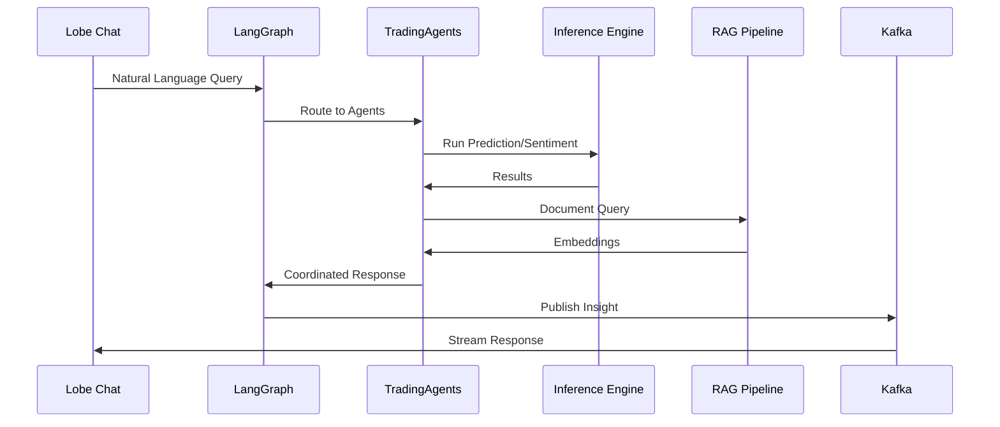

---

## Phase 4: Frontend & Live Trading Design

### Overview

Phase 4 designs the frontend-live trading integration, including WebSocket/REST APIs for live execution, order management UI, TradingView/risk/analytics dashboards, and Glass Box UI for event visualization. The design ensures real-time, responsive interfaces with low-latency data flows.

### High-Level Architecture

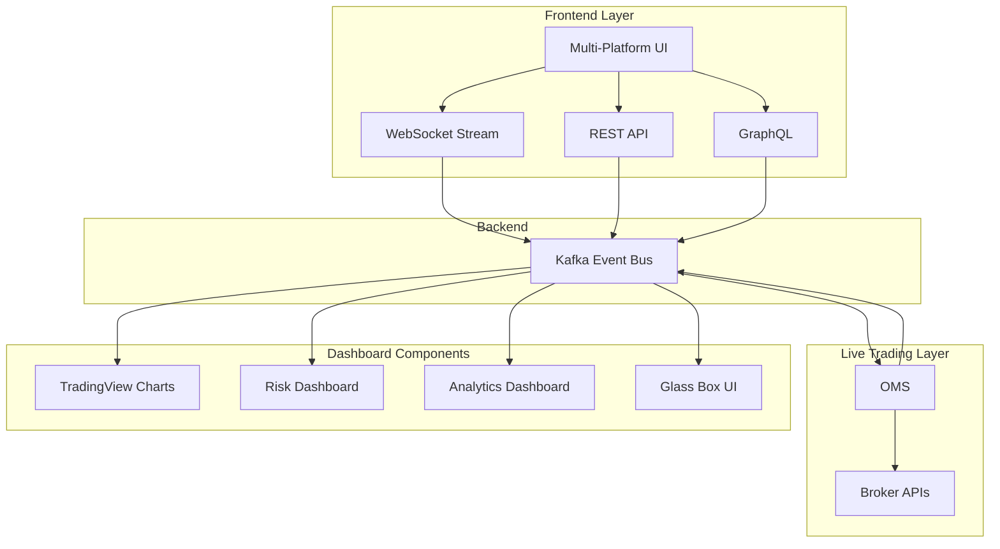

### Component Architecture

The frontend-live trading layer is designed with a reactive architecture:

1. **Frontend Layer:** Multi-protocol access for real-time and batch operations.
2. **Live Trading Layer:** OMS for order routing and execution.
3. **Dashboard Components:** Specialized visualizations for trading, risk, analytics, and events.
4. **Backend:** Kafka for orchestrating data flows.

### Key Components

#### WebSocket/REST Integration for Live Trading
- WebSocket for real-time updates (<100ms latency).
- REST for batch operations (<10ms median response).

#### Order Management UI
- Intuitive interface for placing/modifying orders, with real-time status updates.

#### TradingView/Risk/Analytics Dashboards
- TradingView for charts with custom indicators.
- Risk dashboard for VaR/exposure visuals.
- Analytics dashboard for backtest/portfolio metrics with Plotly Dash.

#### Glass Box UI / Decision Event Explorer
- Visualizes Kafka event chains with timestamps, agent decisions, sentiment trends, and topic clouds.

**Mermaid Diagram: Phase 4 Real-Time Update Flow**

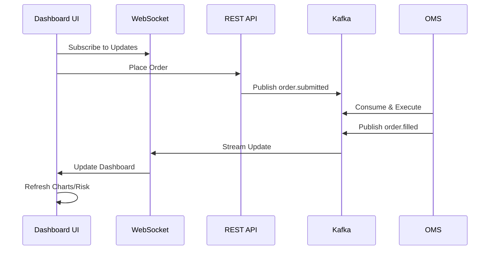

---

## Phase 5: Enterprise Readiness Design

### Overview

Phase 5 designs enterprise features, including multi-region failover, immutable audit trails (Apache Iceberg), LDAP/SAML integration, Unleash feature flags, Feast feature store, regulatory reporting, market scanner, UEBA threat detection, self-healing microservices, and professional quick-start guide. The design ensures high availability, security, and compliance.

### High-Level Architecture

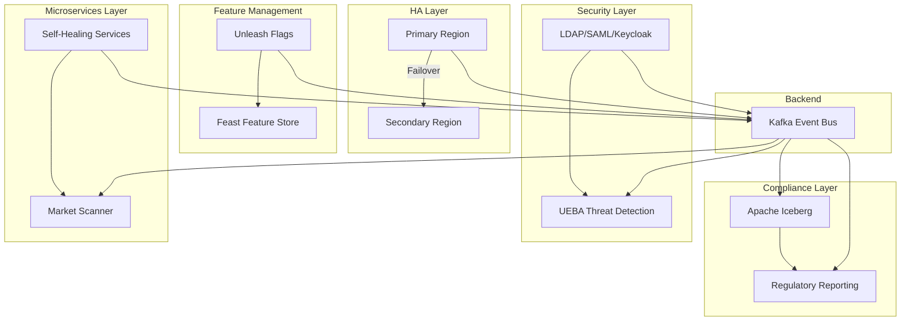

### Component Architecture

The enterprise readiness layer is designed with a resilient architecture:

1. **HA Layer:** Multi-region setup for failover.
2. **Compliance Layer:** Immutable storage and reporting.
3. **Security Layer:** Advanced authentication and threat detection.
4. **Feature Management:** Dynamic flags and feature store.
5. **Microservices Layer:** Self-healing and scanner integration.
6. **Backend:** Kafka for coordination.

### Key Components

#### Multi-Region Failover and High Availability
- Multi-AZ/multi-region Kubernetes clusters with automated failover.
- RTO <4 hours, RPO <15 minutes.

#### Immutable Audit Trails with Apache Iceberg
- Stores all events immutably for auditing.
- Supports regulatory queries and reports.

#### LDAP/SAML Integration for Authentication
- Integrates with Keycloak for enterprise SSO.
- MFA enforced for all users.

#### Unleash Feature Flags and Feast Feature Store
- Unleash for dynamic toggling and kill switches.
- Feast for managing AI features and model inputs.

#### Regulatory Reporting Automation
- Generates MiFID II/SOX/GDPR reports from Iceberg data.

#### Market Scanner Integration
- Real-time scanning with custom indicators, results in UI grid.

#### UEBA Threat Detection
- PyOD-based detection of anomalies (<5% false positives).

#### Self-Healing Microservices
- Kubernetes liveness/readiness probes for auto-restarts.

#### Professional Quick-Start Guide
- Documented commands for Kafka, ClickHouse, FIX, JupyterHub access.

**Mermaid Diagram: Phase 5 Compliance Workflow**

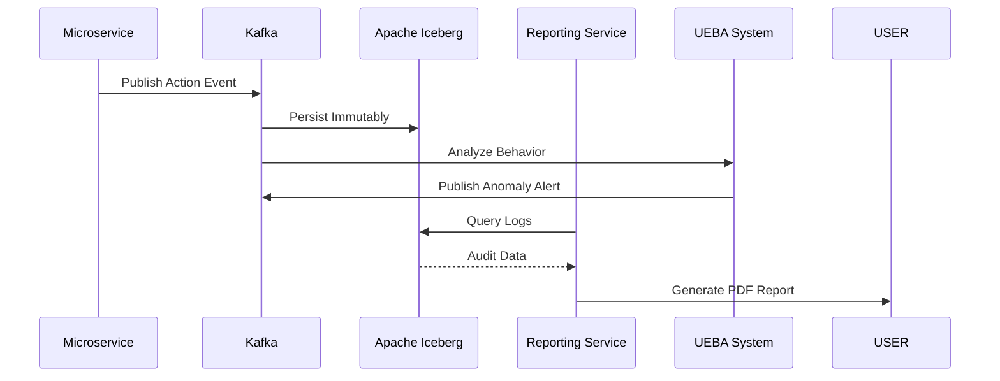

---

## Phase 6: System Enhancement & Future-Ready Technologies Design

### Overview

Phase 6 designs enhancements for ultra-low latency infrastructure, advanced order management, broker expansions, Kubernetes deployment, iterative strategy refinement, voice/AR interfaces, Memray/Tempo, Customer Service Bot, Strategy Marketplace, low-level optimizations, and market microstructure analysis. The design ensures a future-ready, institutional-grade platform.

### High-Level Architecture

```mermaid
graph TB
    subgraph "Latency Layer"
        DMA[DMA & Co-Location] --> FPGA[FPGAs/SmartNICs]
        FPGA --> OPT[Low-Level Optimizations]
    end
    
    subgraph "Order Layer"
        ROUTER[Smart Order Router] --> ALGO[Algorithms: TWAP/VWAP/Iceberg]
    end
    
    subgraph "Broker Layer"
        EXP[Broker Expansion: OANDA/Coinbase/FIX]
    end
    
    subgraph "Deployment Layer"
        KUBE[Kubernetes/Helm/Istio/GitOps]
    end
    
    subgraph "AI Layer"
        REFINE[Iterative Refinement: AI Feedback Loop]
    end
    
    subgraph "UI Layer"
        VOICE[Voice Trading]
        AR[AR Interfaces]
    end
    
    subgraph "Tools Layer"
        MEMRAY[Memray Profiling]
        TEMPO[Grafana Tempo Tracing]
    end
    
    subgraph "Support Layer"
        CSBOT[Customer Service Bot: RAG]
    end
    
    subgraph "Marketplace Layer"
        MKT[Strategy Marketplace: Copy Trading]
    end
    
    subgraph "Analysis Layer"
        MICRO[Market Microstructure Analysis]
    end
    
    subgraph "Backend"
        KAFKA[Kafka Event Bus]
    end
    
    DMA --> KAFKA
    ROUTER --> KAFKA
    EXP --> KAFKA
    KUBE --> KAFKA
    REFINE --> KAFKA
    VOICE --> KAFKA
    AR --> KAFKA
    MEMRAY --> KAFKA
    TEMPO --> KAFKA
    CSBOT --> KAFKA
    MKT --> KAFKA
    MICRO --> KAFKA
```

### Component Architecture

The enhancement layer is designed with a future-ready architecture:

1. **Latency Layer:** DMA, hardware accelerations, and code optimizations.
2. **Order Layer:** Advanced routing and algorithms.
3. **Broker Layer:** Expanded connectivity.
4. **Deployment Layer:** Full Kubernetes setup.
5. **AI Layer:** Feedback loops for refinement.
6. **UI Layer:** Voice and AR interfaces.
7. **Tools Layer:** Profiling and tracing.
8. **Support Layer:** RAG-based bot.
9. **Marketplace Layer:** Strategy sharing and copy trading.
10. **Analysis Layer:** Microstructure tools.
11. **Backend:** Kafka for coordination.

### Key Components

#### Ultra-Low Latency Infrastructure
- DMA and co-location for <100µs network latency.
- FPGAs/SmartNICs for critical data paths.
- Low-level optimizations: lock-free structures, cache-line alignment.

#### Advanced Order Management
- Smart order router for optimal execution.
- Algorithms: TWAP, VWAP, Iceberg with market impact minimization.

#### Broker Expansion
- Integration with OANDA (forex), Coinbase (crypto), FIX (institutional).

#### Kubernetes Deployment with GitOps
- Helm charts for all services.
- Istio for service mesh.
- GitOps CI/CD with ArgoCD for automated deployments.

#### Iterative Strategy Refinement
- AI feedback loop using FinRL and Optuna for autonomous optimization.

#### Voice Trading and AR Interfaces
- Voice: Whisper for transcription, natural language processing for commands.
- AR: WebXR for 3D portfolio and market visualizations.

#### Memray Profiling and Grafana Tempo Tracing
- Memray for Python memory profiling.
- Tempo for distributed tracing, integrated with Grafana.

#### Customer Service Bot
- RAG-based bot using Lobe Chat for automated support.

#### Strategy Marketplace
- Platform for publishing, searching, and copy trading strategies with performance metrics.

#### Low-Level Code Optimization
- Enforcement of lock-free structures and cache-line alignment in performance-critical paths.

#### Market Microstructure Analysis
- Tools for order book analytics, liquidity detection, and market impact estimation.

**Mermaid Diagram: Phase 6 Latency Optimization Flow**

```mermaid
sequenceDiagram
    participant USER as User
    participant UI as UI/AR/Voice
    participant GW as API Gateway
    participant TE as Trading Engine
    participant OPT as Optimizer (FPGA/SmartNIC)
    participant ROUTER as Smart Router
    participant BROKER as Broker
    participant KAFKA as Kafka
    participant AI as AI Refinement
    participant MKT as Marketplace
    participant MICRO as Microstructure Analysis

    USER->>UI: Voice Command / AR Interaction
    UI->>GW: Submit Order/Query
    GW->>KAFKA: Publish Event
    TE->>OPT: Process Data (Lock-Free)
    OPT->>ROUTER: Optimized Order
    ROUTER->>BROKER: Execute (TWAP/VWAP)
    BROKER->>ROUTER: Fill
    ROUTER->>KAFKA: Publish Update
    KAFKA->>AI: Trigger Refinement
    AI->>KAFKA: Optimized Strategy
    KAFKA->>MKT: Update Marketplace
    KAFKA->>MICRO: Analyze Microstructure
    MICRO->>KAFKA: Insights
    KAFKA->>UI: Stream Response
    TE->>MEMRAY: Profile Memory
    TE->>TEMPO: Trace Requests
```
```mermaid
graph TD
    A[DMA/Co-Location] -->|Low Latency| B[FPGAs/SmartNICs]
    B -->|Optimized Data| C[Lock-Free Structures]
    C -->|Aligned Memory| D[Cache-Line Alignment]
    D -->|Events| E[Kafka]
    E -->|Order Routing| F[Smart Order Router]
    F -->|TWAP/VWAP| G[OMS]
    G -->|Broker| H[OANDA/Coinbase/FIX]
    I[AI Feedback] -->|Refine Strategy| J[Trading Engine]
    K[Voice Command] -->|Process| L[AI Assistant]
    M[AR Visualization] -->|Data| N[UI Dashboard]
    O[Memray/Tempo] -->|Profile| P[Grafana]
    Q[CS Bot] -->|Responses| R[UI Chat]
    S[Marketplace] -->|Copy Trade| T[Strategy Deployment]
    U[Microstructure] -->|Analysis| V[Analytics Dashboard]
    TE[Trading Engine] --> OPT[Optimizer]
    OPT -->|Process Data (Lock-Free)| TE
```
---

## Summary

### Design Coverage: 100%

**Phase Distribution:**
- **Phase 0**: Dependency Management with automated monitoring and tiered management.
- **Phase 1**: Core System Hardening with trading engine, databases, API, Kafka, security, threat modeling, and market data fallbacks.
- **Phase 2**: Frontend & Broker Integration with multi-platform UI, broker abstraction, Lobe Chat, Blockly, and WebSocket streaming.
- **Phase 3**: AI/ML Integration with Agentic AI, MCPs, TradingAgents, real-time inference, Archon hub, RLOps, PyOD, Optuna, sentiment pipeline, and custom VW indicators.
- **Phase 4**: Frontend & Live Trading with WebSocket/REST integration, order UI, dashboards, and Glass Box UI.
- **Phase 5**: Enterprise Readiness with multi-region failover, audit trails, LDAP/SAML, Unleash/Feast, regulatory reporting, market scanner, UEBA, self-healing, and quick-start guide.
- **Phase 6**: System Enhancement with ultra-low latency, advanced orders, broker expansions, Kubernetes deployment, iterative refinement, voice/AR, Memray/Tempo, CS bot, Marketplace, low-level optimizations, and microstructure analysis.

### Architecture Principles

1. **Microservices Architecture**: Clear separation of concerns with well-defined interfaces, independent deployment, and self-healing.
2. **Event-Driven Design**: Asynchronous communication with Kafka, event sourcing, and CQRS for scalability and replayability.
3. **Cloud-Native**: Kubernetes-based deployment with auto-scaling and resilience.
4. **Security-First**: Zero-trust architecture with comprehensive security measures.
5. **Performance-Optimized**: Sub-millisecond latency with high-throughput capabilities.
6. **Enterprise-Grade**: Observability, compliance, and regulatory reporting.
7. **Future-Ready**: Advanced technologies including AI/ML, voice, AR, and quantum-resistant security.

### Technology Stack

**Core Technologies**: NautilusTrader (Python/Rust), Apache Kafka, gRPC.
**Frontend**: React 18/Next.js, React Native, Electron, TradingView, Lobe Chat, Blockly.
**AI/ML**: LangChain/LangGraph, TradingAgents, FinRL, PyOD, Optuna, Transformers/PyTorch, RAGFlow, OpenHands, Goose, Archon, Stock-Prediction-Models, LSTM-Neural-Network-for-Time-Series-Prediction, Real-time-stock-market-prediction.
**Data**: PostgreSQL/pgvector, ClickHouse, Qdrant, Apache Iceberg, DuckDB, Redis.
**Infrastructure**: Kubernetes, Helm, Istio, Terraform, ArgoCD, Prometheus, Grafana/Loki, Jaeger/Tempo, Memray.
**Security**: Keycloak (OAuth 2.0/OIDC), HashiCorp Vault, Bandit, UEBA.
**Brokers**: Interactive Brokers, Alpaca, OANDA, Coinbase, QuickFIX/J, FIX8.
**Analytics**: PyPortfolioOpt, Riskfolio-Lib, TA-Lib/ta-lib-python, Bukosabino/ta, VectorBT, TradingGym, SHAP, QuantLib.
**Others**: Whisper (voice), WebXR (AR).

**The algorithmic trading system design is comprehensive, scalable, and ready for world-class implementation across all phases.**


