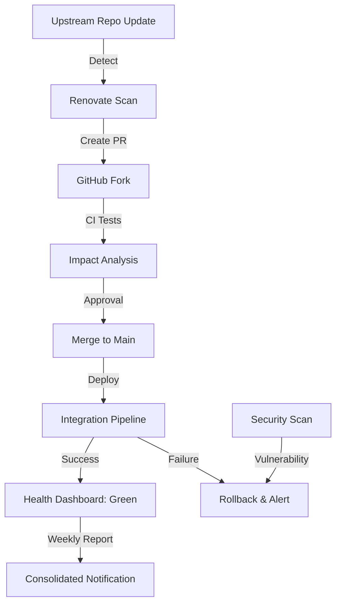
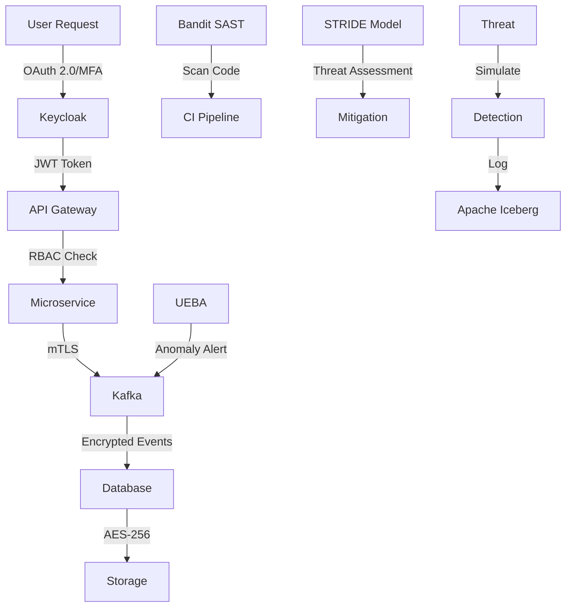
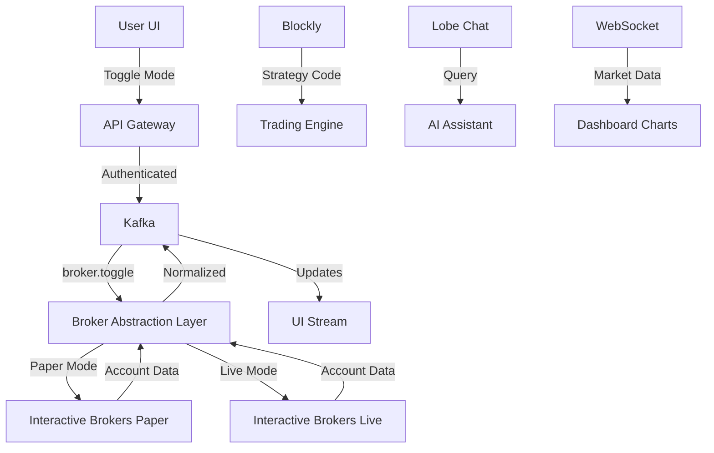
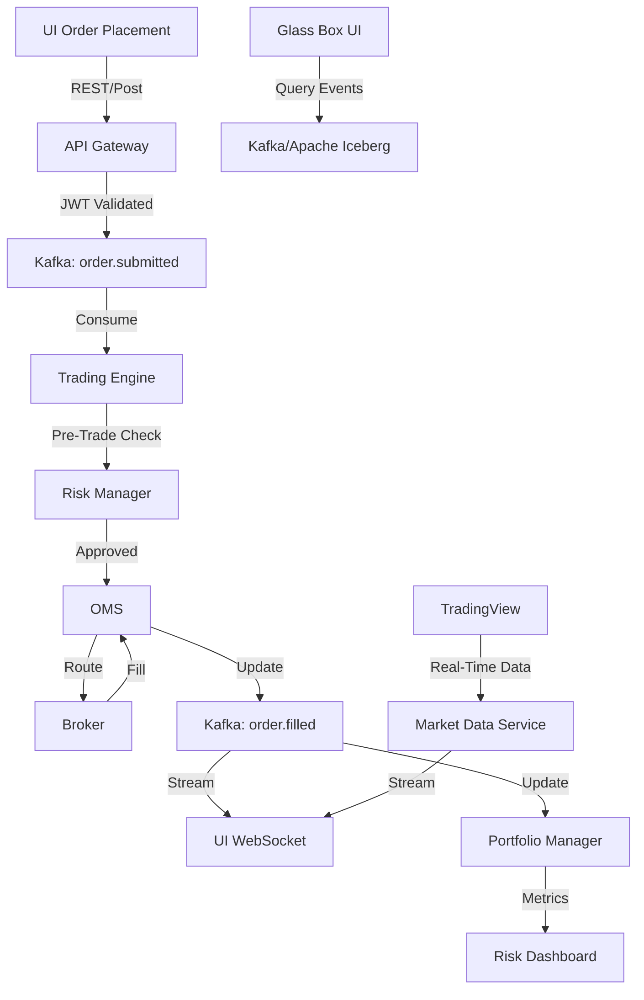
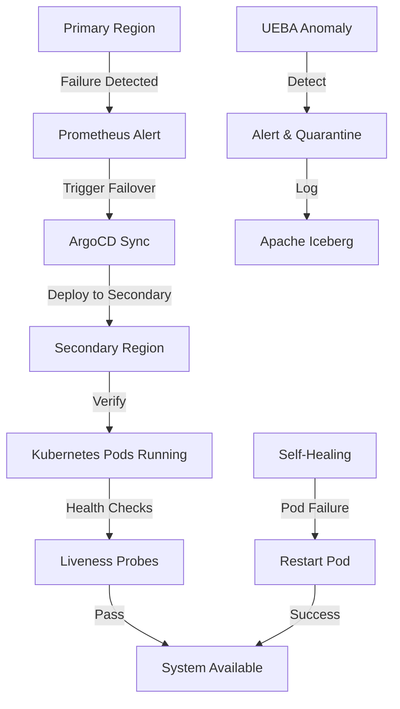
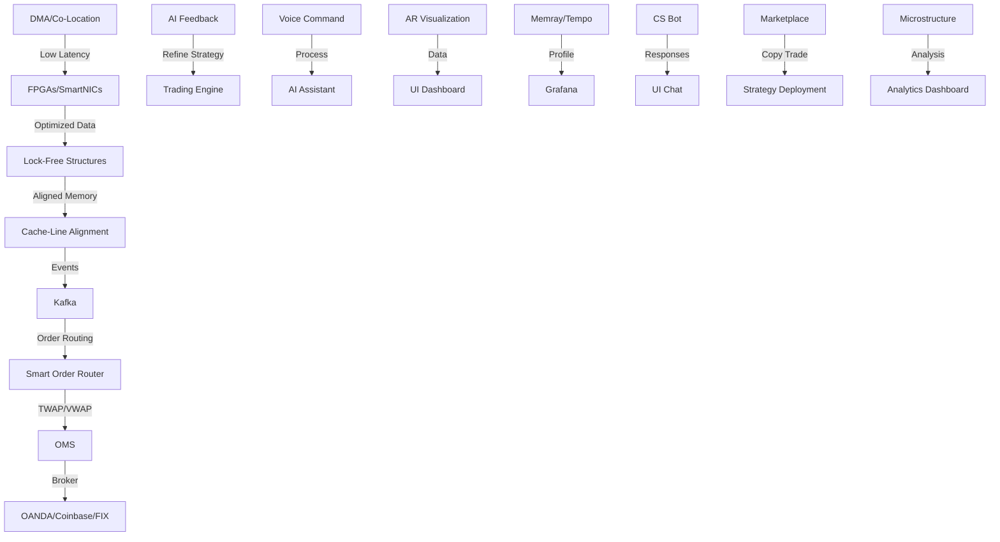

# Complete Requirements Document - Algorithmic Trading System

## Overview

This document consolidates all requirements from phases 0-6 of the algorithmic trading system development. Each phase builds upon the previous phases to create a comprehensive, enterprise-grade trading platform. The platform adopts a "Best-of-Breed" integration strategy, selecting leading open-source projects for each major component to ensure a modular, scalable, and high-performance foundation. It supports a diverse user base, from non-technical retail investors (via intuitive no-code tools and natural language interfaces) to professional quantitative analysts (via advanced Python-based development environments and enterprise-grade features). The system leverages AI Agents and Agentic AI extensively to provide intelligent, automated trading capabilities.

The architecture is composed of distinct microservices communicating through an Apache Kafka event bus, enabling asynchronous, event-driven processing. This design decouples services, ensures data replayability for robust testing and auditing, and scales to handle high-frequency data streams. Key highlights include a sophisticated Agentic AI Assistant as the platform's "brain," supporting natural language management of trading, research, and analysis. The core trading engine, NautilusTrader, is a high-performance Python-based platform with Rust components, supporting event-driven backtesting and live trading across all asset classes (stocks, ETFs, futures, options, forex, commodities, cryptocurrencies).

The system integrates advanced forecasting models (Stock-Prediction-Models, LSTM-Neural-Network-for-Time-Series-Prediction, Real-time-stock-market-prediction), GPU-accelerated backtesting (VectorBT), flexible strategy environments (TradingGym), portfolio optimization (PyPortfolioOpt, Riskfolio-Lib), anomaly detection (PyOD), no-code strategy building (Blockly), visualization tools (react-financial-charts, Plotly Dash), explainable AI (SHAP), reinforcement learning (FinRL), and advanced NLP (Transformers, PyTorch), alongside options analytics (QuantLib).

**Key Characteristics:**
- **High Performance:** Microsecond-level latency for trading operations, achieved through optimized code paths, lock-free data structures, cache-line alignment, and hardware accelerations like FPGAs/SmartNICs.
- **Scalable:** Horizontal scaling across multiple nodes, supporting 10,000+ concurrent users and >1M messages/second throughput.
- **Resilient:** Fault-tolerant with automatic failover, self-healing microservices, and multi-region deployments.
- **Secure:** Enterprise-grade security with zero-trust architecture, RBAC, MFA, AES-256 encryption at rest, TLS 1.3 in transit, SAST (Bandit), and UEBA for threat detection.
- **Observable:** Comprehensive monitoring and alerting with Prometheus, Grafana, Loki/ELK, Jaeger/Tempo, and Memray for profiling.

**Architecture Principles:**
1. **Microservices Architecture:** Service decomposition by business capability, independent deployment, technology diversity, fault isolation, and automated self-healing to minimize downtime and prevent cascading failures.
2. **Event-Driven Architecture:** Asynchronous communication via events, event sourcing for state changes, CQRS for command/query separation, and real-time event processing to support high-frequency trading.
3. **Cloud-Native Design:** Container-first with Docker, Kubernetes orchestration, adherence to 12-Factor App principles, and IaC for all infrastructure.
4. **API-First Design:** Standard REST interfaces, flexible GraphQL queries, real-time WebSocket streams, high-performance gRPC for internal communication, and FIX protocol for institutional connectivity.

The system ensures research-to-production parity, with seamless transitions from backtesting to live trading, and supports advanced features like voice trading, AR interfaces, market microstructure analysis, and a Strategy Marketplace with copy trading capabilities.

---

# Requirements Document - Phase 0: Dependency Management Setup

## Introduction

Phase 0 establishes the foundational framework for managing all external dependencies and best-of-breed components used throughout the algorithmic trading system. This phase implements automated monitoring, update management, and integration pipelines for over 60 external repositories and components (e.g., NautilusTrader, LangChain, PyPortfolioOpt, QuantLib, RAGFlow, etc.), ensuring system stability, security, and compliance through proactive dependency management. It sets up tiered categories for dependencies based on criticality, with customized forks for core components to maintain control over updates and customizations.

## Requirements

### Requirement 1: Best-of-Breed Component Repository Management

**User Story:** As a system architect, I want comprehensive management of all external dependencies and forked repositories, so that I can maintain control over critical components and ensure system stability.

#### Acceptance Criteria

1. WHEN external repositories are forked THEN they SHALL be organized into tiered categories based on criticality (Tier 1: Core like NautilusTrader, LangGraph; Tier 2: Important like PyPortfolioOpt, Riskfolio-Lib; Tier 3: Supporting like Lobe Chat, Whisper; Tier 4: Infrastructure like Apache Kafka, Istio).
2. WHEN repository forks are created THEN proper branch protection rules and access controls SHALL be established, including required reviews, code owners, and restricted push access.
3. WHEN customizations are made THEN they SHALL be tracked and documented with clear change management, including detailed commit messages, PR descriptions, and a CHANGELOG.md in each fork.
4. WHEN upstream changes occur THEN impact assessment SHALL be performed automatically, including compatibility checks, security scans, and performance benchmarks.
5. WHEN integration points are defined THEN they SHALL be documented and validated regularly, with API contracts and test suites for each dependency.

### Requirement 2: Automated Update Monitoring System

**User Story:** As a DevOps engineer, I want automated monitoring of all external dependencies, so that I can proactively manage updates and security vulnerabilities across all components.

#### Acceptance Criteria

1. WHEN monitoring workflows execute THEN they SHALL check all 60+ repositories according to their tier priority, with daily scans for Tier 1 and weekly for Tier 4.
2. WHEN updates are detected THEN impact analysis SHALL be performed automatically with severity classification (critical, high, medium, low) based on changelogs, CVE databases, and semantic versioning.
3. WHEN security vulnerabilities are found THEN immediate notifications SHALL be triggered with remediation guidance, including automated PRs for patches where possible.
4. WHEN breaking changes are detected THEN detailed impact reports SHALL be generated with migration paths, including affected microservices (e.g., Trading Engine integration with NautilusTrader).
5. WHEN monitoring fails THEN fallback mechanisms SHALL ensure continuous monitoring coverage, such as redundant scanners or manual fallback alerts.

### Requirement 3: Tiered Monitoring and Notification Strategy

**User Story:** As a project manager, I want tiered monitoring based on component criticality, so that I can prioritize attention and resources on the most important dependencies.

#### Acceptance Criteria

1. WHEN Tier 1 (Critical) components are monitored THEN daily monitoring with immediate notifications SHALL be implemented, including real-time alerts for CVEs or breaking changes in NautilusTrader or LangGraph.
2. WHEN Tier 2 (Important) components are monitored THEN daily monitoring with standard notifications SHALL be implemented, e.g., for PyPortfolioOpt updates affecting portfolio optimization.
3. WHEN Tier 3 (Supporting) components are monitored THEN weekly monitoring with batch notifications SHALL be implemented, e.g., for Lobe Chat or Whisper updates.
4. WHEN Tier 4 (Infrastructure) components are monitored THEN weekly monitoring with summary notifications SHALL be implemented, e.g., for Apache Kafka or Istio.
5. WHEN notification thresholds are exceeded THEN escalation procedures SHALL be triggered automatically, including alerts to CCB for Tier 1 issues.

### Requirement 4: Consolidated Notification and Reporting

**User Story:** As a development team lead, I want consolidated weekly reports of all dependency updates, so that I can make informed decisions about update priorities and resource allocation.

#### Acceptance Criteria

1. WHEN weekly reports are generated THEN they SHALL include all updates across all tiers in a single consolidated message, with summaries of changes, impacts, and recommended actions.
2. WHEN notifications are sent THEN they SHALL be delivered through multiple channels (Slack, Email, GitHub Issues, Microsoft Teams) with configurable preferences per user/role.
3. WHEN update summaries are created THEN they SHALL include impact assessment and recommended actions, e.g., "NautilusTrader v2.1.0 introduces breaking API change; migration required for Trading Engine."
4. WHEN critical updates are detected THEN immediate notifications SHALL bypass the weekly consolidation, with high-priority alerts for security vulnerabilities.
5. WHEN notification delivery fails THEN backup channels SHALL ensure message delivery, with logging of failures in Grafana Loki.

### Requirement 5: Update Integration Pipeline

**User Story:** As a software engineer, I want automated integration pipelines for dependency updates, so that I can seamlessly incorporate changes while maintaining system integrity.

#### Acceptance Criteria

1. WHEN update PRs are created THEN they SHALL trigger automated CI pipelines with unit tests, integration tests, and performance benchmarks specific to the dependency (e.g., backtesting speed for NautilusTrader updates).
2. WHEN pipeline tests pass THEN the update SHALL be merged automatically for non-critical tiers, with manual approval for Tier 1.
3. WHEN integration fails THEN rollback procedures SHALL be automated, with detailed error reports and suggested fixes.
4. WHEN updates affect multiple components THEN end-to-end tests SHALL be triggered, e.g., testing AI Assistant integration with updated LangGraph.
5. WHEN all updates are integrated THEN system-wide regression tests SHALL be executed to verify no unintended impacts.

### Requirement 6: Dependency Health Dashboard

**User Story:** As a system administrator, I want a centralized health dashboard for all dependencies, so that I can monitor status, vulnerabilities, and update progress at a glance.

#### Acceptance Criteria

1. WHEN the dashboard is accessed THEN it SHALL display real-time status for all tiers, including version, last update, vulnerabilities, and health metrics (e.g., uptime, latency for API dependencies).
2. WHEN filters are applied THEN the dashboard SHALL support tier-based, component-based, and severity-based views.
3. WHEN alerts are triggered THEN the dashboard SHALL show visual indicators (red/yellow/green) with drill-down details.
4. WHEN reports are generated THEN weekly PDF exports SHALL be available with historical trends.
5. WHEN dashboard data is updated THEN it SHALL pull from Renovate, CVE databases, and GitHub APIs in real-time.

**Mermaid Diagram: Dependency Management Flow**

---

# Requirements Document - Phase 1: Core System Validation & Hardening

## Introduction

Phase 1 focuses on validating and hardening the core system components, including the trading engine, database connections, API layer, Kafka event bus, and foundational security. This phase ensures stability for subsequent integrations, with emphasis on zero-trust architecture, threat modeling, and market data fallback mechanisms.

## Requirements

### Requirement 1: Core Trading Engine Validation

**User Story:** As a system architect, I want the core trading engine (NautilusTrader) validated for backtesting and live trading, so that it forms a reliable foundation for the system.

#### Acceptance Criteria

1. WHEN backtesting is executed THEN it SHALL process historical data with realistic simulation (slippage, fees, latency) for all asset classes.
2. WHEN live trading is tested THEN it SHALL handle paper/live modes with Interactive Brokers integration.
3. WHEN custom indicators are integrated THEN all VW indicators (VW SMA/EMA/MACD/MFI, Normalized ATR, Choppy Market Index, etc.) SHALL compute accurately using TA-Lib and NumPy.
4. WHEN performance is measured THEN latency SHALL be <1ms for order processing.
5. WHEN validation fails THEN automated alerts SHALL be sent with detailed logs.

### Requirement 2: Database Connection Hardening

**User Story:** As a database administrator, I want secure and reliable connections to all databases (PostgreSQL/pgvector, ClickHouse, Qdrant, Apache Iceberg, DuckDB, Redis), so that data persistence is robust.

#### Acceptance Criteria

1. WHEN connections are established THEN they SHALL use encrypted channels (TLS 1.3) with connection pooling.
2. WHEN failover is tested THEN automatic switching to replicas SHALL occur with RPO <15 minutes.
3. WHEN data is inserted/retrieved THEN operations SHALL succeed with latency <10ms for Redis, <100ms for others.
4. WHEN schemas are validated THEN they SHALL match defined models for users, strategies, market data, etc.
5. WHEN backups are configured THEN daily snapshots SHALL be taken with PITR support.

### Requirement 3: API Layer Setup

**User Story:** As a developer, I want the foundational API layer (REST, GraphQL, WebSocket, gRPC) set up, so that internal and external communications are enabled.

#### Acceptance Criteria

1. WHEN REST endpoints are called THEN they SHALL respond with <10ms median latency.
2. WHEN GraphQL queries are executed THEN they SHALL support flexible data retrieval with subscriptions.
3. WHEN WebSocket connections are tested THEN real-time streaming SHALL handle >1M messages/second.
4. WHEN gRPC calls are made THEN internal service communication SHALL be high-performance (<1ms).
5. WHEN API documentation is generated THEN OpenAPI/Swagger SHALL be available for all endpoints.

### Requirement 4: Kafka Event Bus Implementation

**User Story:** As a DevOps engineer, I want the Apache Kafka event bus implemented with hierarchical topics, so that asynchronous communication is decoupled and scalable.

#### Acceptance Criteria

1. WHEN topics are created THEN they SHALL follow hierarchical naming (e.g., `domain.action.entity.source.symbol`).
2. WHEN events are published/consumed THEN they SHALL use Schema Registry for consistency.
3. WHEN wildcard subscriptions are tested THEN services SHALL receive relevant events.
4. WHEN throughput is measured THEN >1M messages/second SHALL be handled with <100µs latency.
5. WHEN replayability is verified THEN historical events SHALL be replayed for testing.

### Requirement 5: Zero-Trust Security Implementation

**User Story:** As a security officer, I want a zero-trust security model implemented, so that all access is verified and secured.

#### Acceptance Criteria

1. WHEN authentication is tested THEN OAuth 2.0/OIDC with MFA SHALL be enforced.
2. WHEN authorization is verified THEN RBAC SHALL restrict access based on roles (trader, quant, admin).
3. WHEN encryption is checked THEN data in transit SHALL use TLS 1.3 and at rest AES-256.
4. WHEN SAST scans are run THEN Bandit SHALL detect no critical vulnerabilities.
5. WHEN UEBA is tested THEN anomalies SHALL be detected with <5% false positives.

### Requirement 6: Threat Modeling

**User Story:** As a security architect, I want threat modeling using STRIDE methodology, so that potential vulnerabilities are identified and mitigated.

#### Acceptance Criteria

1. WHEN spoofing threats are tested THEN authentication SHALL prevent identity forgery.
2. WHEN tampering threats are tested THEN data integrity SHALL be maintained with hashing.
3. WHEN repudiation threats are tested THEN audit trails SHALL log all actions immutably.
4. WHEN information disclosure threats are tested THEN encryption SHALL protect sensitive data.
5. WHEN denial of service threats are tested THEN rate limiting and auto-scaling SHALL maintain availability.
6. WHEN elevation of privilege threats are tested THEN RBAC SHALL prevent unauthorized access.

### Requirement 7: Market Data Fallback Mechanism

**User Story:** As a trader, I want automatic fallback for market data sources, so that data availability is ensured.

#### Acceptance Criteria

1. WHEN primary source (Yahoo Finance) fails THEN fallback to Alpha Vantage SHALL occur seamlessly.
2. WHEN all sources are tested THEN data normalization SHALL maintain consistency.
3. WHEN failover latency is measured THEN switching SHALL happen in <100ms.
4. WHEN historical data is requested THEN >5 years of options chains SHALL be available.
5. WHEN dividend forecasts are integrated THEN they SHALL be included in analytics.

**Mermaid Diagram: Phase 1 Security Flow**

---

# Requirements Document - Phase 2: Frontend and Broker Integration

## Introduction

Phase 2 focuses on developing multi-platform user interfaces, integrating brokers for paper/live trading, and enabling real-time streaming, including Lobe Chat for AI interactions and Blockly for no-code strategies.

## Requirements

### Requirement 1: Multi-Platform UI Development

**User Story:** As a user, I want consistent interfaces across web, mobile, desktop, and PWA, so that I can access the platform from any device.

#### Acceptance Criteria

1. WHEN the web interface is accessed THEN it SHALL be responsive with Next.js/React 18, supporting customizable dashboards.
2. WHEN the mobile app is used THEN it SHALL support React Native with biometric authentication and push notifications.
3. WHEN the desktop app is launched THEN it SHALL use Electron with offline analytics via DuckDB.
4. WHEN the PWA is installed THEN it SHALL provide progressive access with service workers for offline functionality.
5. WHEN interfaces are tested THEN they SHALL comply with WCAG 2.1 and load in <2s.

### Requirement 2: Broker Integration with Paper/Live Toggle

**User Story:** As a trader, I want seamless integration with Interactive Brokers and a paper/live toggle, so that I can test strategies safely.

#### Acceptance Criteria

1. WHEN IBKR is connected THEN paper/live modes SHALL toggle without restarting.
2. WHEN orders are placed THEN they SHALL route correctly in each mode.
3. WHEN account data is fetched THEN balances and positions SHALL update in real-time.
4. WHEN toggle is switched THEN UI SHALL reflect the mode with visual indicators.
5. WHEN errors occur THEN fallback mechanisms SHALL handle disconnections.

### Requirement 3: Lobe Chat Integration for AI Assistant

**User Story:** As a user, I want an integrated chat interface for the AI Assistant, so that I can query and interact naturally.

#### Acceptance Criteria

1. WHEN Lobe Chat is opened THEN it SHALL connect to the AI Assistant via WebSocket.
2. WHEN queries are sent THEN responses SHALL return in <2s with >85% accuracy.
3. WHEN voice input is used THEN transcription SHALL achieve >95% accuracy.
4. WHEN documents are uploaded THEN RAG SHALL process them for contextual queries.
5. WHEN chat history is accessed THEN MCPs SHALL maintain context across sessions.

### Requirement 4: Blockly No-Code Strategy Builder

**User Story:** As a non-technical user, I want a visual strategy builder, so that I can create strategies without coding.

#### Acceptance Criteria

1. WHEN blocks are dragged THEN they SHALL connect for logic (indicators, orders, conditions).
2. WHEN code is generated THEN it SHALL be clean Python compatible with NautilusTrader.
3. WHEN strategies are saved THEN they SHALL be stored in PostgreSQL with version control.
4. WHEN backtests are run THEN results SHALL display in the UI with metrics.
5. WHEN strategies are deployed THEN they SHALL integrate with the Trading Engine.

### Requirement 5: Real-Time WebSocket Streaming

**User Story:** As a trader, I want real-time data streaming, so that I can monitor markets and portfolios live.

#### Acceptance Criteria

1. WHEN WebSocket is connected THEN it SHALL stream market data with <100µs latency.
2. WHEN subscriptions are made THEN symbols SHALL update in real-time.
3. WHEN disconnections occur THEN auto-reconnect SHALL happen within 5s.
4. WHEN data volume is high THEN throughput SHALL exceed 1M messages/s.
5. WHEN streaming fails THEN fallback to polling SHALL maintain functionality.

**Mermaid Diagram: Phase 2 Broker Integration Flow**

---

# Requirements Document - Phase 3: AI/ML Integration

## Introduction

Phase 3 integrates AI/ML features, including the Agentic AI Assistant, predictive models, sentiment analysis, custom indicators, RLOps, and AI knowledge hub, ensuring intelligent trading capabilities.

## Requirements

### Requirement 1: Agentic AI Assistant Integration

**User Story:** As a user, I want an Agentic AI Assistant for trading and analysis, so that I can interact naturally.

#### Acceptance Criteria

1. WHEN the assistant is queried THEN it SHALL process natural language with LangGraph orchestration.
2. WHEN agents collaborate THEN asynchronous Kafka communication SHALL be used.
3. WHEN responses are generated THEN they SHALL be accurate and context-aware.
4. WHEN voice input is processed THEN Whisper SHALL convert to text with >95% accuracy.
5. WHEN the assistant is tested THEN latency SHALL be <2s for queries.

### Requirement 2: LangChain/LangGraph MCPs

**User Story:** As a developer, I want MCPs for multi-step AI tasks, so that context is maintained.

#### Acceptance Criteria

1. WHEN MCPs are used THEN conversation history SHALL be preserved across sessions.
2. WHEN workflows are defined THEN they SHALL support multi-step tasks (e.g., query → analysis → trade).
3. WHEN errors occur THEN MCPs SHALL handle retries and fallbacks.
4. WHEN performance is measured THEN MCP overhead SHALL be <50ms.
5. WHEN MCPs are tested THEN they SHALL integrate with TradingAgents.

### Requirement 3: TradingAgents Multi-Agent Framework

**User Story:** As a quant, I want a multi-agent framework for AI decision-making, so that complex tasks are handled collaboratively.

#### Acceptance Criteria

1. WHEN agents are orchestrated THEN Analyst, Researcher, Risk Manager, Compliance, and Trader agents SHALL collaborate.
2. WHEN decisions are made THEN they SHALL be auditable via Kafka events.
3. WHEN agents are tested THEN coordination SHALL achieve >90% task completion rate.
4. WHEN agent communication fails THEN fallback to single-agent mode.
5. WHEN scalability is tested THEN multiple agents SHALL handle concurrent queries.

### Requirement 4: Real-Time Inference Engine

**User Story:** As a trader, I want real-time predictions, so that I can make timely decisions.

#### Acceptance Criteria

1. WHEN inferences are run THEN TensorFlow Serving/PyTorch SHALL provide <100ms latency.
2. WHEN models are deployed THEN they SHALL support Stock-Prediction-Models, LSTM, and Real-time-stock-market-prediction.
3. WHEN accuracy is verified THEN >90% for pattern recognition.
4. WHEN data is streamed THEN Kafka SHALL feed inputs in real-time.
5. WHEN engine is tested THEN it SHALL scale to 10,000+ concurrent inferences.

### Requirement 5: Archon AI Knowledge Hub

**User Story:** As a developer, I want an AI Knowledge Hub for component documentation, so that the assistant has context for tasks.

#### Acceptance Criteria

1. WHEN docs are ingested THEN Tier 1 components (NautilusTrader, Kafka) SHALL be processed with RAGFlow.
2. WHEN queries are made THEN responses SHALL draw from hub knowledge.
3. WHEN updates occur THEN hub SHALL re-ingest docs automatically.
4. WHEN accuracy is tested THEN >95% for documentation-based queries.
5. WHEN hub is tested THEN it SHALL integrate with MCPs for context.

### Requirement 6: Reinforcement Learning with RLOps

**User Story:** As a quant, I want RLOps for DRL strategies, so that models can be continuously trained and deployed.

#### Acceptance Criteria

1. WHEN models are trained THEN FinRL/TradingGym SHALL use historical data from ClickHouse.
2. WHEN deployment occurs THEN RLOps pipeline SHALL automate updates with zero downtime.
3. WHEN performance is measured THEN reward functions SHALL improve over iterations.
4. WHEN testing is done THEN models SHALL achieve positive returns in simulations.
5. WHEN pipeline fails THEN rollback SHALL restore previous model.

### Requirement 7: Anomaly Detection with PyOD

**User Story:** As a risk manager, I want anomaly detection for trading patterns, so that irregularities are flagged.

#### Acceptance Criteria

1. WHEN data is analyzed THEN PyOD SHALL detect anomalies with <5% false positives.
2. WHEN alerts are triggered THEN they SHALL be published to Kafka.
3. WHEN integration is tested THEN detection SHALL work with live and backtest data.
4. WHEN thresholds are set THEN they SHALL be configurable via UI.
5. WHEN accuracy is verified THEN >95% detection rate for simulated anomalies.

### Requirement 8: Hyperparameter Optimization with Optuna

**User Story:** As a quant, I want hyperparameter tuning for strategies, so that performance is optimized.

#### Acceptance Criteria

1. WHEN optimization is run THEN Optuna SHALL tune parameters for strategies and models.
2. WHEN results are compared THEN optimized strategies SHALL show improved Sharpe Ratio.
3. WHEN integration is tested THEN it SHALL work with backtesting engine.
4. WHEN parallelism is verified THEN multi-core/GPU support SHALL accelerate tuning.
5. WHEN logs are checked THEN process SHALL be auditable in Kafka.

### Requirement 9: Sentiment Analysis Pipeline

**User Story:** As a trader, I want sentiment analysis from news/social media, so that I can gauge market mood.

#### Acceptance Criteria

1. WHEN data is ingested THEN Transformers/PyTorch SHALL process news/social feeds.
2. WHEN accuracy is tested THEN >85% for sentiment classification (positive/neutral/negative).
3. WHEN results are integrated THEN they SHALL influence AI insights.
4. WHEN real-time is verified THEN latency <2s for analysis.
5. WHEN testing is done THEN pipeline SHALL handle 10,000+ daily articles.

### Requirement 10: Custom Volume-Weighted Indicators

**User Story:** As a quant, I want custom VW indicators, so that I can implement advanced technical analysis.

#### Acceptance Criteria

1. WHEN indicators are computed THEN VW SMA/EMA/MACD/MFI (various periods) SHALL be accurate.
2. WHEN Normalized ATR is tested THEN 21/8 Day calculations SHALL match reference.
3. WHEN Choppy Market Index is verified THEN it SHALL identify sideways markets correctly.
4. WHEN integration is tested THEN indicators SHALL work in backtesting and live trading.
5. WHEN performance is measured THEN computation SHALL be <1ms per tick.

### Requirement 11: AI Knowledge Hub (Archon)

**User Story:** As a developer, I want an AI Knowledge Hub for component docs, so that the assistant has accurate context.

#### Acceptance Criteria

1. WHEN docs are ingested THEN Tier 1 components (NautilusTrader, Kafka) SHALL be processed.
2. WHEN queries are made THEN responses SHALL be based on hub knowledge.
3. WHEN updates occur THEN re-ingestion SHALL be automated.
4. WHEN accuracy is tested THEN >95% for documentation queries.
5. WHEN hub is integrated THEN it SHALL support MCPs for multi-step tasks.

---

# Requirements Document - Phase 4: Frontend & Live Trading

## Introduction

Phase 4 enables live trading through frontend integration, including WebSocket/REST APIs, order management UI, TradingView charts, risk/analytics dashboards, and Glass Box UI.

## Requirements

### Requirement 1: WebSocket/REST Live Trading Integration

**User Story:** As a trader, I want WebSocket/REST for live trading, so that I can execute and monitor trades in real-time.

#### Acceptance Criteria

1. WHEN WebSocket is connected THEN it SHALL stream order updates with <100ms latency.
2. WHEN REST endpoints are called THEN they SHALL handle live orders with <10ms response.
3. WHEN live data is processed THEN it SHALL integrate with Kafka events.
4. WHEN disconnections occur THEN auto-reconnect SHALL happen within 5s.
5. WHEN testing is done THEN throughput SHALL exceed 10,000 requests/s.

### Requirement 2: Order Management UI

**User Story:** As a trader, I want an intuitive UI for order management, so that I can place and monitor orders easily.

#### Acceptance Criteria

1. WHEN orders are placed THEN the UI SHALL support all types with real-time validation.
2. WHEN status updates occur THEN the UI SHALL refresh via WebSocket.
3. WHEN modifications are made THEN updates SHALL reflect in the backend.
4. WHEN cancellations are requested THEN they SHALL process immediately.
5. WHEN UI is tested THEN it SHALL be responsive across devices.

### Requirement 3: TradingView, Risk, and Analytics Dashboards

**User Story:** As a user, I want integrated dashboards for trading, risk, and analytics, so that I can monitor everything in one place.

#### Acceptance Criteria

1. WHEN TradingView is loaded THEN it SHALL display real-time charts with custom indicators.
2. WHEN risk dashboard is accessed THEN it SHALL show VaR, exposure, and alerts in real-time.
3. WHEN analytics dashboard is viewed THEN it SHALL display backtest results and performance metrics.
4. WHEN data is streamed THEN Plotly Dash SHALL handle visualizations with <100ms updates.
5. WHEN dashboards are customized THEN layouts SHALL save in PostgreSQL.

### Requirement 4: Glass Box UI for Event Explorer

**User Story:** As a quant, I want a Glass Box UI to visualize event chains, so that I can debug strategies.

#### Acceptance Criteria

1. WHEN a trade is selected THEN the UI SHALL display Kafka event chain with timestamps.
2. WHEN events are visualized THEN they SHALL include agent decisions and sentiment trends.
3. WHEN topic clouds are generated THEN they SHALL summarize data flows.
4. WHEN UI is interactive THEN users SHALL filter events by type/symbol.
5. WHEN performance is tested THEN rendering SHALL be <200ms for 1000 events.

**Mermaid Diagram: Phase 4 Order Flow**

---

# Requirements Document - Phase 5: Enterprise Readiness

## Introduction

Phase 5 focuses on enterprise features, including multi-region failover, audit trails, regulatory reporting, UEBA, self-healing, and Market Scanner integration.

## Requirements

### Requirement 1: Multi-Region Failover and High Availability

**User Story:** As an administrator, I want multi-region failover, so that the system maintains 99.95% uptime.

#### Acceptance Criteria

1. WHEN primary region fails THEN traffic SHALL route to secondary region.
2. WHEN failover is tested THEN RTO SHALL be <4 hours and RPO <15 minutes.
3. WHEN auto-scaling is verified THEN HPA SHALL adjust replicas based on load.
4. WHEN self-healing is tested THEN failed pods SHALL restart within 30s.
5. WHEN availability is monitored THEN Prometheus SHALL alert on downtime.

### Requirement 2: Immutable Audit Trails with Apache Iceberg

**User Story:** As a compliance officer, I want immutable audit trails, so that all actions are traceable.

#### Acceptance Criteria

1. WHEN actions occur THEN they SHALL log to Iceberg immutably.
2. WHEN logs are queried THEN they SHALL be retrievable for compliance reports.
3. WHEN tampering is attempted THEN it SHALL fail.
4. WHEN retention is tested THEN logs SHALL be kept for 7 years.
5. WHEN integration is verified THEN all microservices SHALL publish audit events.

### Requirement 3: LDAP/SAML Integration for Authentication

**User Story:** As an enterprise user, I want LDAP/SAML integration, so that I can use corporate credentials.

#### Acceptance Criteria

1. WHEN login is attempted THEN it SHALL support LDAP/SAML via Keycloak.
2. WHEN users are synced THEN corporate directories SHALL integrate seamlessly.
3. WHEN SSO is tested THEN it SHALL work with providers like Okta/Azure AD.
4. WHEN MFA is enforced THEN it SHALL require for all logins.
5. WHEN sessions are managed THEN expiration SHALL be 24 hours.

### Requirement 4: Unleash Feature Flags and Feast Feature Store

**User Story:** As a developer, I want feature flags and a feature store, so that I can manage deployments dynamically.

#### Acceptance Criteria

1. WHEN flags are toggled THEN features (e.g., voice trading) SHALL enable/disable without restart.
2. WHEN kill switches are tested THEN they SHALL halt operations immediately.
3. WHEN Feast is used THEN AI features SHALL store/retrieve data efficiently.
4. WHEN flags are audited THEN changes SHALL log in Iceberg.
5. WHEN A/B testing is done THEN flags SHALL support user segmentation.

### Requirement 5: Regulatory Reporting Automation

**User Story:** As a compliance officer, I want automated regulatory reports, so that I can meet MiFID II/SOX requirements.

#### Acceptance Criteria

1. WHEN reports are generated THEN they SHALL include trades, actions, and risks.
2. WHEN exports are tested THEN PDFs SHALL be created accurately.
3. WHEN scheduling is verified THEN reports SHALL run daily/weekly.
4. WHEN data is sourced THEN it SHALL pull from Iceberg and ClickHouse.
5. WHEN compliance is tested THEN reports SHALL adhere to GDPR data protection.

### Requirement 6: Market Scanner UI Integration

**User Story:** As a trader, I want a market scanner UI, so that I can identify opportunities.

#### Acceptance Criteria

1. WHEN scans are run THEN the UI SHALL display results in a grid with custom filters.
2. WHEN indicators are applied THEN VW MACD, RSI, etc., SHALL compute in real-time.
3. WHEN data is streamed THEN WebSocket SHALL update the grid <1s.
4. WHEN exports are tested THEN results SHALL download as CSV.
5. WHEN performance is measured THEN it SHALL handle 10,000+ symbols.

### Requirement 7: UEBA Threat Detection

**User Story:** As a security officer, I want UEBA for threat detection, so that anomalies are flagged.

#### Acceptance Criteria

1. WHEN user behavior is monitored THEN PyOD SHALL detect anomalies with <5% false positives.
2. WHEN alerts are triggered THEN they SHALL notify via email/Slack.
3. WHEN baselines are established THEN normal patterns SHALL be learned over time.
4. WHEN integration is tested THEN UEBA SHALL work with audit logs.
5. WHEN false positives are minimized THEN machine learning SHALL refine models.

### Requirement 8: Self-Healing Microservices

**User Story:** As an administrator, I want self-healing services, so that downtime is minimized.

#### Acceptance Criteria

1. WHEN a pod fails THEN Kubernetes SHALL restart it within 30s.
2. WHEN liveness probes are tested THEN they SHALL detect unresponsive services.
3. WHEN readiness probes are verified THEN services SHALL not receive traffic until ready.
4. WHEN scaling is tested THEN HPA SHALL adjust replicas based on CPU/load.
5. WHEN recovery is measured THEN system SHALL recover without data loss.

### Requirement 9: Professional Quick-Start Guide Verification

**User Story:** As a quant, I want a quick-start guide for pros, so that I can set up advanced features.

#### Acceptance Criteria

1. WHEN guide is followed THEN commands (e.g., `docker-compose --profile pro up`) SHALL succeed.
2. WHEN JupyterHub is accessed THEN it SHALL launch at `http://localhost:8888`.
3. WHEN Kafka is configured THEN hierarchical topics SHALL be created.
4. WHEN FIX is tested THEN connectivity SHALL be established.
5. WHEN guide is complete THEN it SHALL cover all Phase 5 tasks.

**Mermaid Diagram: Phase 5 HA Flow**

---

# Requirements Document - Phase 6: System Enhancement & Future-Ready Technologies

## Introduction

Phase 6 enhances the platform with next-generation features, including ultra-low latency infrastructure, advanced execution algorithms, broker expansions, iterative refinement, voice/AR interfaces, Memray/Tempo, market microstructure analysis, Customer Service Bot, and Strategy Marketplace.

## Requirements

### Requirement 1: Ultra-Low Latency Infrastructure

**User Story:** As a high-frequency trader, I want ultra-low latency infrastructure, so that I can execute trades efficiently.

#### Acceptance Criteria

1. WHEN DMA is implemented THEN direct market access SHALL reduce latency to <100µs.
2. WHEN co-location is configured THEN servers SHALL be placed near exchanges.
3. WHEN hardware is tested THEN FPGAs/SmartNICs SHALL process critical data paths.
4. WHEN optimizations are applied THEN lock-free structures and cache-line alignment SHALL minimize overhead.
5. WHEN performance is measured THEN end-to-end latency SHALL be <50µs for high-frequency flows.

### Requirement 2: Advanced Order Management

**User Story:** As a trader, I want a smart order router and advanced algorithms, so that I can optimize executions.

#### Acceptance Criteria

1. WHEN router is used THEN it SHALL select optimal broker/path for TWAP/VWAP/Iceberg.
2. WHEN algorithms are tested THEN TWAP SHALL execute over time evenly.
3. WHEN VWAP is verified THEN it SHALL match volume-weighted average.
4. WHEN Iceberg is tested THEN large orders SHALL be hidden with small visible portions.
5. WHEN impact is measured THEN router SHALL minimize market impact.

### Requirement 3: Broker Expansion

**User Story:** As a user, I want expanded broker support, so that I can trade across more venues.

#### Acceptance Criteria

1. WHEN OANDA is integrated THEN forex trading SHALL be supported.
2. WHEN Coinbase is added THEN cryptocurrency trading SHALL be enabled.
3. WHEN FIX protocol is tested THEN institutional connectivity SHALL work with QuickFIX/J/FIX8.
4. WHEN abstraction layer is verified THEN all brokers SHALL normalize data.
5. WHEN failover is tested THEN switching SHALL be seamless.

### Requirement 4: Kubernetes Deployment with GitOps

**User Story:** As a DevOps engineer, I want full Kubernetes deployment, so that the system is cloud-native.

#### Acceptance Criteria

1. WHEN Helm charts are deployed THEN all services SHALL launch with Istio.
2. WHEN GitOps is tested THEN ArgoCD SHALL sync changes automatically.
3. WHEN CI/CD is verified THEN pipelines SHALL build, test, and deploy.
4. WHEN scaling is tested THEN HPA SHALL adjust based on load.
5. WHEN monitoring is integrated THEN Prometheus SHALL collect metrics.

### Requirement 5: Iterative Strategy Refinement

**User Story:** As a quant, I want AI feedback loops for strategy refinement, so that performance improves automatically.

#### Acceptance Criteria

1. WHEN backtest results are analyzed THEN AI SHALL suggest code optimizations.
2. WHEN refinements are applied THEN new versions SHALL be generated with Optuna.
3. WHEN iterations are tested THEN improvements SHALL show in metrics (e.g., higher Sharpe Ratio).
4. WHEN loop is verified THEN it SHALL run autonomously based on live data.
5. WHEN history is logged THEN refinements SHALL be auditable.

### Requirement 6: Voice Trading and AR Interfaces

**User Story:** As a user, I want voice trading and AR interfaces, so that I can interact innovatively.

#### Acceptance Criteria

1. WHEN voice commands are spoken THEN Whisper SHALL transcribe with >95% accuracy.
2. WHEN commands are processed THEN they SHALL convert to orders (e.g., "Buy 100 AAPL at market").
3. WHEN AR is accessed THEN WebXR SHALL display 3D portfolio visuals.
4. WHEN interactions are tested THEN gestures/voice SHALL control views.
5. WHEN latency is measured THEN responses SHALL be <2s.

### Requirement 7: Memray Profiling and Grafana Tempo Tracing

**User Story:** As a developer, I want profiling and tracing tools, so that I can optimize performance.

#### Acceptance Criteria

1. WHEN Memray is run THEN it SHALL profile memory usage in Python code.
2. WHEN Tempo is queried THEN it SHALL show distributed traces across services.
3. WHEN integrations are tested THEN Grafana SHALL display profiles/traces.
4. WHEN bottlenecks are identified THEN optimizations SHALL reduce latency/memory.
5. WHEN testing is done THEN tools SHALL have <5% overhead.

### Requirement 8: Customer Service Bot

**User Story:** As a user, I want a RAG-based support bot, so that I can get quick help.

#### Acceptance Criteria

1. WHEN queries are made THEN the bot SHALL respond using platform docs.
2. WHEN RAG is tested THEN it SHALL retrieve from Qdrant/pgvector.
3. WHEN accuracy is verified THEN responses SHALL be >90% relevant.
4. WHEN chat is real-time THEN latency SHALL be <2s.
5. WHEN escalation is needed THEN it SHALL route to human support.

### Requirement 9: Strategy Marketplace

**User Story:** As a user, I want a Strategy Marketplace with copy trading, so that I can discover and replicate strategies.

#### Acceptance Criteria

1. WHEN strategies are published THEN they SHALL be visible with metrics (Sharpe Ratio, drawdown).
2. WHEN searching is tested THEN filters (asset class, performance) SHALL work.
3. WHEN copy trading is enabled THEN subscribed strategies SHALL replicate trades.
4. WHEN permissions are verified THEN public/private settings SHALL be enforced.
5. WHEN monetization is scoped THEN subscription models SHALL be planned.

### Requirement 10: Low-Level Code Optimization

**User Story:** As a performance engineer, I want low-level optimizations, so that critical paths are efficient.

#### Acceptance Criteria

1. WHEN lock-free structures are tested THEN they SHALL handle concurrency without locks.
2. WHEN cache-line alignment is verified THEN memory access SHALL be optimized.
3. WHEN FPGAs/SmartNICs are integrated THEN data paths SHALL achieve <50µs latency.
4. WHEN benchmarks are run THEN improvements SHALL be >20% in speed/memory.
5. WHEN testing is done THEN no regressions in existing functionality.

### Requirement 11: Market Microstructure Analysis

**User Story:** As a trader, I want market microstructure tools, so that I can analyze order books and liquidity.

#### Acceptance Criteria

1. WHEN order books are analyzed THEN depth and imbalance SHALL be calculated.
2. WHEN liquidity is detected THEN metrics (spread, volume) SHALL be provided.
3. WHEN impact is estimated THEN simulations SHALL predict price movement.
4. WHEN UI is integrated THEN results SHALL display in real-time.
5. WHEN accuracy is tested THEN predictions SHALL match historical data >85%.

**Mermaid Diagram: Phase 6 Enhancement Flow**

