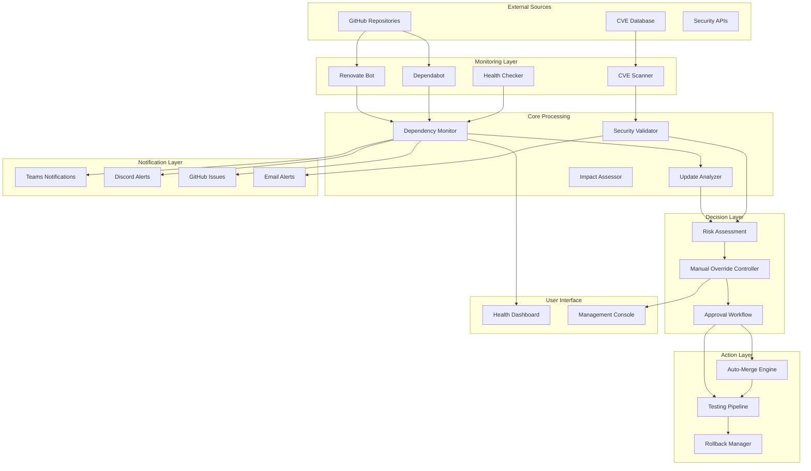
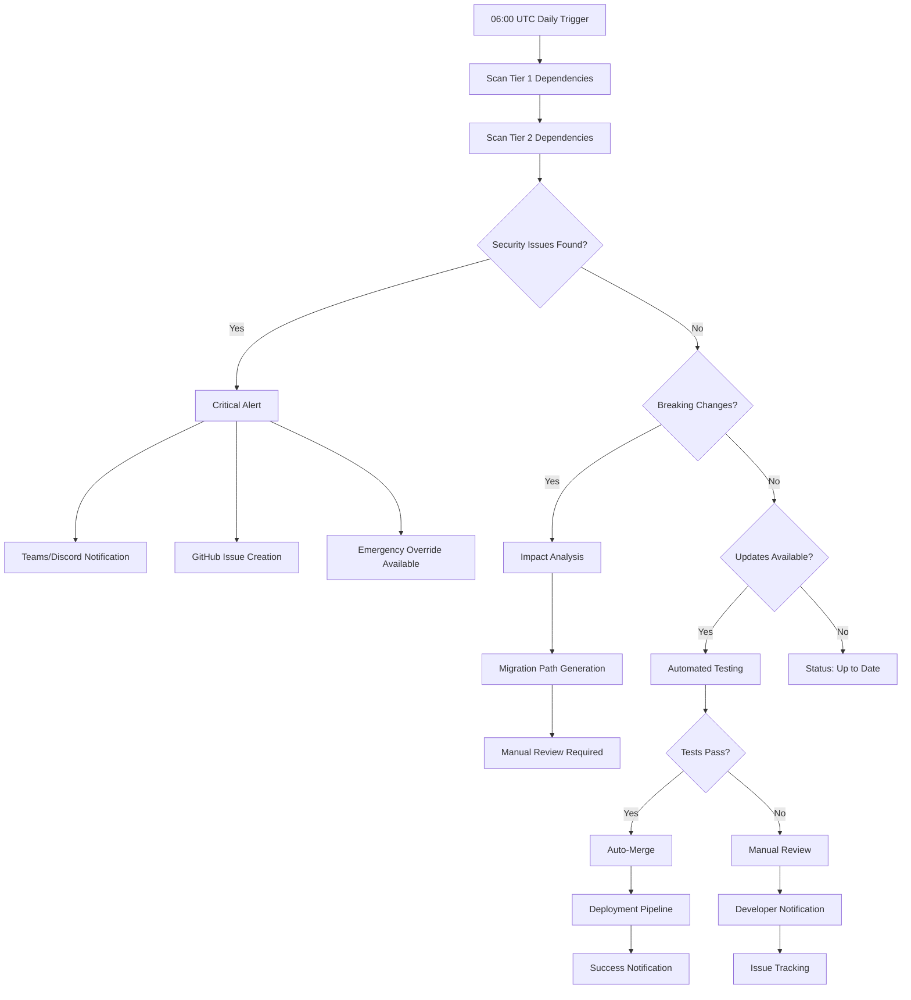
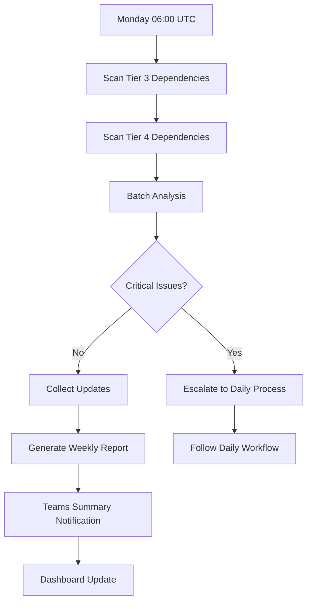
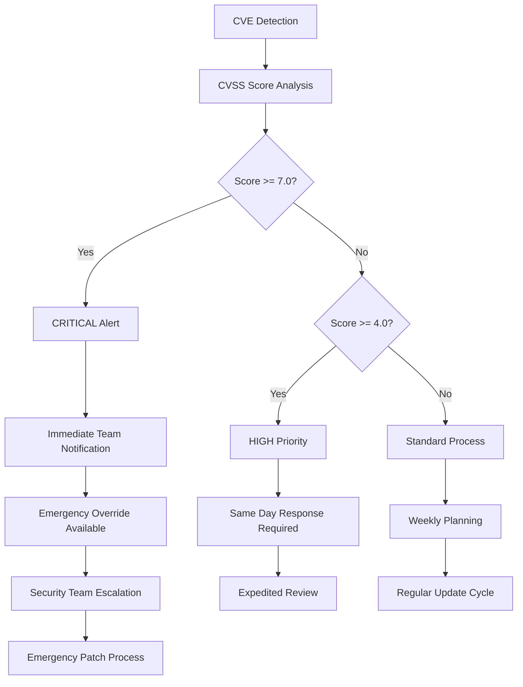
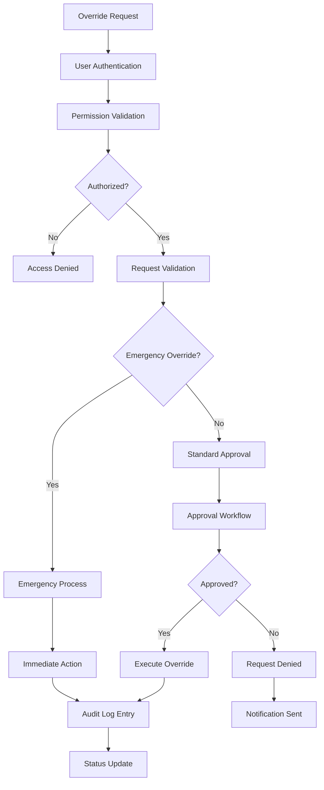

# Comprehensive Dependency Workflow Documentation

## Table of Contents
1. [Overview](#overview)
2. [Architecture & Design Principles](#architecture--design-principles)
3. [Workflow Diagrams](#workflow-diagrams)
4. [Step-by-Step Procedures](#step-by-step-procedures)
5. [Integration Patterns](#integration-patterns)
6. [API Documentation](#api-documentation)
7. [Troubleshooting Guide](#troubleshooting-guide)
8. [Maintenance & Operations](#maintenance--operations)

## Overview

The Dependency Management Workflow is the foundational system for managing 60+ best-of-breed open-source components across the Algorithmic Trading System. This document provides comprehensive guidance for understanding, operating, and maintaining the automated dependency management infrastructure.

### Key Components
- **Tiered Dependency Classification** (Tier 1-4 based on criticality)
- **Automated Monitoring & Update Detection** (Renovate, Dependabot, CVE scanning)
- **Multi-Channel Notification System** (Teams, Discord, GitHub Issues, Email)
- **Health Dashboard** (React 18/Next.js with real-time monitoring)
- **Manual Override Controls** (FastAPI-based approval workflows)
- **Placeholder Protocol** (Systematic technical debt management)

## Architecture & Design Principles

### Core Design Principles
1. **Event-Driven Architecture**: All communication via Apache Kafka
2. **Microservices Pattern**: Independently deployable components
3. **Cloud-Native Design**: Docker containers with Kubernetes orchestration
4. **API-First Design**: RESTful APIs with GraphQL and gRPC support
5. **Zero-Trust Security**: Every request authenticated and authorized
6. **Immutable Infrastructure**: Infrastructure as Code with Terraform

### System Architecture



## Workflow Diagrams

### 1. Daily Monitoring Workflow (Tier 1 & 2)



### 2. Weekly Monitoring Workflow (Tier 3 & 4)



### 3. Security Vulnerability Response Workflow



### 4. Manual Override Workflow



## Step-by-Step Procedures

### 1. Daily Monitoring Operations

#### 1.1 Automated Daily Scan
```bash
# Triggered by GitHub Actions at 06:00 UTC
name: "Daily Dependency Monitoring"
schedule: "0 6 * * *"

# Process:
1. Scan Tier 1 critical dependencies
2. Scan Tier 2 important dependencies  
3. Run security vulnerability checks
4. Generate impact assessments
5. Send notifications based on findings
```

#### 1.2 Security Alert Response
```yaml
Critical Security Alert Response:
  1. Receive immediate notification (Teams/Discord)
  2. Access emergency override controls
  3. Review CVSS score and impact
  4. Decide: Emergency patch or scheduled update
  5. Execute approved action
  6. Verify fix effectiveness
  7. Update team on resolution
```

#### 1.3 Breaking Change Handling
```yaml
Breaking Change Process:
  1. Automated detection via semantic analysis
  2. Generate migration path documentation
  3. Create compatibility assessment
  4. Manual review required
  5. Schedule coordinated update
  6. Execute with rollback plan
  7. Validate system functionality
```

### 2. Weekly Reporting Operations

#### 2.1 Weekly Report Generation
```bash
# Triggered every Monday at 06:00 UTC
Weekly Process:
1. Collect all dependency status updates
2. Aggregate Tier 3 & 4 findings
3. Generate consolidated report
4. Send Teams notification with summary
5. Update dashboard with latest metrics
6. Archive weekly data for trending
```

#### 2.2 Dashboard Maintenance
```yaml
Dashboard Updates:
  1. Real-time status indicator refresh
  2. Historical trend data update
  3. Security metrics compilation
  4. Performance metrics collection
  5. User activity analytics
  6. System health verification
```

### 3. Manual Override Procedures

#### 3.1 Emergency Override
```yaml
Emergency Override Steps:
  1. Access: /manual-override/emergency
  2. Authenticate with elevated permissions
  3. Provide justification and impact assessment
  4. Select target dependency and action
  5. Execute with automatic audit logging
  6. Monitor execution results
  7. Report to team within 30 minutes
```

#### 3.2 Standard Override
```yaml
Standard Override Steps:
  1. Submit override request via dashboard
  2. Provide detailed justification
  3. Wait for approval (SLA: 24 hours)
  4. Receive notification on decision
  5. Execute if approved
  6. Monitor and report results
```

## Integration Patterns

### 1. Event-Driven Communication

#### Kafka Topic Structure
```yaml
Topics:
  dependency.tier1.update: "Critical dependency updates"
  dependency.tier2.update: "Important dependency updates"
  dependency.security.alert: "Security vulnerability alerts"
  dependency.status.health: "Health check events"
  dependency.override.request: "Manual override requests"
  dependency.audit.log: "Audit trail events"
```

#### Event Schema Example
```json
{
  "eventType": "dependency.security.alert",
  "timestamp": "2025-08-28T06:00:00Z",
  "data": {
    "dependencyName": "nautilus_trader",
    "tier": "tier1", 
    "vulnerability": {
      "cve": "CVE-2025-1234",
      "cvssScore": 8.5,
      "severity": "HIGH"
    },
    "affectedVersions": ["1.2.3", "1.2.4"],
    "fixedVersion": "1.2.5",
    "recommendations": ["immediate_update", "security_patch"]
  }
}
```

### 2. API Integration Patterns

#### REST API Endpoints
```yaml
Health Dashboard API:
  GET /api/v1/dependencies: "List all dependencies"
  GET /api/v1/dependencies/{tier}: "Get tier-specific dependencies"
  GET /api/v1/health: "System health status"
  POST /api/v1/override: "Submit override request"

Monitoring API:
  GET /api/v1/monitoring/status: "Current monitoring status"
  POST /api/v1/monitoring/trigger: "Manual monitoring trigger"
  GET /api/v1/reports/weekly: "Weekly reports"

Security API:
  GET /api/v1/security/alerts: "Active security alerts"
  GET /api/v1/security/vulnerabilities: "Vulnerability database"
  POST /api/v1/security/acknowledge: "Acknowledge alerts"
```

#### GraphQL Schema
```graphql
type Dependency {
  id: ID!
  name: String!
  tier: Tier!
  version: String!
  latestVersion: String!
  status: DependencyStatus!
  vulnerabilities: [Vulnerability!]!
  customizations: [String!]!
  repository: String!
  fork: String!
}

type Query {
  dependencies(tier: Tier): [Dependency!]!
  securityAlerts(severity: Severity): [SecurityAlert!]!
  systemHealth: HealthStatus!
}

type Mutation {
  submitOverride(request: OverrideRequest!): OverrideResponse!
  acknowledgeAlert(alertId: ID!): Boolean!
}
```

### 3. Database Integration

#### PostgreSQL Schema
```sql
-- Dependencies table
CREATE TABLE dependencies (
    id SERIAL PRIMARY KEY,
    name VARCHAR(255) NOT NULL,
    tier VARCHAR(10) NOT NULL,
    repository_url VARCHAR(500),
    fork_url VARCHAR(500),
    current_version VARCHAR(50),
    latest_version VARCHAR(50),
    status VARCHAR(20),
    last_checked TIMESTAMP,
    customizations JSONB,
    created_at TIMESTAMP DEFAULT NOW(),
    updated_at TIMESTAMP DEFAULT NOW()
);

-- Security alerts table
CREATE TABLE security_alerts (
    id SERIAL PRIMARY KEY,
    dependency_id INTEGER REFERENCES dependencies(id),
    cve_id VARCHAR(50),
    cvss_score DECIMAL(3,1),
    severity VARCHAR(20),
    description TEXT,
    fixed_version VARCHAR(50),
    acknowledged BOOLEAN DEFAULT FALSE,
    created_at TIMESTAMP DEFAULT NOW()
);

-- Override requests table
CREATE TABLE override_requests (
    id SERIAL PRIMARY KEY,
    dependency_id INTEGER REFERENCES dependencies(id),
    requested_by VARCHAR(100),
    action_type VARCHAR(50),
    justification TEXT,
    status VARCHAR(20),
    approved_by VARCHAR(100),
    executed_at TIMESTAMP,
    created_at TIMESTAMP DEFAULT NOW()
);
```

## API Documentation

### Health Dashboard API

#### Get All Dependencies
```http
GET /api/v1/dependencies
Authorization: Bearer <token>

Response:
{
  "dependencies": [
    {
      "id": "nautilus_trader",
      "name": "nautilus_trader",
      "tier": "tier1",
      "version": "1.193.0",
      "latestVersion": "1.194.0",
      "status": "update_available",
      "vulnerabilities": 0,
      "customizations": ["Rust performance enhancements"],
      "repository": "https://github.com/nautechsystems/nautilus_trader",
      "fork": "https://github.com/vincentspereira/nautilus_trader",
      "lastUpdated": "2025-08-28T06:00:00Z"
    }
  ],
  "total": 63,
  "by_tier": {
    "tier1": 10,
    "tier2": 19,
    "tier3": 11,
    "tier4": 23
  }
}
```

#### Submit Override Request
```http
POST /api/v1/override
Authorization: Bearer <token>
Content-Type: application/json

{
  "dependency_name": "nautilus_trader",
  "action": "force_update",
  "justification": "Critical security patch required",
  "priority": "emergency"
}

Response:
{
  "override_id": "override_20250828_120000_nautilus_trader",
  "status": "approved",
  "message": "Emergency override approved and executed",
  "execution_time": "2025-08-28T12:01:30Z"
}
```

### Monitoring API

#### Get System Health
```http
GET /api/v1/health
Authorization: Bearer <token>

Response:
{
  "status": "healthy",
  "timestamp": "2025-08-28T12:00:00Z",
  "services": {
    "dependency_monitor": "healthy",
    "notification_service": "healthy", 
    "security_scanner": "healthy",
    "dashboard": "healthy"
  },
  "metrics": {
    "dependencies_monitored": 63,
    "active_alerts": 2,
    "last_scan": "2025-08-28T06:00:00Z",
    "next_scan": "2025-08-29T06:00:00Z"
  }
}
```

## Troubleshooting Guide

### Common Issues and Solutions

#### 1. Monitoring Service Not Running
```bash
# Symptoms:
- No daily notifications received
- Dashboard shows stale data
- GitHub Actions workflow failures

# Diagnosis:
kubectl get pods -n dependency-management
docker-compose ps

# Resolution:
kubectl restart deployment/dependency-monitor
docker-compose restart dependency-monitor

# Verification:
curl http://localhost:8000/health
```

#### 2. Notification Delivery Failures
```bash
# Symptoms:
- Teams/Discord messages not received
- GitHub Issues not created
- Email alerts missing

# Diagnosis:
# Check webhook configurations
kubectl logs -n dependency-management notification-service

# Resolution:
# Update webhook URLs in configuration
kubectl edit configmap notification-config

# Test notification delivery
curl -X POST http://localhost:8001/test-notification
```

#### 3. Security Scanner Issues
```bash
# Symptoms:
- CVE alerts not triggering
- Security dashboard empty
- False positive alerts

# Diagnosis:
kubectl logs -n dependency-management security-scanner

# Resolution:
# Update CVE database
kubectl exec -it security-scanner -- python update_cve_db.py

# Restart security scanner
kubectl restart deployment/security-scanner
```

#### 4. Dashboard Connection Issues
```bash
# Symptoms:
- Dashboard not loading
- API endpoints returning errors
- Real-time updates not working

# Diagnosis:
kubectl get ingress
kubectl logs -n dependency-management dashboard

# Resolution:
# Check ingress configuration
kubectl describe ingress dependency-dashboard

# Restart dashboard service
kubectl restart deployment/dashboard
```

### Performance Optimization

#### Database Performance
```sql
-- Add indexes for common queries
CREATE INDEX idx_dependencies_tier ON dependencies(tier);
CREATE INDEX idx_dependencies_status ON dependencies(status);
CREATE INDEX idx_security_alerts_severity ON security_alerts(severity);
CREATE INDEX idx_override_requests_status ON override_requests(status);

-- Optimize query performance
ANALYZE dependencies;
ANALYZE security_alerts;
ANALYZE override_requests;
```

#### Monitoring Optimization
```yaml
# Adjust monitoring frequency for performance
monitoring_config:
  tier1_interval: "1h"  # More frequent for critical
  tier2_interval: "4h"  # Standard for important
  tier3_interval: "24h" # Daily for supporting
  tier4_interval: "168h" # Weekly for infrastructure
```

## Maintenance & Operations

### Daily Operations Checklist
```yaml
Daily Tasks:
  - [ ] Verify monitoring service health
  - [ ] Review overnight alerts and notifications
  - [ ] Check dashboard functionality
  - [ ] Validate security scanner operation
  - [ ] Monitor system resource usage
  - [ ] Review any manual override requests
```

### Weekly Operations Checklist
```yaml
Weekly Tasks:
  - [ ] Review weekly consolidated report
  - [ ] Analyze dependency update trends
  - [ ] Check system performance metrics
  - [ ] Update documentation if needed
  - [ ] Review and clean audit logs
  - [ ] Validate backup and recovery procedures
```

### Monthly Operations Checklist
```yaml
Monthly Tasks:
  - [ ] Comprehensive system health review
  - [ ] Security audit and compliance check
  - [ ] Performance benchmark analysis
  - [ ] Update disaster recovery procedures
  - [ ] Review and update monitoring thresholds
  - [ ] Dependency portfolio analysis
```

### Backup and Recovery

#### Configuration Backup
```bash
# Backup dependency configurations
kubectl get configmap -n dependency-management -o yaml > dependency-configs-backup.yaml

# Backup database
pg_dump dependency_management > dependency_db_backup.sql

# Backup monitoring configurations
tar -czf monitoring-backup.tar.gz monitoring/
```

#### Recovery Procedures
```bash
# Restore configurations
kubectl apply -f dependency-configs-backup.yaml

# Restore database
psql dependency_management < dependency_db_backup.sql

# Restore monitoring
tar -xzf monitoring-backup.tar.gz
```

### Security Hardening

#### Access Controls
```yaml
rbac_config:
  roles:
    admin: ["read", "write", "execute", "override"]
    developer: ["read", "write"]
    analyst: ["read"]
    emergency: ["read", "execute", "emergency_override"]

  policies:
    tier1_access: "admin, emergency"
    override_approval: "admin"
    security_alerts: "admin, developer, emergency"
```

#### Audit Logging
```yaml
audit_config:
  enabled: true
  retention_days: 365
  log_events:
    - dependency_updates
    - security_alerts
    - override_requests
    - configuration_changes
    - user_actions
```

This comprehensive workflow documentation provides the complete operational framework for the Phase 0 Dependency Management System, ensuring teams can effectively operate, maintain, and troubleshoot the system while preparing for Phase 1 development.