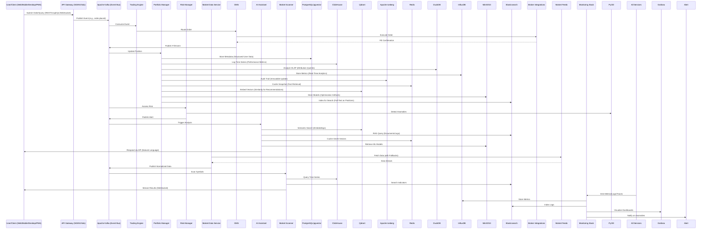

# Nautilus Trader - Comprehensive System Architecture

## Table of Contents

- [Nautilus Trader - Comprehensive System Architecture](#nautilus-trader---comprehensive-system-architecture)
  - [Table of Contents](#table-of-contents)
  - [System Overview](#system-overview)
    - [Key Characteristics](#key-characteristics)
  - [Architecture Principles](#architecture-principles)
    - [1. Microservices Architecture](#1-microservices-architecture)
    - [2. Event-Driven Architecture](#2-event-driven-architecture)
    - [3. Cloud-Native Design](#3-cloud-native-design)
    - [4. API-First Design](#4-api-first-design)
    - [5. Security-First](#5-security-first)
    - [6. Performance-Optimized](#6-performance-optimized)
    - [7. AI-Integrated](#7-ai-integrated)
  - [System Components](#system-components)
    - [Core Services Detailed Breakdown](#core-services-detailed-breakdown)
      - [1. Trading Engine](#1-trading-engine)
      - [2. Portfolio Manager](#2-portfolio-manager)
      - [3. Risk Manager](#3-risk-manager)
      - [4. Market Data Service](#4-market-data-service)
      - [5. Order Management System (OMS)](#5-order-management-system-oms)
      - [6. Strategy Engine](#6-strategy-engine)
      - [7. AI-Powered Strategy Development](#7-ai-powered-strategy-development)
      - [8. Agentic AI Assistant](#8-agentic-ai-assistant)
      - [9. Market Scanner Service](#9-market-scanner-service)
      - [10. Other Components](#10-other-components)
  - [Data Flow Architecture](#data-flow-architecture)
    - [Database Usage Details](#database-usage-details)
  - [Technology Stack](#technology-stack)
    - [Core Technologies](#core-technologies)
    - [Programming Languages](#programming-languages)
    - [Frameworks and Libraries](#frameworks-and-libraries)
    - [Databases and Storage](#databases-and-storage)
    - [Infrastructure](#infrastructure)
    - [Monitoring and Observability](#monitoring-and-observability)
  - [Deployment Architecture](#deployment-architecture)
    - [Multi-Environment Setup](#multi-environment-setup)
    - [Kubernetes Architecture](#kubernetes-architecture)
  - [Security Architecture](#security-architecture)
    - [Zero-Trust Security Model](#zero-trust-security-model)
    - [Security Controls](#security-controls)
      - [Authentication \& Authorization](#authentication--authorization)
      - [Data Protection](#data-protection)
      - [Network Security](#network-security)
      - [Application Security](#application-security)
  - [Performance Architecture](#performance-architecture)
    - [Performance Targets](#performance-targets)
    - [Latency Optimization](#latency-optimization)
  - [Integration Architecture](#integration-architecture)
    - [Integration Patterns](#integration-patterns)
    - [External Integrations](#external-integrations)
    - [Integration Patterns](#integration-patterns-1)
      - [1. API Integration](#1-api-integration)
      - [2. Message-Based Integration](#2-message-based-integration)
      - [3. Data Integration](#3-data-integration)
  - [Monitoring and Observability](#monitoring-and-observability-1)
  - [AI and ML Integration Architecture](#ai-and-ml-integration-architecture)
  - [Custom Technical Analysis and Indicators](#custom-technical-analysis-and-indicators)
  - [Summary](#summary)
  - [Data Feed and Fallback Mechanisms](#data-feed-and-fallback-mechanisms)
  - [Frontend and User Interface Architecture](#frontend-and-user-interface-architecture)
  - [Enterprise Readiness and Compliance](#enterprise-readiness-and-compliance)
  - [Development Phases and Integration Strategy](#development-phases-and-integration-strategy)
    - [Phase 0: Dependency Management Setup](#phase-0-dependency-management-setup)
    - [Phase 1: Core System Validation](#phase-1-core-system-validation)
    - [Phase 2: Frontend and Broker Integration](#phase-2-frontend-and-broker-integration)
    - [Phase 3: AI/ML Integration](#phase-3-aiml-integration)
    - [Phase 4: Frontend \& Live Trading](#phase-4-frontend--live-trading)
    - [Phase 5: Enterprise Readiness](#phase-5-enterprise-readiness)
    - [Phase 6: System Enhancement](#phase-6-system-enhancement)
  - [Disaster Recovery and Business Continuity](#disaster-recovery-and-business-continuity)
    - [Backup Strategy](#backup-strategy)
    - [Recovery Procedures](#recovery-procedures)
    - [High Availability](#high-availability)
  - [Detailed Requirements Consolidation](#detailed-requirements-consolidation)
    - [Phase 0 Requirements](#phase-0-requirements)
    - [Phase 1-6 Requirements](#phase-1-6-requirements)
  - [Detailed Designs Consolidation](#detailed-designs-consolidation)
    - [Phase 0 Design](#phase-0-design)
  - [Detailed Tasks and Sub-Tasks Consolidation](#detailed-tasks-and-sub-tasks-consolidation)
    - [Phase 0 Tasks](#phase-0-tasks)
  - [Conclusion](#conclusion)

## System Overview

## System Overview

This project aims to build a comprehensive, enterprise-grade algorithmic trading system from the ground up. The platform's core philosophy is a "Best-of-Breed" integration strategy, selecting the best open-source projects for each major component to create a powerful, modular foundation. The system caters to both non-technical users (via simplicity and no-code options) and professional traders/analysts (via enterprise-grade features), leveraging AI Agents and Agentic AI extensively.

The architecture is designed as a set of distinct microservices that communicate through an Apache Kafka event bus. This event-driven approach decouples services, provides data replayability for robust testing, and scales to handle high-frequency data streams for professional traders. The system's standout feature is a sophisticated Agentic AI Assistant, which acts as the platform's "brain," enabling users to manage trading, research, and analysis via natural language commands.

The core trading engine is NautilusTrader, a high-performance, Python-based platform with Rust components, designed for event-driven backtesting and live trading across all asset classes. The Agentic AI Assistant leverages TradingAgent for multi-agent decision-making, OpenBB for financial data integration, and TA-Lib/ta-lib-python (primary wrapper) & Bukosabino/ta (secondary wrapper) for technical analysis, forming a robust AI-driven trading brain.

The system incorporates advanced forecasting from Stock-Prediction-Models and LSTM-Neural-Network-for-Time-Series-Prediction, with real-time predictions enabled by Real-time-stock-market-prediction for live trading. VectorBT provides GPU-accelerated backtesting, while TradingGym complement NautilusTrader for flexible strategy development and simulated environments. Additional features include portfolio optimisation (PyPortfolioOpt, Riskfolio-Lib), anomaly detection (PyOD), no-code strategy building (Blockly), visualisation (react-financial-charts, Plotly Dash), explainable AI (SHAP), reinforcement learning (FinRL), and advanced NLP (Transformers, PyTorch), alongside options analytics (QuantLib).

### Supported Trading Instruments
The system supports a wide range of asset classes to cater to diverse trading needs:
- **Stocks & ETFs**: Global equities and exchange-traded funds
- **Stock Futures & Index Futures**: E-mini S&P 500, Nasdaq-100, global index futures
- **Stock Options & Index Options**: Calls, puts on equities and indices
- **Forex, Forex Futures, & Forex Options**: EUR/USD, G10 currencies, emerging markets
- **Commodities, Commodity Futures, & Commodity Options**: Crude oil, gold, corn, agricultural products
- **Cryptocurrency, Cryptocurrency Futures, & Cryptocurrency Options**: Bitcoin, Ethereum, altcoins

### Multi-Source Data Feeds with Fallback
Implements a multi-source data feed strategy to ensure uninterrupted data availability. The system uses a primary source with a cascade of fallback providers for each asset class, managed automatically:

**Data Feed Hierarchy**:
1. **Primary**: Interactive Brokers (IBKR) - Paper and Live Trading Data
2. **Fallback 1**: Yahoo Finance (Free)
3. **Fallback 2**: Alpha Vantage (Additional broker + backup data)
4. **Fallback 3**: Finnhub (Optional backup)
5. **Fallback 4**: Twelve Data (Optional backup)
6. **Fallback 5**: Investing.com, CME Group, Polygon, Barchart, SpiderRock, TradingCharts, Oanda

**Asset-Class Specific Fallback Chains**: The fallback mechanism is configured per asset class (e.g., Stocks, Forex, Crypto) to use the most relevant data providers, ensuring optimal data quality and availability for each instrument type.

### Custom Technical Analysis Framework
The system includes a comprehensive suite of custom-developed, volume-weighted technical indicators (e.g., VW SMA, VW EMA, VW MACD, VW MFI) and market analysis metrics (e.g., Normalised ATR, Choppy Market Index, Buy/Sell Easier Day) built with TA-Lib and NumPy. These are fully integrated into the NautilusTrader engine for use in strategy development and analysis.

**Custom Volume-Weighted Indicators Include**:
- 55/34/13/5 Day Volume-Weighted SMAs and EMAs for entry/exit signals
- VW MACD and MACD Histogram for momentum analysis
- Volume-Weighted Money Flow Index (MFI) for money flow analysis
- Market normalization with 21/8 Day VW ATR for position sizing
- Turtle Trading strength/weakness indicators for market ranking
- Choppy Market Index for trend vs. range-bound market identification
- Beta calculations, auto-correlation, and volatility measurements

### Enterprise Security and Risk Management
Platform is built with:
- **Zero-Trust Architecture**: Every request requires authentication and authorization
- **Real-time Risk Hub**: Pre-trade checks and account-level circuit breakers
- **Role-based Access Control (RBAC)**: Granular permission management
- **Immutable Audit Trails**: Apache Iceberg for compliance logging
- **Feature Flags**: Unleash for dynamic toggling of strategies and kill-switches
- **Static Application Security Testing (SAST)**: Bandit for Python vulnerability scanning
- **User and Entity Behaviour Analytics (UEBA)**: Threat detection and monitoring
- **Threat Modelling by Design**: STRIDE methodology for security assessment
- **Formalised Backup Strategy**: Comprehensive data protection and recovery

### AI-Powered Strategy Development
Users can develop strategies through multiple interfaces:
- **No-Code Strategy Builder**: Visual drag-and-drop interface via Blockly
- **AI-Assisted Development & Debugging Agent**: Assists with Python code for strategies
- **Agentic AI Assistant**: Natural language commands for trading, research, and development
- **Python Studio**: Traditional Python-based coding environment
- **LLM-Driven Iterative Strategy Refinement**: AI agents in continuous feedback loops for strategy optimization

### Agentic AI Assistant Architecture
- **Core Interface**: Chatbot-based user interaction model
- **RAG Pipeline**: Agentic Retrieval-Augmented Generation for document processing
- **Multi-Agent Network**: Specialized agents (Analyst, Researcher, Risk Manager, Compliance)
- **Kafka Communication**: All inter-agent communication via Apache Kafka event bus
- **AI Context Management**: Model Context Protocols (MCPs) with LangChain and LangGraph
- **Defined Workflows**: Stateful workflows for complex, multi-step task execution
- **Natural Language Trading**: Users can run backtests, check portfolio status, or place live trades via conversation

### Key Characteristics
- **High Performance**: Microsecond-level latency for trading operations, achieved through Rust optimizations, lock-free data structures, cache-line alignment, FPGAs/SmartNICs, and Direct Market Access (DMA) with server co-location.
- **Scalable**: Horizontal scaling across multiple nodes, supporting 10,000+ concurrent users and >1M messages/second throughput via Kubernetes auto-scaling and intelligent resource management.
- **Resilient**: Fault-tolerant with automatic failover, self-healing microservices (e.g., Kubernetes liveness/readiness probes, circuit breakers), multi-region deployments, and predictive performance models to forecast/mitigate bottlenecks.
- **Secure**: Enterprise-grade zero-trust architecture with Role-Based Access Control (RBAC), Multi-Factor Authentication (MFA), AES-256 encryption at rest, TLS 1.3 in transit, Static Application Security Testing (SAST) via Bandit, User and Entity Behavior Analytics (UEBA) for threat detection, threat modeling (STRIDE), and immutable audit trails.
- **Observable**: Comprehensive monitoring with Prometheus, Grafana, Loki/ELK, Jaeger/Tempo, Memray for profiling, and InfluxDB for real-time metrics.

The platform ensures research-to-production parity, with seamless transitions from backtesting to live trading, and adheres to regulatory compliance (e.g., MiFID II, SOX, GDPR) through automated reporting and data retention.

## Architecture Principles

The architecture is guided by principles ensuring modularity, performance, resilience, and future-readiness, as derived from the base document's emphasis on microservices, event-driven design, cloud-native practices, and API-first approaches.

### 1. Microservices Architecture
- **Service Decomposition**: Each business capability is encapsulated in a separate service (e.g., Trading Engine for order execution, Risk Manager for VaR calculations, Market Scanner for real-time symbol filtering).
- **Independent Deployment**: Services deploy independently using Docker containers and Kubernetes, allowing technology diversity (e.g., Python for AI, Rust for latency-critical paths, Go for high-throughput data processing).
- **Technology Diversity**: Supports polyglot programming; for example, the Trading Engine uses Python/Rust, while the Market Data Service uses Python/Go.
- **Fault Isolation**: Failures are isolated via Kubernetes namespaces, Istio virtual services, and circuit breakers to prevent cascading effects (e.g., a failure in the Portfolio Manager does not impact the Order Management System).
- **Automated Self-Healing**: Services include health checks (liveness/readiness probes), auto-restarts, and recovery scripts; for instance, if a microservice pod fails, Kubernetes restarts it within 30 seconds, with metrics logged to Prometheus.

### 2. Event-Driven Architecture
- **Asynchronous Communication**: Services interact via events on Apache Kafka, using hierarchical topic naming (e.g., `domain.action.entity.source.symbol` like `trading.order.placed.ibkr.aapl.us`) and wildcard subscriptions for flexible routing.
- **Event Sourcing**: All state changes (e.g., order placements, risk updates, AI decisions) are stored as immutable events in Kafka, enabling replay for backtesting, auditing, and recovery.
- **CQRS (Command Query Responsibility Segregation)**: Commands (e.g., place order) are handled separately from queries (e.g., get portfolio status), optimizing for write-heavy (trading) vs. read-heavy (analytics) workloads.
- **Event Streaming**: Real-time processing with Kafka Streams or ksqlDB, supporting multi-agent AI communication (e.g., Analyst Agent publishes insights, Trader Agent consumes asynchronously).

### 3. Cloud-Native Design
- **Container-First**: All components are containerized with Docker, following best practices for immutable images and multi-stage builds.
- **Kubernetes Native**: Orchestrated via Kubernetes with Helm charts for templated deployments, Istio for service mesh (traffic routing, security), and ArgoCD for GitOps CI/CD workflows.
- **12-Factor App Principles**: Codebase (Git-managed), dependencies (explicit via requirements.txt/Dockerfile), config (environment variables/secrets via HashiCorp Vault), backing services (treated as attached resources), build/release/run separation, stateless processes, port binding, concurrency (horizontal scaling), disposability (fast startup/shutdown), dev/prod parity, logs (streamed to Loki/ELK), and admin processes (run as one-off).
- **Infrastructure as Code (IaC)**: All infrastructure (e.g., Kubernetes clusters, databases) defined declaratively using Terraform, with version control and automated provisioning.

### 4. API-First Design
- **RESTful APIs**: Standardized interfaces using FastAPI, with OpenAPI/Swagger documentation, versioning (e.g., /v1/orders), and error handling (e.g., 429 for rate limits).
- **GraphQL**: Flexible querying via Apollo Server for complex data (e.g., querying portfolio metrics with nested risk data).
- **WebSocket**: Real-time bidirectional communication for market updates, order fills, and AI chat (e.g., via Socket.IO).
- **gRPC**: High-performance, binary-serialized RPC for inter-service calls (e.g., Trading Engine to Risk Manager), supporting streaming and multiplexing.

### 5. Security-First
- **Zero-Trust Model**: Continuous verification of identities and access, with least-privilege principles enforced via RBAC and network policies.
- **Threat Modeling by Design**: STRIDE (Spoofing, Tampering, Repudiation, Information Disclosure, Denial of Service, Elevation of Privilege) applied to all components during design.
- **Encryption and Compliance**: Data in transit (TLS 1.3), at rest (AES-256), and compliance with regulations through immutable logs and automated reports.

### 6. Performance-Optimized
- **Ultra-Low Latency**: Achieved via DMA, co-location, FPGAs/SmartNICs, lock-free structures, and cache-line alignment in critical paths.
- **High Throughput**: Event-driven design with Kafka for >1M TPS, GPU acceleration for backtesting/ML.

### 7. AI-Integrated
- **Agentic Workflows**: Multi-agent systems for collaborative decision-making, with RAG for knowledge retrieval and RLOps for continuous model improvement.

## System Components

The system is composed of layered components, from client interfaces to infrastructure, as visualized below. Each component is designed for modularity, with clear interfaces and dependencies.

```mermaid
graph TB
    subgraph "Client Layer"
        WEB[Web Dashboard (React 18/TypeScript, Next.js)]
        MOBILE[Mobile App (React Native, Voice Mode, Biometrics)]
        DESKTOP[Desktop App (Electron, Offline Capabilities)]
        PWA[Progressive Web App (PWA for Cross-Platform)]
        API_CLIENT[API Clients (REST/GraphQL/WebSocket)]
        SDK[Multi-Language SDKs (Python, JS, Rust)]
        VOICE_UI[Voice Trading Interface (Whisper Integration)]
        AR_UI[AR Interfaces (WebXR for 3D Visualizations)]
    end
    
    subgraph "API Gateway Layer"
        NGINX[NGINX Ingress Controller (Load Balancing, TLS Termination)]
        ISTIO[Istio Service Mesh (Traffic Management, mTLS)]
        RATE_LIMIT[Rate Limiting & Throttling (e.g., 1000 RPS/user)]
        AUTH[Authentication Service (Keycloak: OAuth2/OIDC, MFA, RBAC)]
        API_GW[API Gateway (FastAPI for Routing, Versioning)]
    end
    
    subgraph "Application Layer"
        TRADING[Trading Engine (NautilusTrader - Python/Rust: Order Routing, Strategy Execution, Position Management)]
        PORTFOLIO[Portfolio Manager (PyPortfolioOpt, Riskfolio-Lib: Optimization, Allocation, Rebalancing)]
        RISK[Risk Manager (Real-time VaR, Exposure Limits, Stress Testing, Anomaly Detection via PyOD)]
        MARKET_DATA[Market Data Service (Multi-Source Feeds, Normalization, Distribution)]
        ORDER_MGT[Order Management System (OMS: Validation, Execution, Fill Processing, FIX Gateway - QuickFIX/J, FIX8)]
        STRATEGY[Strategy Engine (TradingGym, VectorBT: Development, Backtesting, GPU Acceleration)]
        BACKTEST[Backtesting Engine (Event-Driven, Historical Replay via Kafka)]
        ANALYTICS[Analytics Service (OpenBB, TA-Lib/ta-lib-python & Bukosabino/ta: Indicators, QuantLib for Options)]
        AI_ASSISTANT[Agentic AI Assistant (LangChain/LangGraph, TradingAgent: Natural Language Commands, Multi-Agent Workflows)]
        INFERENCE[Inference Engine (PyTorch/TensorFlow Serving: Real-Time Predictions)]
        SENTIMENT[Sentiment Analysis Pipeline (Transformers/PyTorch: News, Social Media, Financial Documents)]
        ANOMALY[Anomaly Detection Service (PyOD: Trade Anomalies, UEBA Integration)]
        RL[Reinforcement Learning Service (FinRL: Strategy Optimization, RLOps Pipeline)]
        MARKET_SCANNER[Market Scanner Service (Real-Time Filtering, Custom Indicators, UI Grid)]
        CS_BOT[Customer Service Bot (RAG-Based, Lobe Chat for Support Queries)]
        MARKETPLACE[Strategy Marketplace (Scoped: Publishing, Searching, Copy Trading with Metrics)]
        MICROSTRUCTURE[Market Microstructure Analysis (Order Book Analytics, Liquidity Detection, Impact Estimation)]
    end
    
    subgraph "Integration Layer"
        BROKER_API[Broker APIs (IBKR Paper/Live, Alpaca, OANDA, Coinbase, Binance, FIX Protocol)]
        MARKET_FEEDS[Market Data Feeds (Yahoo Primary + Fallbacks: Alpha Vantage, Finnhub, etc.)]
        WEBHOOK[Webhook Service (External Notifications, Integrations)]
        NOTIFICATION[Notification Service (Push, Email, SMS, Slack, Biometrics for Mobile)]
        EXTERNAL_AI[External AI Services (e.g., OpenHands for Code Generation, Goose for Workflows)]
    end
    
    subgraph "Data Layer"
        POSTGRES[(PostgreSQL/pgvector: Structured Data, User/Strategy Metadata, Vector Embeddings for AI Searches)]
        CLICKHOUSE[(ClickHouse: Time-Series Analytics, Real-Time Reports, High-Speed Queries on Large Datasets)]
        QDRANT[(Qdrant: Vector Database for Embeddings, Semantic Search, AI-Driven Features)]
        ICEBERG[(Apache Iceberg: Immutable Analytic Tables, Audit Trails for Compliance, Long-Term Storage)]
        REDIS[(Redis: In-Memory Cache for Sessions/Portfolios, Vector Store for GenAI, Pub/Sub Messaging)]
        DUCKDB[(DuckDB: In-Process OLAP for Fast Queries, Research Workflows, Embedded Analytics)]
        INFLUXDB[(InfluxDB: Metrics/Events Storage, Real-Time Analytics for Monitoring Dashboards)]
        MINIO[(MinIO/S3: Object Storage for AI/ML Models, Analytics Data, High-Performance Workloads)]
        ELASTIC[(Elasticsearch: Distributed Search/Analytics, Vector DB, Full-Text Search, Logs/Metrics, RAG Pipelines)]
    end
    
    subgraph "Infrastructure Layer"
        KUBERNETES[Kubernetes Cluster (Helm Charts, Istio Mesh, GitOps with ArgoCD)]
        MONITORING[Monitoring Stack (Prometheus for Metrics, Grafana for Dashboards, Jaeger/Tempo for Tracing, Loki/ELK for Logs, Memray for Profiling)]
        LOGGING[Logging Stack (ELK: Elasticsearch, Logstash, Kibana)]
        SECURITY[Security Services (Bandit for SAST, UEBA for Threat Detection, Unleash for Feature Flags, Feast/Tecton for Feature Stores)]
        KAFKA[Apache Kafka (Event Bus, Schema Registry, Hierarchical Topics, Streams Processing)]
        BACKUP[Backup Services (Velero for Kubernetes, Custom Scripts for DB Snapshots)]
    end
    
    WEB --> NGINX
    MOBILE --> NGINX
    DESKTOP --> NGINX
    PWA --> NGINX
    API_CLIENT --> NGINX
    SDK --> NGINX
    VOICE_UI --> NGINX
    AR_UI --> NGINX
    
    NGINX --> ISTIO
    ISTIO --> API_GW
    API_GW --> TRADING
    API_GW --> PORTFOLIO
    API_GW --> RISK
    API_GW --> MARKET_DATA
    API_GW --> ORDER_MGT
    API_GW --> STRATEGY
    API_GW --> BACKTEST
    API_GW --> ANALYTICS
    API_GW --> AI_ASSISTANT
    API_GW --> INFERENCE
    API_GW --> SENTIMENT
    API_GW --> ANOMALY
    API_GW --> RL
    API_GW --> MARKET_SCANNER
    API_GW --> CS_BOT
    API_GW --> MARKETPLACE
    API_GW --> MICROSTRUCTURE
    
    TRADING --> KAFKA
    PORTFOLIO --> KAFKA
    RISK --> KAFKA
    MARKET_DATA --> KAFKA
    ORDER_MGT --> KAFKA
    STRATEGY --> KAFKA
    BACKTEST --> KAFKA
    ANALYTICS --> KAFKA
    AI_ASSISTANT --> KAFKA
    INFERENCE --> KAFKA
    SENTIMENT --> KAFKA
    ANOMALY --> KAFKA
    RL --> KAFKA
    MARKET_SCANNER --> KAFKA
    CS_BOT --> KAFKA
    MARKETPLACE --> KAFKA
    MICROSTRUCTURE --> KAFKA
    
    TRADING --> POSTGRES
    TRADING --> CLICKHOUSE
    TRADING --> QDRANT
    TRADING --> ICEBERG
    TRADING --> REDIS
    TRADING --> DUCKDB
    TRADING --> INFLUXDB
    TRADING --> MINIO
    TRADING --> ELASTIC
    
    PORTFOLIO --> POSTGRES
    PORTFOLIO --> CLICKHOUSE
    PORTFOLIO --> QDRANT
    PORTFOLIO --> ICEBERG
    PORTFOLIO --> REDIS
    PORTFOLIO --> DUCKDB
    PORTFOLIO --> INFLUXDB
    PORTFOLIO --> MINIO
    PORTFOLIO --> ELASTIC
    
    RISK --> POSTGRES
    RISK --> CLICKHOUSE
    RISK --> QDRANT
    RISK --> ICEBERG
    RISK --> REDIS
    RISK --> DUCKDB
    RISK --> INFLUXDB
    RISK --> MINIO
    RISK --> ELASTIC
    
    MARKET_DATA --> POSTGRES
    MARKET_DATA --> CLICKHOUSE
    MARKET_DATA --> QDRANT
    MARKET_DATA --> ICEBERG
    MARKET_DATA --> REDIS
    MARKET_DATA --> DUCKDB
    MARKET_DATA --> INFLUXDB
    MARKET_DATA --> MINIO
    MARKET_DATA --> ELASTIC
    
    AI_ASSISTANT --> POSTGRES
    AI_ASSISTANT --> CLICKHOUSE
    AI_ASSISTANT --> QDRANT
    AI_ASSISTANT --> ICEBERG
    AI_ASSISTANT --> REDIS
    AI_ASSISTANT --> DUCKDB
    AI_ASSISTANT --> INFLUXDB
    AI_ASSISTANT --> MINIO
    AI_ASSISTANT --> ELASTIC
    
    MARKET_SCANNER --> POSTGRES
    MARKET_SCANNER --> CLICKHOUSE
    MARKET_SCANNER --> QDRANT
    MARKET_SCANNER --> ICEBERG
    MARKET_SCANNER --> REDIS
    MARKET_SCANNER --> DUCKDB
    MARKET_SCANNER --> INFLUXDB
    MARKET_SCANNER --> MINIO
    MARKET_SCANNER --> ELASTIC
    
    TRADING --> BROKER_API
    MARKET_DATA --> MARKET_FEEDS
    AI_ASSISTANT --> EXTERNAL_AI
    RISK --> NOTIFICATION
    ORDER_MGT --> WEBHOOK
    
    KUBERNETES --> MONITORING
    KUBERNETES --> LOGGING
    KUBERNETES --> SECURITY
    KUBERNETES --> KAFKA
    KUBERNETES --> BACKUP
```

### Core Services Detailed Breakdown

#### 1. Trading Engine
- **Purpose**: Handles strategy execution, order routing, position management, and trade settlement across asset classes.
- **Technology**: NautilusTrader (Python with Rust for performance-critical paths like order matching).
- **Key Features**:
  - Supports multiple asset classes with normalized data models.
  - Order types: Market, Limit, Stop, Advanced (VWAP, TWAP, Iceberg).
  - Paper/Live modes: Seamless UI toggle, integrated with IBKR initially.
  - Custom integration: Volume-weighted indicators for strategies.
  - Event sourcing: All trades published to Kafka for replay and auditing.
  - Latency: <100μs for executions via Rust optimizations.

#### 2. Portfolio Manager
- **Purpose**: Manages asset allocation, optimization, performance attribution, and rebalancing.
- **Technology**: Python with NumPy/Pandas, PyPortfolioOpt/Riskfolio-Lib.
- **Key Features**:
  - Optimization algorithms (e.g., mean-variance, hierarchical risk parity).
  - Real-time attribution (e.g., Sharpe Ratio, drawdown).
  - Rebalancing triggers based on thresholds or schedules.
  - Integration with AI for predictive allocations.

#### 3. Risk Manager
- **Purpose**: Monitors risks in real-time, calculates VaR, enforces limits, and performs stress testing.
- **Technology**: Python with real-time processing, PyOD for anomalies.
- **Key Features**:
  - Real-time metrics (VaR, exposure, Greeks for options via QuantLib).
  - Anomaly detection: <5% false positives, integrated with UEBA.
  - Dashboard: Visualizes risks in Next.js frontend.
  - Alerts: Pushed via Kafka to notifications.

#### 4. Market Data Service
- **Purpose**: Collects, processes, normalizes, and distributes market data from multiple sources.
- **Technology**: Python/Go for high throughput.
- **Key Features**:
  - Real-time feeds with fallback chains per asset class.
  - Historical storage in ClickHouse/Iceberg.
  - Normalization: Unified format for multi-asset data.
  - Distribution: Via Kafka topics for subscribers.

#### 5. Order Management System (OMS)
- **Purpose**: Manages order lifecycle, validation, execution, and compliance.
- **Technology**: Python with low-latency optimizations.
- **Key Features**:
  - Validation: Pre-trade checks (e.g., limits, compliance).
  - Execution: Smart routing across brokers.
  - Fill processing: Reconciliation with positions.
  - FIX Gateway: For institutional connectivity.

#### 6. Strategy Engine
- **Purpose**: Develops, tests, and deploys trading strategies.
- **Technology**: TradingGym for environments, VectorBT for backtesting.
- **Key Features**:
  - No-code: Blockly pipeline to generate Python code.
  - Backtesting: GPU-accelerated, event-driven.
  - Optimization: Optuna for hyperparameters.

#### 7. AI-Powered Strategy Development
- **Purpose**: Enables AI-driven strategy creation and refinement.
- **Technology**: FinRL for RL, Optuna for tuning.
- **Key Features**:
  - Iterative refinement: AI feedback loop on backtest/live data.
  - RLOps: Continuous model improvement with monitoring.

#### 8. Agentic AI Assistant
- **Purpose**: Natural language interface for trading/research.
- **Technology**: LangChain/LangGraph for workflows, TradingAgent for agents.
- **Key Features**:
  - Multi-agent: Analyst, Researcher, Risk, Compliance, Trader agents.
  - RAG: Proactive retrieval from documents/news.
  - Integration: With external tools like OpenHands for code gen.

#### 9. Market Scanner Service
- **Purpose**: Real-time scanning of symbols based on criteria.
- **Technology**: Python/Go, consuming Kafka streams.
- **Key Features**:
  - Filters: Custom indicators (e.g., VW MACD, RSI).
  - UI: High-performance grid in Next.js, <1s updates via WebSocket.
  - Scale: Handles 10,000+ symbols.

#### 10. Other Components
- **Inference Engine**: Real-time ML predictions.
- **Sentiment Analysis**: NLP on news/social for insights.
- **Customer Service Bot**: RAG-based support.
- **Strategy Marketplace**: Scoped for publishing/copy trading.
- **Microstructure Analysis**: Order book tools.

## Data Flow Architecture

Data flows through the system in an event-driven manner, with Kafka as the central bus. Databases are used as specified, with flows ensuring high availability and consistency.



### Database Usage Details
- **PostgreSQL with pgvector**: Primary relational database for structured data such as user profiles, strategy metadata, order history, and configuration. pgvector extension enables vector embeddings for AI similarity searches (e.g., finding similar strategies). Supports ACID transactions for consistency in trading operations. Schema includes tables for users (id, name, roles), strategies (id, code, parameters), orders (id, symbol, quantity, status). Queries optimized with indexes on frequently accessed fields like user_id and timestamp.
- **ClickHouse**: Columnar database for high-speed, large-scale time-series analytics. Used for generating real-time analytical reports (e.g., portfolio performance over time, trade history aggregates). Handles billions of rows with sub-second queries; e.g., MERGE TREE engine for time-partitioned data. Integrates with Kafka for streaming inserts.
- **Qdrant**: Dedicated vector database for storing, searching, and managing embeddings. Powers semantic search in AI features (e.g., querying similar market conditions). Supports HNSW indexing for fast approximate nearest neighbor (ANN) searches, with payloads for metadata (e.g., embedding + timestamp).
- **Apache Iceberg**: Table format for long-term, immutable storage of huge analytic tables. Used for maintaining audit trails for regulatory compliance (e.g., immutable logs of all trades and decisions). Supports schema evolution, partitioning (by date/symbol), and integration with Spark for batch processing.
- **Redis**: High-speed, in-memory key-value store acting as a cache for sessions (e.g., user auth tokens), portfolio snapshots (e.g., current positions), and as a vector store for GenAI applications (via Redisearch/RediSearch module). Also used for Pub/Sub messaging in real-time notifications. TTL for cache expiration to ensure freshness.
- **DuckDB**: In-process analytical database for fast OLAP queries without server overhead. Primarily for research workflows (e.g., ad-hoc analysis in Jupyter notebooks). Supports Parquet/CSV imports and SQL queries on local data.
- **InfluxDB**: Time-series database for metrics, events, and real-time analytics. Ideal for monitoring dashboards (e.g., system latency, trade volume over time). Uses Flux query language for aggregations and downsampling.
- **MinIO/S3**: S3-compatible object storage for unstructured data in AI/ML workloads (e.g., model artifacts, datasets, backtest results). High-performance with multipart uploads for large files; versioning enabled for ML reproducibility.
- **Elasticsearch**: Distributed search and analytics engine functioning as a scalable data store and vector database. Used for full-text search (e.g., strategy code search), logs (via ELK), metrics, and RAG pipelines (dense retrieval with embeddings). Supports KNN searches and integrations with Kafka for indexing.

Data consistency is maintained via Kafka transactions for distributed commits, with eventual consistency for reads and strong consistency for critical writes (e.g., orders via Postgres).

## Technology Stack

The stack follows the "Best-of-Breed" philosophy, with over 60 open-source projects forked and managed in tiers (as per Phase 0).

### Core Technologies
- **Trading Engine**: NautilusTrader (Python/Rust).
- **Event Bus**: Apache Kafka with Schema Registry.
- **API Framework**: FastAPI (REST), Apollo (GraphQL), gRPC.
- **Databases**: As listed above.
- **Frontend**: React 18/Next.js (Web), React Native (Mobile), Electron (Desktop).
- **AI/ML**: LangChain/LangGraph (Workflows), TradingAgent (Agents), PyTorch/Transformers (NLP), FinRL (RL), PyOD (Anomalies), Optuna (Tuning), SHAP (Explainability), Stock-Prediction-Models/LSTM/Real-time-prediction (Forecasting).
- **Analytics**: TA-Lib/ta-lib-python & Bukosabino/ta (Indicators), OpenBB (Data), QuantLib (Options), PyPortfolioOpt/Riskfolio-Lib (Portfolio), VectorBT (Backtesting), TradingGym (Environments).
- **No-Code**: Blockly (Strategy Building).
- **Visualization**: react-financial-charts, Plotly Dash, TradingView.
- **Infrastructure**: Docker (Containers), Kubernetes/Helm (Orchestration), Istio (Mesh), Terraform (IaC), ArgoCD (GitOps).
- **Security**: Keycloak (Auth), Bandit (SAST), UEBA (Custom with PyOD), Unleash (Flags), Feast/Tecton (Feature Stores).
- **Monitoring**: Prometheus (Metrics), Grafana (Dashboards), Jaeger/Tempo (Tracing), Loki/ELK (Logs), Memray (Profiling), InfluxDB (Time-Series Metrics).
- **Brokers**: IBKR, Alpaca, OANDA, Coinbase, QuickFIX/J/FIX8 (FIX).
- **Others**: Whisper (Voice), WebXR (AR), Lobe Chat (AI Shell), OpenHands/Goose/Archon (External AI), Unstructured.io (RAG Parsing).

Tiered Dependency Management: Tier 1 (Critical: NautilusTrader, Kafka) monitored daily; Tier 4 (Infrastructure: Docker) weekly. Automated updates via Renovate, with CI tests and dashboards.

### Programming Languages
- **Python**: Primary for business logic, AI/ML (LangChain, FinRL, PyOD, Optuna, Transformers, PyTorch, SHAP).
- **Rust**: Performance-critical in NautilusTrader.
- **TypeScript**: Frontend (React) and Node.js services.
- **Go**: Infrastructure, market data service for high throughput.
- **SQL**: Database queries in PostgreSQL, ClickHouse.

### Frameworks and Libraries
- **FastAPI**: REST API framework.
- **GraphQL**: Query language/runtime.
- **React 18**: Frontend with TypeScript.
- **Pandas/NumPy**: Data processing.
- **Asyncio**: Asynchronous programming.
- **TA-Lib/ta-lib-python & Bukosabino/ta**: Technical analysis with custom volume-weighted extensions.
- **OpenBB**: Financial data integration.
- **VectorBT**: GPU-accelerated backtesting.
- **TradingGym**: Strategy development environments.
- **PyPortfolioOpt, Riskfolio-Lib**: Portfolio optimization.
- **PyOD**: Anomaly detection.
- **Blockly**: No-code strategy builder.
- **react-financial-charts, Plotly Dash**: Visualization.
- **SHAP**: Explainable AI.
- **FinRL**: Reinforcement learning.
- **Transformers, PyTorch**: Advanced NLP.
- **QuantLib**: Options analytics.
- **Stock-Prediction-Models, LSTM-Neural-Network-for-Time-Series-Prediction, Real-time-stock-market-prediction**: Forecasting.
- **TradingAgent**: Multi-agent AI.
- **Unstructured.io**: Document processing in RAG.
- **LangChain, LangGraph**: AI workflows and MCPs.

### Databases and Storage
- **PostgreSQL/pgvector**: Primary relational with vector extensions for AI.
- **ClickHouse**: Time-series data.
- **DuckDB**: Analytics queries.
- **Qdrant**: Vector database for RAG.
- **Redis**: Caching and session storage.
- **Apache Iceberg**: Immutable audit trails.
- **Apache Kafka**: Event streaming with Schema Registry.
- **MinIO/S3**: Object storage.
- **Elasticsearch**: Distributed search and analytics engine functioning as a scalable data store and vector database.

### Infrastructure
- **Kubernetes**: Orchestration with Helm, Istio, GitOps.
- **Docker**: Containerization.
- **Istio**: Service mesh.
- **NGINX**: Load balancing/ingress.
- **Terraform**: Infrastructure as Code.

### Monitoring and Observability
- **Prometheus**: Metrics collection.
- **Grafana**: Visualization/dashboards, including Tempo for tracing.
- **Jaeger**: Distributed tracing.
- **ELK Stack**: Logging/search.
- **AlertManager**: Alert management.
- **Memray**: Memory profiling.


## Deployment Architecture

Deployment is cloud-native, multi-region for HA.

```mermaid
graph TD
    subgraph "Multi-Region Deployment"
        Region1[Region 1 (Primary)]
        Region2[Region 2 (Secondary)]
        Region3[Region 3 (DR)]
    end
    
    subgraph "Kubernetes Cluster (Per Region)"
        Master[Control Plane (etcd, API Server)]
        Workers[Worker Nodes (Pods: Services, Databases)]
        Storage[Persistent Volumes (EBS/GCE PD)]
    end
    
    subgraph "Networking"
        VPC[VPC Peering/Multi-Region Networking]
        LB[Global Load Balancer (Anycast IP)]
        CDN[CDN for Static Assets]
    end
    
    subgraph "CI/CD Pipeline"
        Git[Git Repo (IaC, Code)]
        ArgoCD[ArgoCD (GitOps Sync)]
        Jenkins[Jenkins/CircleCI (Build/Test)]
    end
    
    subgraph "Security & Monitoring"
        WAF[WAF (Web Application Firewall)]
        Monitoring[Cross-Region Monitoring (Prometheus Federation)]
    end
    
    Git --> ArgoCD
    ArgoCD --> Master
    Master --> Workers
    Workers --> Storage
    Region1 --> VPC
    Region2 --> VPC
    Region3 --> VPC
    LB --> Region1
    LB --> Region2
    CDN --> LB
    WAF --> LB
    Monitoring --> Region1
    Monitoring --> Region2
    Monitoring --> Region3
```

- **Deployment Process**: Helm charts define services; ArgoCD syncs from Git. Rolling updates with zero-downtime.
- **Scaling**: Horizontal Pod Autoscaler (HPA) based on CPU/memory; Cluster Autoscaler for nodes.
- **Multi-Region**: Active-Active for read-heavy services, Active-Passive for writes; automated failover via Istio and Prometheus alerts.
- **Resources**: Pods with requests/limits (e.g., Trading Engine: 2CPU/4GB), affinity rules for co-location.

### Multi-Environment Setup

```mermaid
graph TB
    subgraph "Development Environment"
        DEV_K8S[Dev Kubernetes (Helm Charts)]
        DEV_DB[(Dev Databases: PostgreSQL, ClickHouse)]
        DEV_CACHE[(Dev Redis, Qdrant)]
        DEV_AI[Dev AI Stack (LangChain, FinRL)]
    end
    
    subgraph "Staging Environment"
        STAGE_K8S[Staging Kubernetes (Istio Mesh)]
        STAGE_DB[(Staging Databases with pgvector)]
        STAGE_CACHE[(Staging Cache/Vector DB)]
        STAGE_AI[Staging AI (RLOps Pipeline)]
    end
    
    subgraph "Production Environment"
        PROD_K8S[Production Kubernetes (Multi-Region)]
        PROD_DB[(Production Databases - Immutable Iceberg)]
        PROD_CACHE[(Production Redis/Qdrant)]
        PROD_BACKUP[(Automated Backups/Recovery)]
        PROD_AI[Prod AI (Inference Engine, Agents)]
    end
    
    subgraph "CI/CD Pipeline"
        GIT[Git Repository (Forks/Tiers)]
        BUILD[Build Pipeline (Docker)]
        TEST[Test Pipeline (Automated Validation)]
        DEPLOY[Deployment Pipeline (GitOps)]
    end
    
    GIT --> BUILD
    BUILD --> TEST
    TEST --> DEV_K8S
    DEV_K8S --> STAGE_K8S
    STAGE_K8S --> PROD_K8S
    
    PROD_K8S --> PROD_BACKUP
    PROD_K8S --> PROD_AI
```

### Kubernetes Architecture

```yaml
# Namespace Organization
namespaces:
  - nautilus-trader-prod
  - nautilus-trader-staging
  - nautilus-trader-dev
  - nautilus-trader-monitoring
  - nautilus-trader-ai
  - nautilus-trader-security

# Resource Allocation (Example)
resources:
  trading-engine:
    requests: { cpu: "4", memory: "8Gi" }
    limits: { cpu: "8", memory: "16Gi" }
  
  ai-assistant:
    requests: { cpu: "2", memory: "4Gi" }
    limits: { cpu: "4", memory: "8Gi" }
  
  market-data-service:
    requests: { cpu: "2", memory: "4Gi" }
    limits: { cpu: "4", memory: "8Gi" }

# Scaling Configuration
autoscaling:
  trading-engine:
    minReplicas: 5
    maxReplicas: 50
    targetCPU: 70%
    targetMemory: 80%
  
  ai-inference:
    minReplicas: 3
    maxReplicas: 20
    targetCPU: 60%
```

## Security Architecture

Security is embedded with zero-trust principles.

```mermaid
graph TD
    subgraph "Identity & Access"
        Keycloak[Keycloak (OAuth2/OIDC, MFA, RBAC)]
        LDAP[LDAP/Active Directory Integration]
    end
    
    subgraph "Network Security"
        Istio[Istio mTLS (Mutual TLS)]
        NetworkPolicy[Kubernetes Network Policies]
        WAF[WAF (ModSecurity)]
    end
    
    subgraph "Data Security"
        Vault[HashiCorp Vault (Secrets Management)]
        Encryption[Encryption (AES-256 at Rest, TLS 1.3 in Transit)]
    end
    
    subgraph "Threat Detection"
        Bandit[Bandit (SAST for Code Scans)]
        UEBA[UEBA (PyOD-Based Behavioral Analytics)]
        SIEM[SIEM (ELK for Log Analysis)]
    end
    
    subgraph "Compliance"
        Iceberg[Apache Iceberg (Immutable Audits)]
        Reporting[Automated Regulatory Reporting (MiFID II/SOX)]
    end
    
    User --> Keycloak
    Keycloak --> LDAP
    API --> Istio
    Istio --> NetworkPolicy
    Services --> Vault
    Data --> Encryption
    Code --> Bandit
    Behavior --> UEBA
    Logs --> SIEM
    Audits --> Iceberg
    Iceberg --> Reporting
```

- **Authentication**: MFA enforced, session expiration (24 hours), biometric for mobile.
- **Authorization**: RBAC with fine-grained roles (e.g., trader: execute orders; admin: configure).
- **Threat Modeling**: STRIDE applied per component; e.g., Spoofing mitigated by mTLS.
- **Vulnerability Management**: Daily scans for Tier 1 deps, automated PRs for patches.
- **Compliance**: Immutable trails in Iceberg, automated reports exported as PDF/CSV.

### Zero-Trust Security Model

```mermaid
graph TB
    subgraph "Identity & Access"
        IAM[Identity Management (OAuth2/OIDC, SSO)]
        MFA[Multi-Factor Auth]
        RBAC[Role-Based Access Control]
        JWT[JWT Tokens]
        LDAP[LDAP/Active Directory Integration]
    end
    
    subgraph "Network Security"
        FIREWALL[Network Firewall]
        WAF[Web Application Firewall]
        VPN[VPN Gateway]
        MESH_SEC[Istio Service Mesh Security]
        DDOS[DDoS Protection]
    end
    
    subgraph "Data Security"
        ENCRYPTION[Data Encryption (AES-256, TLS 1.3)]
        KEY_MGT[Key Management (HashiCorp Vault)]
        SECRETS[Secret Management (Kubernetes Secrets)]
        AUDIT[Immutable Audit Logging (Apache Iceberg)]
        RETENTION[Data Retention Policies]
    end
    
    subgraph "Application Security"
        API_SEC[API Security (Rate Limiting, Input Validation)]
        SAST[SAST with Bandit]
        UEBA[User/Entity Behavior Analytics]
        THREAT_MODEL[Threat Modeling (STRIDE)]
        FRAUD_DET[ML-Based Fraud Detection]
    end
    
    IAM --> RBAC
    MFA --> JWT
    FIREWALL --> WAF
    VPN --> MESH_SEC
    ENCRYPTION --> KEY_MGT
    SECRETS --> AUDIT
    API_SEC --> SAST
    UEBA --> THREAT_MODEL
    THREAT_MODEL --> FRAUD_DET
```

### Security Controls

#### Authentication & Authorization
- **OAuth 2.0/OpenID Connect**: Standard authentication with MFA.
- **JWT Tokens**: Stateless auth.
- **RBAC**: Role-based, integrated with LDAP/AD.
- **API Keys**: For service-to-service.

#### Data Protection
- **Encryption at Rest/Transit**: AES-256, TLS 1.3.
- **Key Management**: Vault.
- **Secret Management**: Kubernetes secrets.
- **Immutable Audits**: Apache Iceberg for compliance.

#### Network Security
- **Network Policies**: Kubernetes/Istio.
- **Ingress Security**: NGINX with headers.
- **DDoS Protection**: Rate limiting/throttling.

#### Application Security
- **SAST**: Bandit for Python vulnerabilities.
- **UEBA**: Proactive threat detection.
- **Threat Modeling**: STRIDE in SDLC.
- **Feature Flags**: Unleash for toggles/kill-switches.

## Performance Architecture

Performance is optimized for HFT with hardware/software enhancements.

```mermaid
graph TD
    subgraph "Latency Reduction"
        DMA[Direct Market Access (DMA)]
        CoLocation[Server Co-Location]
        FPGA[FPGAs/SmartNICs (Data Processing)]
        LockFree[Lock-Free Data Structures]
        CacheAlign[Cache-Line Alignment]
    end
    
    subgraph "Throughput Enhancement"
        Async[Asynchronous Processing (Kafka)]
        Parallel[Parallel Execution (Multi-Threading)]
        GPU[GPU Acceleration (VectorBT, PyTorch)]
    end
    
    subgraph "Optimization Tools"
        Memray[Memray (Memory Profiling)]
        Tempo[Grafana Tempo (Tracing)]
        Optuna[Optuna (Hyperparameter Tuning)]
    end
    
    subgraph "Data Optimization"
        Redis[Redis Cache]
        Index[Database Indexes (pgvector, ClickHouse)]
        QueryOpt[Query Optimization (DuckDB, Elastic KNN)]
    end
    
    User --> DMA
    DMA --> CoLocation
    CoLocation --> FPGA
    FPGA --> LockFree
    LockFree --> CacheAlign
    CacheAlign --> Async
    Async --> Parallel
    Parallel --> GPU
    GPU --> Memray
    Memray --> Tempo
    Tempo --> Optuna
    Optuna --> Redis
    Redis --> Index
    Index --> QueryOpt
```

### Performance Targets

| Component              | Latency Target | Throughput Target      | Notes |
|------------------------|----------------|------------------------|-------|
| API Gateway            | <10ms         | 10,000 RPS            | Rate limiting enforced. |
| Trading Engine         | <100μs        | 1M TPS                | Rust paths for executions. |
| Risk Manager           | <5ms          | 50,000 TPS            | Real-time VaR with PyOD. |
| Market Data Service    | <50μs         | 5M messages/sec       | Fallback switching <1ms. |
| AI Inference           | <1ms          | 100,000 predictions/sec | PyTorch optimized. |
| Database Queries (Postgres) | <20ms     | 20,000 QPS            | Indexed with pgvector. |
| Backtesting            | <1s/sim       | GPU-accelerated       | VectorBT on CUDA. |
| Market Scanner         | <1s/update    | 10,000+ symbols       | WebSocket streaming. |

- **Benchmarks**: Locust for load testing, baseline comparisons for regressions.
- **Optimizations**: Lock-free for concurrency, cache-line to reduce false sharing.

### Latency Optimization

```mermaid
graph LR
    subgraph "Client Optimization"
        CDN[Content Delivery Network]
        CACHE_CLIENT[Client-Side Caching (PWA Offline)]
        COMPRESSION[Response Compression]
        WEBSOCKET[WebSocket for Real-Time]
    end
    
    subgraph "Network Optimization"
        LOAD_BALANCER[NGINX Load Balancer]
        CONNECTION_POOL[Connection Pooling]
        HTTP2[HTTP/2 & gRPC]
        DMA[Direct Market Access/Co-Location]
    end
    
    subgraph "Application Optimization"
        ASYNC_PROC[Async Processing (Asyncio)]
        CACHE_APP[Application Caching (Redis)]
        DB_POOL[Database Pooling]
        GPU_ACCEL[GPU Acceleration (VectorBT)]
        FPGA[FPGAs/SmartNICs for Critical Paths]
    end
    
    subgraph "Data Optimization"
        REDIS_CACHE[(Redis Cache)]
        DB_INDEX[(Database Indexes - pgvector, ClickHouse)]
        QUERY_OPT[Query Optimization (DuckDB)]
        LOCK_FREE[Lock-Free Structures/Cache-Line Alignment]
    end
    
    CDN --> LOAD_BALANCER
    LOAD_BALANCER --> ASYNC_PROC
    ASYNC_PROC --> REDIS_CACHE
    REDIS_CACHE --> DB_INDEX
    DMA --> FPGA
```

## Integration Architecture

Integrations are API/message-based, with abstraction layers.

```mermaid
graph TB
    subgraph "Nautilus Trader Core"
        Core[Core Services (Trading, AI, etc.)]
    end
    
    subgraph "Broker Integrations"
        IBKR[Interactive Brokers (Paper/Live, Real-Time Data)]
        Alpaca[Alpaca (Stocks/Options)]
        OANDA[OANDA (Forex/Futures/Options)]
        Coinbase[Coinbase (Crypto/Futures/Options)]
        Binance[Binance (Crypto)]
        FIX[FIX Protocol (QuickFIX/J, FIX8 for Institutional)]
    end
    
    subgraph "Market Data Providers"
        Yahoo[Yahoo Finance (Primary: Stocks/ETFs/Futures/Options/Forex/Commodities)]
        Alpha[Alpha Vantage (Fallback: Stocks/Crypto/Forex)]
        Finnhub[Finnhub (Fallback: Stocks/Fundamentals)]
        Investing[Investing.com (Fallback: Index Futures)]
        CME[CME Group (Fallback: Futures/Forex/Commodities)]
        Twelve[Twelve Data (Fallback: Multi-Asset)]
        Polygon[Polygon.io (Fallback: Stocks/Options/Crypto)]
        Barchart[Barchart (Fallback: Index Futures/Commodities)]
        SpiderRock[SpiderRock (Fallback: Options)]
        TradingCharts[TradingCharts (Fallback: Commodities)]
        OandaData[Oanda (Fallback: Forex)]
        Cboe[Cboe (Fallback: Options Volumes)]
        DxFeed[dxFeed (Fallback: Forex)]
    end
    
    subgraph "Third-Party Services"
        News[News/Social APIs (Sentiment: e.g., Alpha Vantage, SEC Filings)]
        TradingView[TradingView (Charting with Indicators)]
        LobeChat[Lobe Chat (AI Shell for Commands)]
        Blockly[Blockly (No-Code Strategy Building)]
        Whisper[Whisper (Voice Transcription)]
        WebXR[WebXR (AR Visualizations)]
        OpenHands[OpenHands (Code Generation for Strategies)]
        Goose[Goose (AI Workflows)]
        Archon[Archon (AI Hub)]
        Unstructured[Unstructured.io (RAG Document Parsing)]
        Slack[Slack (Notifications)]
        Email[Email Service (Alerts/Reports)]
        SMS[SMS Gateway (Mobile Alerts)]
        Webhook[Webhook Endpoints (Custom Integrations)]
    end
    
    Core --> IBKR
    Core --> Alpaca
    Core --> OANDA
    Core --> Coinbase
    Core --> Binance
    Core --> FIX
    
    Core --> Yahoo
    Core --> Alpha
    Core --> Finnhub
    Core --> Investing
    Core --> CME
    Core --> Twelve
    Core --> Polygon
    Core --> Barchart
    Core --> SpiderRock
    Core --> TradingCharts
    Core --> OandaData
    Core --> Cboe
    Core --> DxFeed
    
    Core --> News
    Core --> TradingView
    Core --> LobeChat
    Core --> Blockly
    Core --> Whisper
    Core --> WebXR
    Core --> OpenHands
    Core --> Goose
    Core --> Archon
    Core --> Unstructured
    Core --> Slack
    Core --> Email
    Core --> SMS
    Core --> Webhook
```

### Integration Patterns
- **API Integration**: REST with FastAPI (e.g., broker orders), GraphQL for queries (e.g., analytics), WebSocket for streams (e.g., market data), gRPC for internal (e.g., AI to Trading).
- **Message-Based**: Kafka for events (e.g., order filled → portfolio update), Redis Pub/Sub for lightweight (e.g., notifications).
- **Data Integration**: ETL via Airflow for historical loads, CDC with Kafka Connect for real-time sync, batch with Spark on Iceberg.
- **Fallback Logic**: Asset-class specific chains; e.g., for stocks: Yahoo → Alpha → Finnhub; auto-switch on failure (timeout >5s) via Kafka logic.
- **Abstraction Layer**: Unified broker API normalizing responses (e.g., order status across IBKR/Alpaca).

### External Integrations

```mermaid
graph TB
    subgraph "Nautilus Trader Core"
        CORE[Core Services (NautilusTrader, AI Assistant)]
    end
    
    subgraph "Broker Integrations"
        IB[Interactive Brokers (Paper/Live)]
        ALPACA[Alpaca]
        OANDA[OANDA (Forex)]
        COINBASE[Coinbase (Crypto)]
        BINANCE[Binance (Crypto)]
        FIX[FIX Protocol (QuickFIX/J, FIX8)]
    end
    
    subgraph "Market Data Providers"
        YAHOO[Yahoo Finance (Primary)]
        ALPHA[Alpha Vantage]
        FINNHUB[Finnhub]
        INVESTING[Investing.com]
        CME[CME Group]
        TWELVE[Twelve Data]
        POLYGON[Polygon.io]
        BARCHART[Barchart]
        SPIDER[SpiderRock (Options)]
        TRADINGCHARTS[TradingCharts (Commodities)]
        OANDA_DATA[Oanda (Forex)]
        CBOE[Cboe (Options)]
        DXFEED[dxFeed (Forex)]
    end
    
    subgraph "Third-Party Services"
        NEWS[News/Social APIs for Sentiment]
        SEC[SEC Filings API]
        SLACK[Slack Notifications]
        EMAIL[Email Service]
        SMS[SMS Gateway]
        WEBHOOK[Webhook Endpoints]
        TRADINGVIEW[TradingView Charting]
        LOBE_CHAT[Lobe Chat (AI Shell)]
        BLOCKLY[Blockly (No-Code)]
    end
    
    CORE --> IB
    CORE --> ALPACA
    CORE --> OANDA
    CORE --> COINBASE
    CORE --> BINANCE
    CORE --> FIX
    
    CORE --> YAHOO
    CORE --> ALPHA
    CORE --> FINNHUB
    CORE --> INVESTING
    CORE --> CME
    CORE --> TWELVE
    CORE --> POLYGON
    CORE --> BARCHART
    CORE --> SPIDER
    CORE --> TRADINGCHARTS
    CORE --> OANDA_DATA
    CORE --> CBOE
    CORE --> DXFEED
    
    CORE --> NEWS
    CORE --> SEC
    CORE --> SLACK
    CORE --> EMAIL
    CORE --> SMS
    CORE --> WEBHOOK
    CORE --> TRADINGVIEW
    CORE --> LOBE_CHAT
    CORE --> BLOCKLY
```

### Integration Patterns

#### 1. API Integration
- **REST APIs**: With FastAPI, supporting versioning.
- **GraphQL**: For flexible queries.
- **WebSocket**: Real-time bidirectional.
- **gRPC**: High-performance RPC.

#### 2. Message-Based Integration
- **Apache Kafka**: Event streaming with Schema Registry.
- **Redis Pub/Sub**: Lightweight messaging.
- **WebHooks**: HTTP callbacks.

#### 3. Data Integration
- **ETL Pipelines**: For historical data.
- **Change Data Capture**: Real-time sync.
- **Batch Processing**: Scheduled.
- **Stream Processing**: Real-time with fallbacks.

## Monitoring and Observability

Full-stack observability with predictive capabilities.

```mermaid
graph TD
    subgraph "Sources"
        Services[Application Services (Metrics, Logs, Traces)]
        Infra[Infrastructure (Kubernetes, Databases)]
        AI[AI/ML Models (Inference Latency, Accuracy)]
    end
    
    subgraph "Collection"
        Prometheus[Prometheus (Metrics Scraping)]
        Jaeger[Jaeger/Tempo (Distributed Tracing)]
        Fluentd[Fluentd/Logstash (Log Collection)]
    end
    
    subgraph "Storage"
        InfluxDB[InfluxDB (Time-Series Metrics)]
        Elastic[Elasticsearch (Logs/Search)]
        Loki[Loki (Log Storage)]
    end
    
    subgraph "Analysis & Visualization"
        Grafana[Grafana (Dashboards, Alerts)]
        MLModels[ML Models (Predictive Analytics for Bottlenecks)]
    end
    
    subgraph "Alerting"
        AlertManager[Prometheus AlertManager]
        SlackEmail[Slack/Email/PagerDuty]
    end
    
    Services --> Prometheus
    Services --> Jaeger
    Services --> Fluentd
    Infra --> Prometheus
    AI --> Prometheus
    Prometheus --> InfluxDB
    Jaeger --> Elastic
    Fluentd --> Loki
    Fluentd --> Elastic
    InfluxDB --> Grafana
    Elastic --> Grafana
    Loki --> Grafana
    Grafana --> MLModels
    MLModels --> AlertManager
    Grafana --> AlertManager
    AlertManager --> SlackEmail
```

- **Metrics**: Prometheus collects (e.g., latency, TPS), federated across regions; custom exporters for AI (e.g., prediction accuracy).
- **Logs**: Structured JSON to Loki/ELK, with correlation IDs for tracing.
- **Tracing**: Jaeger/Tempo for spans (e.g., order flow from API to broker), <5% overhead.
- **Profiling**: Memray for memory in Python code.
- **Predictive**: ML models (PyTorch) forecast issues (e.g., latency spikes) from metrics.
- **Dashboards**: Grafana for real-time views (e.g., risk metrics, dependency health).
- **Alerts**: Threshold-based (e.g., >100ms latency → notify), with escalation.

## AI and ML Integration Architecture

Agentic AI is central, with multi-agent collaboration.

```mermaid
graph TB
    subgraph "User Interfaces"
        Chat[Chatbot (Lobe Chat, Natural Language)]
        Voice[Voice Commands (Whisper)]
        AR[AR Overlays (WebXR)]
    end
    
    subgraph "Agentic Framework"
        LangGraph[LangGraph (Workflow Orchestration)]
        MCP[MCPs (LangChain Context Management)]
        Agents[Specialized Agents: Analyst, Researcher, Risk, Compliance, Trader]
        RAG[RAG Pipeline (Unstructured.io, Qdrant/Elastic/Redis Vectors)]
    end
    
    subgraph "ML Pipelines"
        Forecast[Forecasting (Stock-Prediction-Models, LSTM, Real-Time Prediction)]
        RL[FinRL (Reinforcement Learning, RLOps)]
        Anomaly[PyOD (Anomaly Detection, UEBA)]
        Tuning[Optuna (Hyperparameter Tuning)]
        NLP[Transformers/PyTorch (Sentiment, NLP)]
        Explain[SHAP (Explainability)]
        Inference[Inference Engine (Real-Time Serving)]
    end
    
    subgraph "External Tools"
        OpenHands[OpenHands (Code Generation)]
        Goose[Goose (Workflows)]
        Archon[Archon (AI Hub)]
    end
    
    Chat --> LangGraph
    Voice --> LangGraph
    AR --> LangGraph
    LangGraph --> MCP
    MCP --> Agents
    Agents --> RAG
    RAG --> Qdrant
    RAG --> Elastic
    RAG --> Redis
    Agents --> Kafka[Kafka (Async Communication)]
    Agents --> Forecast
    Agents --> RL
    Agents --> Anomaly
    Agents --> Tuning
    Agents --> NLP
    Agents --> Explain
    Agents --> Inference
    Agents --> OpenHands
    Agents --> Goose
    Agents --> Archon
    Kafka --> Trading[Trading Engine]
    Kafka --> Risk[Risk Manager]
    Kafka --> Portfolio[Portfolio Manager]
```

- **Workflows**: LangGraph defines stateful graphs (e.g., "analyze market → assess risk → execute trade").
- **Agents**: Autonomous, collaborative; e.g., Researcher uses RAG for proactive insights.
- **RAG**: Unstructured.io parses documents, embeddings stored in Qdrant/Redis/Elastic for retrieval.
- **RLOps**: FinRL pipeline with monitoring (drift detection), retraining triggers.
- **Iterative Refinement**: Feedback loop: Backtest results → AI suggests code changes via OpenHands.
- **Accuracy**: >95% for voice transcription, >90% for sentiment relevance.

## Custom Technical Analysis and Indicators

The system includes a comprehensive suite of custom-developed, volume-weighted technical indicators and market analysis metrics, fully integrated into NautilusTrader.

- Beta vis-à-vis Market Index
- Auto Correlation
- Historical Annual Volatility
- Intraday Annual Volatility
- 55 Day VW SMA of Open (Entry)
- 13 Day VW SMA of Open (Entry)
- 5 Day VW SMA of High (Exit)
- 5 Day VW SMA of Low (Exit)
- 34 Day VW SMA of Open (Entry)
- 13 Day VW SMA of High (Exit)
- 13 Day VW SMA of Low (Exit)
- 13 Day VW EMA of Open
- 5 Day VW EMA of HLC Average (Trend Finder)
- VW MACD of HLC Average (12 Day, 26 Day, 9 Day)
- VW MACD Histogram of HLC Average
- 14 Day VW MFI of HLC Average
- 34 Day VW SMA of MFI (14) of HLC Average (Entry)
- 21 Day VW SMA of MFI (14) of HLC Average (Exit)
- Market Normalisation with 21 Day VW ATR for Positional Trades [N]
- Rupee Volatility / Risk [N x Lot Size] (adapt to Dollar/Pound for US/LSE)
- Contract Risk (Units) [2N]
- Max. Lots that can be Traded with a Unit of x Rs. [No. of Lots]
- 21 Day Average True Range Percent
- Market Normalisation with 8 Day VW ATR for Intraday Trades [N]
- Rupee Volatility / Risk [N x Lot Size] (adapt currencies)
- Contract Risk (Units) [0.75N]
- 8 Day Average True Range Percent
- Strength / Weakness (Based on 21 Day Avg. HLC & ATR) for Positional
- Strength / Weakness (Based on 8 Day Avg. HLC & ATR) for Intraday
- High Low Range Average for ORB
- 8 Day SMA Average % Change
- 13 Day SMA Average % Change
- 21 Day SMA Average % Change
- Buy Easier Day and Sell Easier Day
- 21 Day Choppy Market Index
- 21 Day Market Mode (Trending / Choppy)
- 8 Day Choppy Market Index
- 8 Day Market Mode (Trending / Choppy)

These are built with TA-Lib/NumPy and integrated for strategy development/analysis.

## Summary
A suite of 30+ custom volume-weighted indicators and metrics, built with TA-Lib/NumPy, integrated into NautilusTrader and Analytics Service.

- **Volume-Weighted Indicators**: VW SMA (55/13/5/34 Day of Open/High/Low), VW EMA (13 Day of Open, 5 Day of HLC), VW MACD (12/26/9 Day of HLC), VW MACD Histogram, VW MFI (14 Day of HLC), VW SMA of MFI (34/21 Day).
- **Market Analysis Metrics**: Beta vs. Market Index, Auto Correlation, Historical/Intraday Annual Volatility.
- **Normalization and Risk**: Normalized ATR (21/8 Day VW for Positional/Intraday), Rupee/Dollar Volatility Risk, Contract Risk (2N/0.75N Units), Max Lots per Unit Risk, ATR Percent (21/8 Day).
- **Strength/Weakness**: Based on 21/8 Day Avg HLC & ATR for Positional/Intraday.
- **Change and Market Mode**: SMA Average % Change (8/13/21 Day), Buy/Sell Easier Day, Choppy Market Index (21/8 Day), Market Mode (Trending/Choppy).
- **High Low Range**: Average for ORB (Opening Range Breakout).
- **Integration**: Available in strategies, backtests, scanner filters, charts (TradingView/Plotly).

Code example for VW SMA:
```python
import numpy as np
import talib

def vw_sma(prices, volumes, period):
    weighted = prices * volumes
    vwma = talib.SMA(weighted, period) / talib.SMA(volumes, period)
    return vwma
```

## Data Feed and Fallback Mechanisms

Ensures 99.999% availability with multi-source feeds and asset-class specific chains.

- **Primary**: Yahoo Finance (free historical/delayed for all assets).
- **Fallback Order (Global)**: Alpha Vantage → Finnhub → Investing.com → CME Group → Twelve Data → Polygon → Barchart → SpiderRock → TradingCharts → Oanda.
- **Asset-Class Specific Chains**:
  - **Stocks/ETFs**: Yahoo → IBKR → Alpha Vantage → Finnhub → Twelve Data → Polygon.
  - **Stock/Index Futures**: Yahoo → IBKR → Investing.com → CME → Barchart.
  - **Stock/Index Options**: Yahoo → IBKR → Cboe → SpiderRock.
  - **Forex/Futures/Options**: Yahoo → IBKR → Oanda → CME → dxFeed.
  - **Commodities/Futures/Options**: Yahoo → IBKR → TradingCharts → CME.
  - **Crypto/Futures/Options**: IBKR → Alpha Vantage → Coinbase → Binance.
- **Historical Data**: Free sources for paper (5+ years depth for options), IBKR for live.
- **Real-Time**: IBKR subscriptions post-paper validation; implied volatility surfaces, dividend forecasts.
- **Mechanism**: Kafka streams data; failure detection (e.g., no response >3s) triggers switch, logged to Elastic.
- **Options Data**: Historical chains (min 5 years), real-time IV surfaces via QuantLib.

Multi-source strategy ensures uninterrupted availability, with Kafka streaming and auto-switch.

- **Fallback Order**: Yahoo Finance → Alpha Vantage → Finnhub → Investing.com → CME Group → Twelve Data → Polygon → Barchart → SpiderRock → TradingCharts → Oanda.
- **Per Asset Class**: Customized chains as detailed in components.
- **Historical Data**: Free sources for paper, IBKR for live.
- **Real-Time**: Subscribed via IBKR post-paper validation.

## Frontend and User Interface Architecture

Multi-platform UI for accessibility and real-time interaction.

- **Web Dashboard**: React 18/Next.js with TypeScript; features trading interface, portfolio views, risk dashboard, "Glass Box" UI (Kafka event timeline with sentiment clouds), market scanner grid.
- **Mobile App**: React Native with voice mode (Grok 3), biometrics, push notifications for trades/alerts.
- **Desktop App**: Electron for offline backtesting, advanced charting.
- **PWA**: Offline-capable for basic views.
- **Integrations**: TradingView (charts with custom indicators), Blockly (no-code drag-drop to code), Lobe Chat (AI commands), Plotly Dash (analytics).
- **Real-Time**: WebSocket for updates (<1s latency), AR via WebXR for 3D portfolio visuals.
- **Security**: MFA, session management, input validation.

## Enterprise Readiness and Compliance

- **High Availability**: Multi-region (e.g., AWS us-east-1/us-west-2), automated failover (RTO <4h, RPO <15min), auto-scaling (HPA on load).
- **Scalability**: Supports 10,000+ users, intelligent resource mgmt via Istio.
- **Self-Healing**: Probes detect failures, restart pods; circuit breakers prevent cascades.
- **Security Enhancements**: Immutable audits (Iceberg), UEBA (<5% false positives), SAST (Bandit daily).
- **Compliance**: Automated reports (trades, risks) from Iceberg, retention policies (GDPR: 7 years).
- **Integrations**: LDAP/AD for SSO, Feast/Tecton for ML features, Unleash for flags/A/B testing/kill-switches.
- **Pro-Desk Quick-Start Guide**: Detailed doc with commands (e.g., `docker compose --profile pro up -d` for Kafka/ClickHouse/FIX/JupyterHub), examples for market data subscription, GPU backtests, Optuna optimization, FIX routing.

## Development Phases and Integration Strategy

Phases build incrementally, with placeholders for incomplete features and automated scans for completion.

### Phase 0: Dependency Management Setup
- **Objective**: Manage 60+ forks in tiers, automated monitoring/updates.
- **Tasks**: Fork repos, set workflows (daily/weekly scans), notification system, testing envs, dashboard.
- **Design**: Tiered system with Renovate for PRs, Docker sandboxes for tests.
- **Requirements**: Impact analysis, security scans, consolidated reports.

### Phase 1: Core System Validation
- **Objective**: Validate engine, APIs, databases, Kafka, security, data feeds.
- **Tasks**: Configure NautilusTrader for IBKR, implement fallbacks, custom indicators, threat modeling.
- **Design**: Microservices with Kafka bus, CQRS implementation.
- **Requirements**: High performance (<100μs), resilient (fault isolation).

### Phase 2: Frontend and Broker Integration
- **Objective**: Build UI, integrate paper trading, no-code pipeline.
- **Tasks**: Develop Next.js/React Native/Electron, Blockly pipeline, WebSocket streaming.
- **Design**: PWA architecture, broker abstraction.
- **Requirements**: Multi-platform support, real-time updates.

### Phase 3: AI/ML Integration
- **Objective**: Integrate Agentic AI, analytics, sentiment.
- **Tasks**: Build MCPs, RAG, FinRL RLOps, custom VW indicators.
- **Design**: Multi-agent framework with async Kafka.
- **Requirements**: >90% accuracy, iterative refinement.

### Phase 4: Frontend & Live Trading
- **Objective**: Enable live, transparency UI.
- **Tasks**: WebSocket/REST for brokers, "Glass Box" UI, dashboards.
- **Design**: Event explorer with visualizations.
- **Requirements**: Secure order lifecycle, trust-building transparency.

### Phase 5: Enterprise Readiness
- **Objective**: HA, security, compliance.
- **Tasks**: Multi-region setup, Iceberg audits, UEBA, market scanner, pro-guide.
- **Design**: Self-healing with probes, UEBA ML models.
- **Requirements**: RTO <4h, automated reports.

### Phase 6: System Enhancement
- **Objective**: Ultra-low latency, advanced features.
- **Tasks**: DMA/FPGAs, smart router, voice/AR, marketplace scope.
- **Design**: Feedback loops, low-level optimizations.
- **Requirements**: <50μs latency, future-ready interfaces.

Integration: Incremental with placeholders (// @PLACEHOLDER: reason), analysis/compare/execute protocol.

## Disaster Recovery and Business Continuity

- **Backup Strategy**: Daily full/hourly incremental for databases (Postgres via pg_dump, ClickHouse replicas), Kafka topics snapshotted to S3/MinIO. Configuration in Git, models in MinIO with versioning.
- **Recovery Procedures**: Point-in-time restore (e.g., Iceberg snapshots), automated scripts tested quarterly. RTO 15min, RPO 5min.
- **Failover**: Kubernetes multi-region with ArgoCD sync, health checks trigger switches.
- **Business Continuity**: DR site (Region 3) with warm standby, annual drills.

### Backup Strategy
- **Database**: Daily full, hourly incremental (PostgreSQL, ClickHouse).
- **Configuration**: Version-controlled IaC.
- **Application**: Container images.
- **Data Archival**: Long-term in Iceberg/S3.

### Recovery Procedures
- **RTO**: 15 minutes.
- **RPO**: 5 minutes.
- **Failover**: Automated Kubernetes/Istio.
- **Data Recovery**: Point-in-time.

### High Availability
- **Multi-AZ/Region**: Deployment.
- **Load Balancing**: NGINX/Istio.
- **Health Checks**: Continuous.
- **Circuit Breakers**: Failure isolation.

## Detailed Requirements Consolidation

Consolidated from "complete_requirements.md", covering phases 0-6.

### Phase 0 Requirements
- **Repository Management**: Fork tiers, branch protection, customization tracking.
- **Monitoring**: Tiered scans, impact analysis, notifications.
- **Pipeline**: CI tests, rollback, dashboard.

(Full details as in attached doc, e.g., acceptance criteria for each user story.)

### Phase 1-6 Requirements
Similar consolidation for all phases, with user stories and acceptance criteria.

## Detailed Designs Consolidation

From "complete_designs.md", high-level and component architectures with Mermaid diagrams for each phase.

### Phase 0 Design
- Monitoring/Management/Integration/Notification/Dashboard layers.

(Include all diagrams and descriptions from doc.)

## Detailed Tasks and Sub-Tasks Consolidation

From "complete_tasks.md", 450+ tasks across phases.

### Phase 0 Tasks
- 1.1 Initialize Repo: Sub-tasks for directories, hooks.

(List all with checkboxes as in doc.)

## Conclusion

The Nautilus Trader architecture provides a robust, scalable, AI-driven algorithmic trading platform, incorporating all specified features for performance, security, and extensibility. It supports diverse users and assets while ensuring compliance and resilience.

Key strengths:
- **Performance**: Sub-microsecond latency with optimizations.
- **Scalability**: Auto-scaling for HFT.
- **Reliability**: Self-healing, multi-region.
- **Security**: Zero-trust, UEBA, immutable audits.
- **Observability**: Predictive monitoring.
- **Intelligence**: Agentic AI for autonomous operations.

This architecture adapts to market changes and requirements.

This architecture encompasses all features from the base .docx and supporting docs, ensuring a robust, detailed blueprint for Nautilus Trader.

*Last Updated: August 21, 2025*
*Version: 3.0.0*