# Nautilus Trader - System Architecture Documentation

## Overview

Nautilus Trader is a comprehensive algorithmic trading platform designed for high-frequency trading, institutional trading, and advanced retail trading applications. This document provides a detailed architectural overview of the system, its components, and their interactions.

## Table of Contents

1. [System Architecture Overview](#system-architecture-overview)
2. [Core Components](#core-components)
3. [Data Flow Architecture](#data-flow-architecture)
4. [Deployment Architecture](#deployment-architecture)
5. [Security Architecture](#security-architecture)
6. [Performance Architecture](#performance-architecture)
7. [Integration Architecture](#integration-architecture)
8. [Monitoring and Observability](#monitoring-and-observability)

## System Architecture Overview

### High-Level Architecture

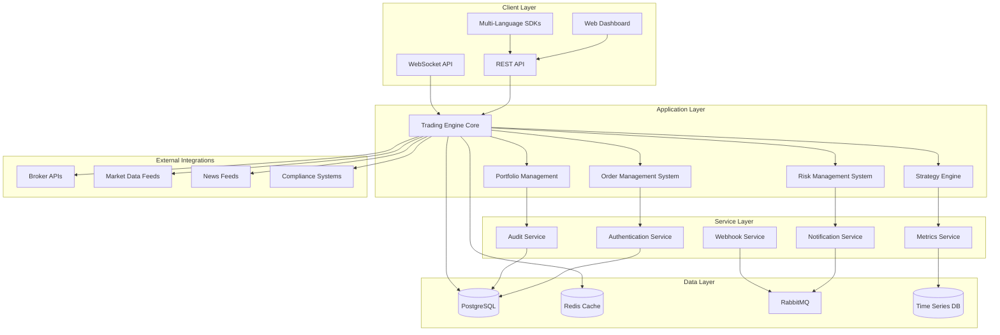

### Architecture Principles

1. **Microservices Architecture**: Loosely coupled, independently deployable services
2. **Event-Driven Design**: Asynchronous communication using message queues
3. **High Availability**: Redundancy and failover mechanisms at all levels
4. **Scalability**: Horizontal scaling capabilities for all components
5. **Security First**: Zero-trust security model with end-to-end encryption
6. **Performance Optimized**: Sub-millisecond latency for critical trading operations
7. **Cloud Native**: Kubernetes-based deployment with container orchestration

## Core Components

### 1. Trading Engine Core

The heart of the Nautilus Trader system, responsible for:

- **Order Processing**: High-speed order validation, routing, and execution
- **Market Data Processing**: Real-time market data ingestion and normalization
- **Strategy Execution**: Running algorithmic trading strategies
- **Risk Monitoring**: Real-time risk assessment and position monitoring

**Key Features:**
- Sub-millisecond order processing latency
- Support for multiple asset classes (Equities, FX, Crypto, Derivatives)
- Real-time P&L calculation
- Advanced order types and execution algorithms

**Technology Stack:**
- Language: Python with C++ extensions for performance-critical paths
- Framework: AsyncIO for concurrent processing
- Serialization: Protocol Buffers for efficient data exchange
- Memory Management: Object pooling and zero-copy operations

### 2. Order Management System (OMS)

Comprehensive order lifecycle management:

- **Order Validation**: Pre-trade compliance and risk checks
- **Order Routing**: Intelligent routing to optimal execution venues
- **Execution Management**: Real-time execution monitoring and reporting
- **Post-Trade Processing**: Trade settlement and reporting

**Architecture:**
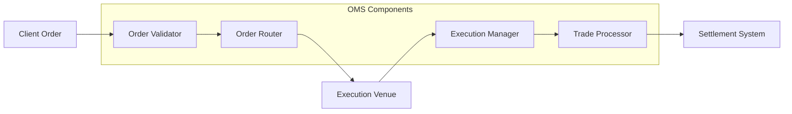

### 3. Risk Management System (RMS)

Real-time risk monitoring and control:

- **Pre-Trade Risk**: Order-level risk validation
- **Real-Time Risk**: Continuous position and portfolio risk monitoring
- **Risk Limits**: Configurable risk limits and automatic position sizing
- **Stress Testing**: Scenario analysis and stress testing capabilities

**Risk Metrics:**
- Value at Risk (VaR)
- Expected Shortfall (ES)
- Maximum Drawdown
- Sharpe Ratio
- Beta and correlation analysis

### 4. Portfolio Management System (PMS)

Comprehensive portfolio tracking and analysis:

- **Position Management**: Real-time position tracking across all accounts
- **P&L Calculation**: Mark-to-market and realized P&L calculation
- **Performance Attribution**: Strategy and asset-level performance analysis
- **Reporting**: Comprehensive portfolio reporting and analytics

### 5. Strategy Engine

Flexible strategy development and execution framework:

- **Strategy Framework**: Base classes and utilities for strategy development
- **Backtesting Engine**: Historical strategy testing and optimization
- **Live Trading**: Real-time strategy execution with paper and live trading modes
- **Strategy Monitoring**: Real-time strategy performance monitoring

**Supported Strategy Types:**
- Market Making
- Arbitrage
- Trend Following
- Mean Reversion
- Statistical Arbitrage
- Machine Learning-based strategies

## Data Flow Architecture

### Real-Time Data Flow

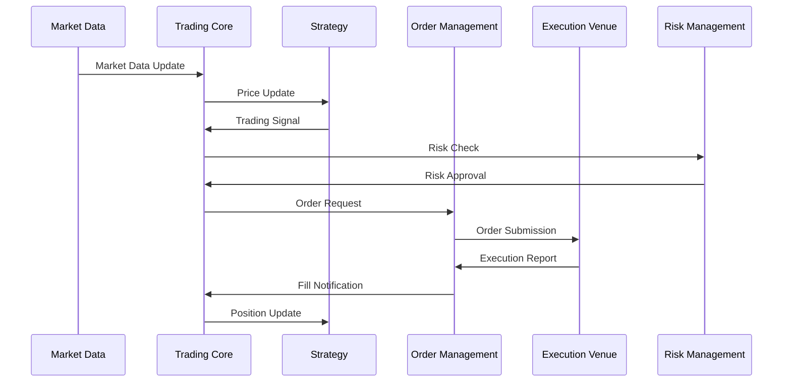

### Data Storage Architecture

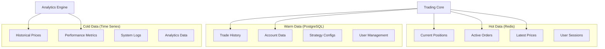

## Deployment Architecture

### Kubernetes Deployment

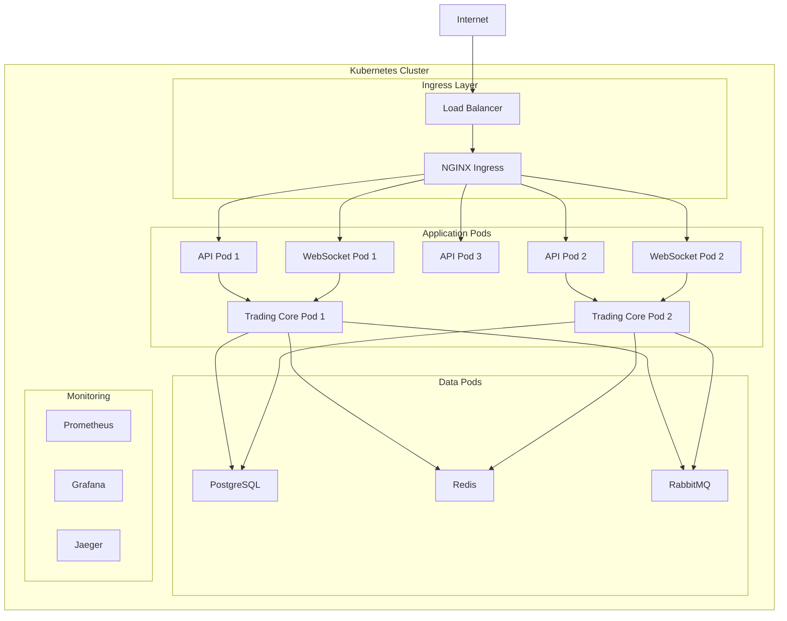

### Multi-Environment Architecture

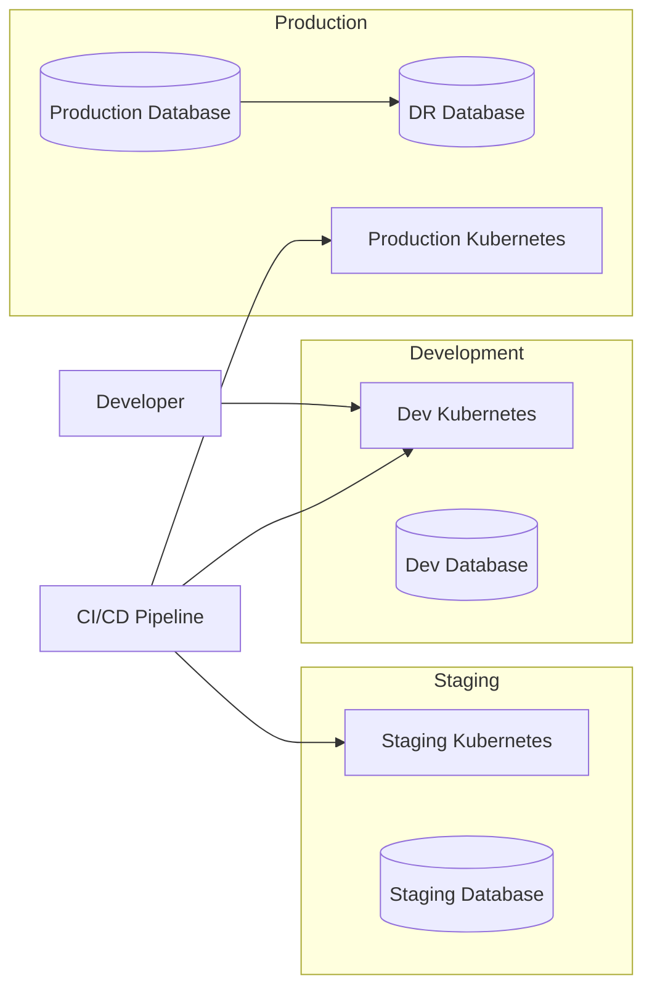

## Security Architecture

### Zero-Trust Security Model

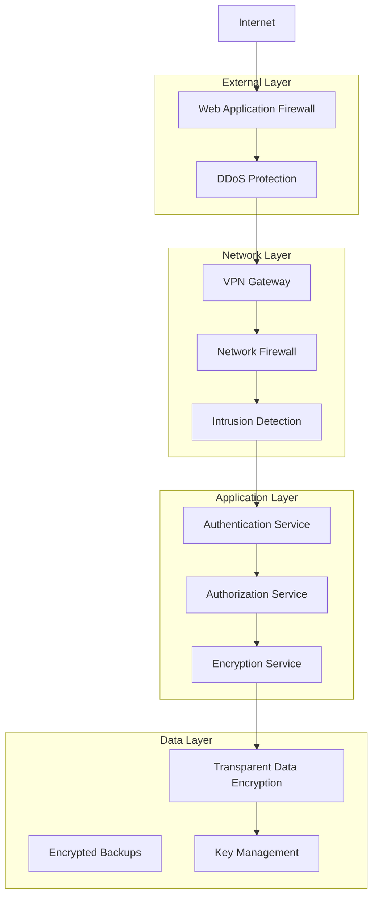

### Security Features

1. **Authentication & Authorization**
   - Multi-factor authentication (MFA)
   - Role-based access control (RBAC)
   - JWT tokens with short expiration
   - API key management

2. **Data Protection**
   - End-to-end encryption
   - Data at rest encryption
   - PII data masking
   - Secure key management

3. **Network Security**
   - Network segmentation
   - VPN access for sensitive operations
   - Intrusion detection and prevention
   - Regular security audits

4. **Compliance**
   - SOC 2 Type II compliance
   - GDPR compliance
   - Financial regulations compliance
   - Regular penetration testing

## Performance Architecture

### Latency Optimization

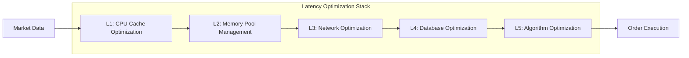

### Performance Targets

| Component | Latency Target | Throughput Target |
|-----------|---------------|-------------------|
| Market Data Processing | < 10 μs | 1M+ messages/sec |
| Order Validation | < 50 μs | 100K+ orders/sec |
| Risk Calculation | < 100 μs | 50K+ calculations/sec |
| Database Queries | < 1 ms | 10K+ queries/sec |
| API Response | < 10 ms | 1K+ requests/sec |

### Scalability Architecture

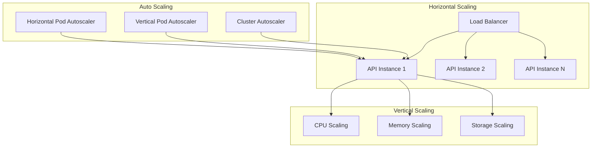

## Integration Architecture

### External System Integrations

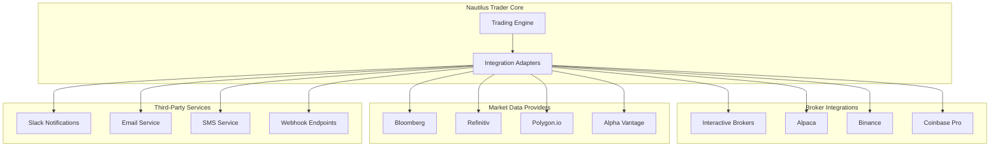

### API Architecture

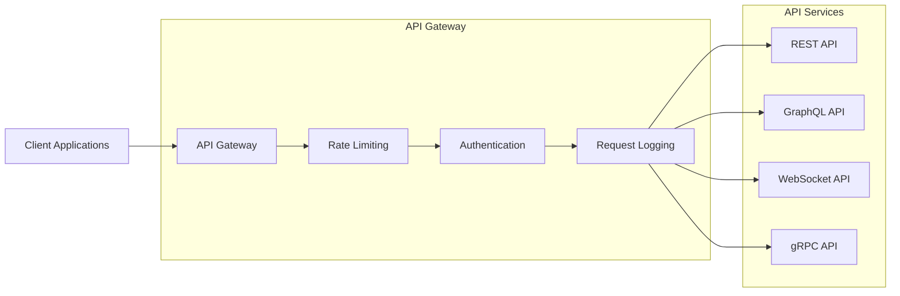

## Monitoring and Observability

### Observability Stack

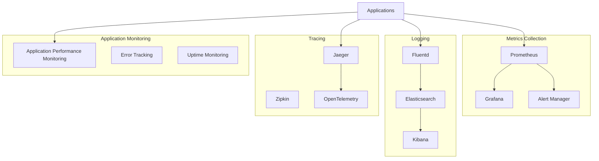

### Key Metrics and Alerts

#### System Metrics
- CPU utilization > 80%
- Memory utilization > 85%
- Disk utilization > 90%
- Network latency > 100ms

#### Application Metrics
- Order processing latency > 1ms
- API response time > 100ms
- Error rate > 1%
- Queue depth > 1000 messages

#### Business Metrics
- Daily trading volume
- P&L performance
- Strategy performance
- Risk metrics compliance

### Health Checks and SLAs

| Service | Availability SLA | Response Time SLA | Error Rate SLA |
|---------|------------------|-------------------|----------------|
| Trading Engine | 99.99% | < 1ms | < 0.01% |
| REST API | 99.9% | < 100ms | < 0.1% |
| WebSocket API | 99.9% | < 10ms | < 0.1% |
| Database | 99.99% | < 10ms | < 0.01% |
| Message Queue | 99.9% | < 5ms | < 0.1% |

## Disaster Recovery and Business Continuity

### Backup Strategy

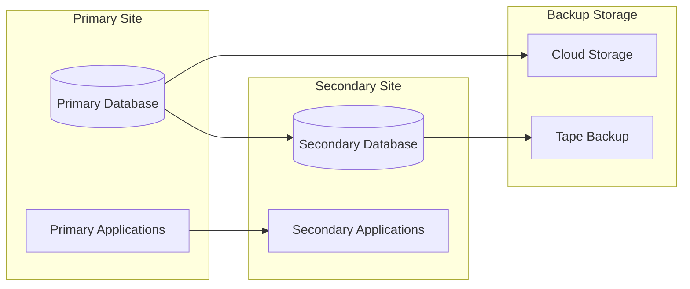

### Recovery Procedures

1. **RTO (Recovery Time Objective)**: 15 minutes
2. **RPO (Recovery Point Objective)**: 5 minutes
3. **Automated Failover**: Database and application failover
4. **Manual Failover**: Complete site failover procedures
5. **Data Recovery**: Point-in-time recovery capabilities

## Technology Stack Summary

### Core Technologies
- **Languages**: Python, TypeScript, C++
- **Frameworks**: FastAPI, React, AsyncIO
- **Databases**: PostgreSQL, Redis, InfluxDB
- **Message Queues**: RabbitMQ, Apache Kafka
- **Container Orchestration**: Kubernetes, Docker
- **Cloud Platforms**: AWS, GCP, Azure

### Development Tools
- **Version Control**: Git, GitHub
- **CI/CD**: GitHub Actions, ArgoCD
- **Testing**: pytest, Jest, Locust
- **Monitoring**: Prometheus, Grafana, Jaeger
- **Documentation**: Sphinx, OpenAPI, Mermaid

### Security Tools
- **Authentication**: Auth0, Keycloak
- **Encryption**: HashiCorp Vault
- **Scanning**: Snyk, OWASP ZAP
- **Compliance**: Compliance frameworks and auditing tools

## Conclusion

The Nautilus Trader architecture is designed to provide a robust, scalable, and high-performance algorithmic trading platform. The microservices architecture ensures flexibility and maintainability, while the focus on performance and security makes it suitable for institutional and high-frequency trading applications.

The system's modular design allows for easy integration with various brokers, market data providers, and third-party services, making it a comprehensive solution for algorithmic trading needs.

---

*This document is maintained by the Nautilus Trader architecture team and is updated regularly to reflect the current system design.*

**Last Updated**: January 2025  
**Version**: 1.0.0  
**Document Owner**: Architecture Team