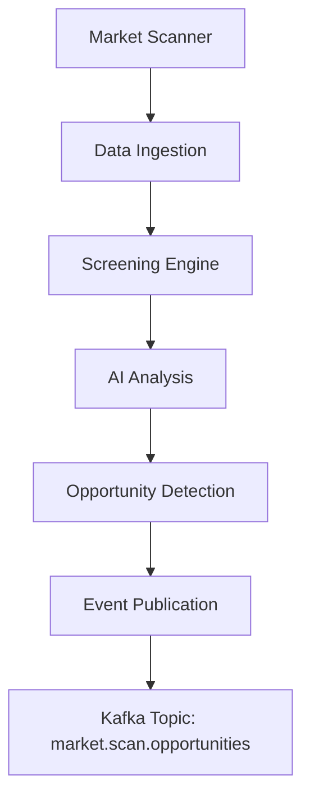

# Market Scanner Service

## Overview

The Market Scanner Service provides real-time market scanning and opportunity detection capabilities for the Algorithmic Trading System. It monitors multiple markets, asset classes, and technical indicators to identify trading opportunities based on predefined criteria and machine learning models.

## Features

### Real-Time Market Scanning
- Multi-asset scanning (stocks, options, futures, forex, crypto)
- Technical indicator-based screening
- Volume and price action analysis
- Pattern recognition and alerts

### AI-Powered Opportunity Detection
- Machine learning-based signal generation
- Sentiment analysis integration
- News and event correlation
- Predictive modeling for opportunity scoring

### Integration Points
- **Event Bus**: Publishes scanning results to Kafka topics
- **Database**: Stores scan results in ClickHouse for historical analysis
- **AI Assistant**: Integrates with forecasting models
- **Risk Manager**: Validates opportunities against risk parameters

## Architecture

## Configuration

### Scanner Parameters
- Asset universes and market segments
- Technical indicator thresholds
- Volume and liquidity filters
- Risk and sizing parameters

### AI Model Integration
- Integration with forecasting models
- Sentiment analysis pipelines
- Pattern recognition algorithms
- Real-time inference endpoints

## API Endpoints

### RESTful API
- `GET /api/v1/scan/results` - Get latest scan results
- `POST /api/v1/scan/criteria` - Update scanning criteria
- `GET /api/v1/scan/status` - Get scanner status

### WebSocket Streams
- Real-time opportunity alerts
- Scanning progress updates
- Market condition changes

## Development Status

🚧 **Phase 0**: Directory structure and documentation
📋 **Phase 1**: Core scanning engine implementation
🔬 **Phase 2**: AI model integration
🚀 **Phase 3**: Real-time optimization

## Dependencies

- Market data feeds (real-time and historical)
- Technical analysis libraries (TA-Lib, pandas-ta)
- Machine learning frameworks (scikit-learn, PyTorch)
- Event streaming (Apache Kafka)
- Database storage (ClickHouse, Redis)