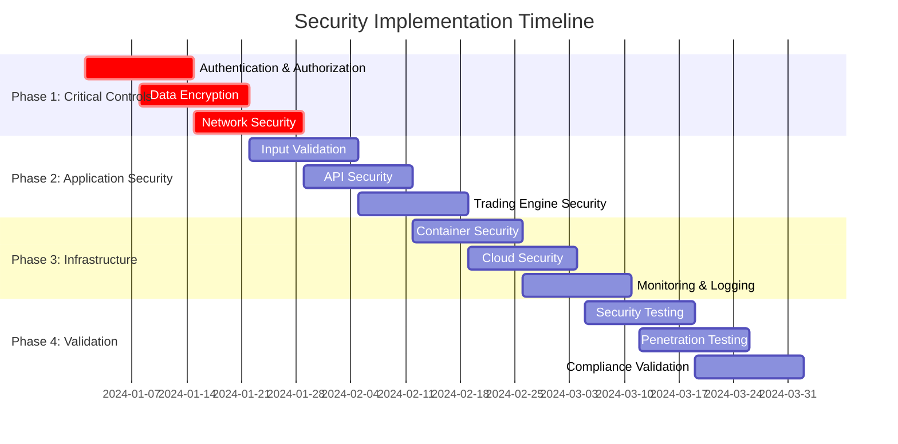

# Security Implementation Guide

## Executive Summary

This implementation guide provides detailed technical instructions for implementing the security controls identified in the STRIDE threat model and risk documentation. It includes step-by-step procedures, configuration examples, and validation methods for each security control.

## Table of Contents

1. [Implementation Overview](#implementation-overview)
2. [Authentication and Authorization](#authentication-and-authorization)
3. [Data Protection](#data-protection)
4. [Network Security](#network-security)
5. [Application Security](#application-security)
6. [Infrastructure Security](#infrastructure-security)
7. [Monitoring and Logging](#monitoring-and-logging)
8. [Incident Response](#incident-response)
9. [Compliance Implementation](#compliance-implementation)
10. [Testing and Validation](#testing-and-validation)

## Implementation Overview

### Implementation Phases



### Prerequisites

```yaml
Infrastructure Requirements:
  - Kubernetes cluster (v1.25+)
  - Docker containers
  - Load balancer (HAProxy/Nginx)
  - Certificate management (Let's Encrypt/Internal CA)
  - Secret management (HashiCorp Vault)

Software Requirements:
  - Python 3.9+
  - Node.js 18+
  - PostgreSQL 14+
  - Redis 7+
  - Apache Kafka 3.0+

Security Tools:
  - SIEM solution (ELK Stack/Splunk)
  - Vulnerability scanner (Nessus/OpenVAS)
  - Container scanner (Trivy/Clair)
  - Code analysis (SonarQube)
```

## Authentication and Authorization

### Multi-Factor Authentication (MFA)

#### Implementation Steps

**Step 1: Install MFA Libraries**
```bash
# Python backend
pip install pyotp qrcode[pil] cryptography

# Node.js frontend
npm install speakeasy qrcode jsonwebtoken
```

**Step 2: Backend MFA Implementation**
```python
# auth/mfa.py
import pyotp
import qrcode
from io import BytesIO
from cryptography.fernet import Fernet

class MFAManager:
    def __init__(self, encryption_key):
        self.cipher = Fernet(encryption_key)
    
    def generate_secret(self, user_id):
        """Generate TOTP secret for user"""
        secret = pyotp.random_base32()
        encrypted_secret = self.cipher.encrypt(secret.encode())
        
        # Store encrypted secret in database
        self.store_user_secret(user_id, encrypted_secret)
        
        return secret
    
    def generate_qr_code(self, user_email, secret):
        """Generate QR code for authenticator app"""
        totp_uri = pyotp.totp.TOTP(secret).provisioning_uri(
            name=user_email,
            issuer_name="Algorithmic Trading System"
        )
        
        qr = qrcode.QRCode(version=1, box_size=10, border=5)
        qr.add_data(totp_uri)
        qr.make(fit=True)
        
        img = qr.make_image(fill_color="black", back_color="white")
        buffer = BytesIO()
        img.save(buffer, format='PNG')
        
        return buffer.getvalue()
    
    def verify_token(self, user_id, token):
        """Verify TOTP token"""
        encrypted_secret = self.get_user_secret(user_id)
        secret = self.cipher.decrypt(encrypted_secret).decode()
        
        totp = pyotp.TOTP(secret)
        return totp.verify(token, valid_window=1)
    
    def generate_backup_codes(self, user_id, count=10):
        """Generate backup codes for account recovery"""
        import secrets
        import string
        
        codes = []
        for _ in range(count):
            code = ''.join(secrets.choice(string.ascii_uppercase + string.digits) 
                          for _ in range(8))
            codes.append(code)
        
        # Hash and store backup codes
        hashed_codes = [self.hash_backup_code(code) for code in codes]
        self.store_backup_codes(user_id, hashed_codes)
        
        return codes
```

**Step 3: JWT Token Security**
```python
# auth/jwt_manager.py
import jwt
import datetime
from cryptography.hazmat.primitives import serialization
from cryptography.hazmat.primitives.asymmetric import rsa

class JWTManager:
    def __init__(self):
        self.private_key = self.load_private_key()
        self.public_key = self.load_public_key()
        self.algorithm = 'RS256'
    
    def generate_token(self, user_id, roles, permissions):
        """Generate JWT token with security claims"""
        now = datetime.datetime.utcnow()
        payload = {
            'sub': user_id,
            'iat': now,
            'exp': now + datetime.timedelta(hours=1),
            'nbf': now,
            'iss': 'trading-system',
            'aud': 'trading-api',
            'roles': roles,
            'permissions': permissions,
            'jti': self.generate_jti(),  # JWT ID for revocation
            'session_id': self.generate_session_id()
        }
        
        return jwt.encode(payload, self.private_key, algorithm=self.algorithm)
    
    def verify_token(self, token):
        """Verify JWT token and extract claims"""
        try:
            payload = jwt.decode(
                token, 
                self.public_key, 
                algorithms=[self.algorithm],
                audience='trading-api',
                issuer='trading-system'
            )
            
            # Check if token is revoked
            if self.is_token_revoked(payload.get('jti')):
                raise jwt.InvalidTokenError('Token has been revoked')
            
            return payload
        except jwt.ExpiredSignatureError:
            raise jwt.InvalidTokenError('Token has expired')
        except jwt.InvalidTokenError as e:
            raise jwt.InvalidTokenError(f'Invalid token: {str(e)}')
```

**Step 4: Role-Based Access Control (RBAC)**
```python
# auth/rbac.py
from enum import Enum
from typing import List, Dict, Set

class Permission(Enum):
    # Trading permissions
    CREATE_ORDER = "create_order"
    MODIFY_ORDER = "modify_order"
    CANCEL_ORDER = "cancel_order"
    VIEW_ORDERS = "view_orders"
    
    # Portfolio permissions
    VIEW_PORTFOLIO = "view_portfolio"
    MODIFY_PORTFOLIO = "modify_portfolio"
    CREATE_PORTFOLIO = "create_portfolio"
    
    # Risk permissions
    VIEW_RISK = "view_risk"
    MODIFY_RISK_LIMITS = "modify_risk_limits"
    OVERRIDE_RISK = "override_risk"
    
    # Admin permissions
    MANAGE_USERS = "manage_users"
    SYSTEM_CONFIG = "system_config"
    VIEW_AUDIT_LOGS = "view_audit_logs"

class Role(Enum):
    SUPER_ADMIN = "super_admin"
    ADMIN = "admin"
    RISK_MANAGER = "risk_manager"
    TRADER = "trader"
    ANALYST = "analyst"
    VIEWER = "viewer"

class RBACManager:
    def __init__(self):
        self.role_permissions = {
            Role.SUPER_ADMIN: set(Permission),
            Role.ADMIN: {
                Permission.MANAGE_USERS,
                Permission.SYSTEM_CONFIG,
                Permission.VIEW_AUDIT_LOGS,
                Permission.VIEW_PORTFOLIO,
                Permission.VIEW_RISK,
                Permission.VIEW_ORDERS
            },
            Role.RISK_MANAGER: {
                Permission.VIEW_RISK,
                Permission.MODIFY_RISK_LIMITS,
                Permission.OVERRIDE_RISK,
                Permission.VIEW_PORTFOLIO,
                Permission.VIEW_ORDERS
            },
            Role.TRADER: {
                Permission.CREATE_ORDER,
                Permission.MODIFY_ORDER,
                Permission.CANCEL_ORDER,
                Permission.VIEW_ORDERS,
                Permission.VIEW_PORTFOLIO,
                Permission.VIEW_RISK
            },
            Role.ANALYST: {
                Permission.VIEW_PORTFOLIO,
                Permission.VIEW_RISK,
                Permission.VIEW_ORDERS
            },
            Role.VIEWER: {
                Permission.VIEW_PORTFOLIO,
                Permission.VIEW_ORDERS
            }
        }
    
    def check_permission(self, user_roles: List[str], required_permission: Permission) -> bool:
        """Check if user has required permission"""
        user_permissions = set()
        
        for role_str in user_roles:
            try:
                role = Role(role_str)
                user_permissions.update(self.role_permissions.get(role, set()))
            except ValueError:
                continue
        
        return required_permission in user_permissions
    
    def get_user_permissions(self, user_roles: List[str]) -> Set[Permission]:
        """Get all permissions for user roles"""
        permissions = set()
        
        for role_str in user_roles:
            try:
                role = Role(role_str)
                permissions.update(self.role_permissions.get(role, set()))
            except ValueError:
                continue
        
        return permissions
```

### Session Management

**Step 5: Secure Session Implementation**
```python
# auth/session_manager.py
import redis
import json
import hashlib
from datetime import datetime, timedelta

class SessionManager:
    def __init__(self, redis_client):
        self.redis = redis_client
        self.session_timeout = 3600  # 1 hour
        self.max_sessions_per_user = 5
    
    def create_session(self, user_id, user_agent, ip_address):
        """Create new user session"""
        session_id = self.generate_session_id(user_id, user_agent, ip_address)
        
        session_data = {
            'user_id': user_id,
            'created_at': datetime.utcnow().isoformat(),
            'last_activity': datetime.utcnow().isoformat(),
            'user_agent': user_agent,
            'ip_address': ip_address,
            'is_active': True
        }
        
        # Store session
        self.redis.setex(
            f"session:{session_id}",
            self.session_timeout,
            json.dumps(session_data)
        )
        
        # Track user sessions
        self.add_user_session(user_id, session_id)
        
        return session_id
    
    def validate_session(self, session_id, ip_address, user_agent):
        """Validate session and update activity"""
        session_data = self.get_session(session_id)
        
        if not session_data:
            return None
        
        # Check IP address consistency
        if session_data['ip_address'] != ip_address:
            self.invalidate_session(session_id)
            return None
        
        # Update last activity
        session_data['last_activity'] = datetime.utcnow().isoformat()
        self.redis.setex(
            f"session:{session_id}",
            self.session_timeout,
            json.dumps(session_data)
        )
        
        return session_data
    
    def invalidate_session(self, session_id):
        """Invalidate specific session"""
        session_data = self.get_session(session_id)
        if session_data:
            user_id = session_data['user_id']
            self.remove_user_session(user_id, session_id)
        
        self.redis.delete(f"session:{session_id}")
    
    def invalidate_all_user_sessions(self, user_id):
        """Invalidate all sessions for a user"""
        session_ids = self.get_user_sessions(user_id)
        
        for session_id in session_ids:
            self.redis.delete(f"session:{session_id}")
        
        self.redis.delete(f"user_sessions:{user_id}")
```

## Data Protection

### Encryption Implementation

**Step 1: Database Encryption**
```python
# security/encryption.py
from cryptography.fernet import Fernet
from cryptography.hazmat.primitives import hashes
from cryptography.hazmat.primitives.kdf.pbkdf2 import PBKDF2HMAC
import base64
import os

class EncryptionManager:
    def __init__(self, master_key=None):
        if master_key:
            self.key = master_key
        else:
            self.key = self.generate_key()
        
        self.cipher = Fernet(self.key)
    
    @staticmethod
    def generate_key():
        """Generate encryption key"""
        return Fernet.generate_key()
    
    @staticmethod
    def derive_key_from_password(password: str, salt: bytes = None):
        """Derive key from password using PBKDF2"""
        if salt is None:
            salt = os.urandom(16)
        
        kdf = PBKDF2HMAC(
            algorithm=hashes.SHA256(),
            length=32,
            salt=salt,
            iterations=100000,
        )
        key = base64.urlsafe_b64encode(kdf.derive(password.encode()))
        return key, salt
    
    def encrypt_data(self, data: str) -> str:
        """Encrypt string data"""
        if isinstance(data, str):
            data = data.encode()
        
        encrypted_data = self.cipher.encrypt(data)
        return base64.urlsafe_b64encode(encrypted_data).decode()
    
    def decrypt_data(self, encrypted_data: str) -> str:
        """Decrypt string data"""
        encrypted_bytes = base64.urlsafe_b64encode(encrypted_data.encode())
        decrypted_data = self.cipher.decrypt(encrypted_bytes)
        return decrypted_data.decode()
    
    def encrypt_file(self, file_path: str, output_path: str = None):
        """Encrypt file"""
        if output_path is None:
            output_path = file_path + '.encrypted'
        
        with open(file_path, 'rb') as file:
            file_data = file.read()
        
        encrypted_data = self.cipher.encrypt(file_data)
        
        with open(output_path, 'wb') as encrypted_file:
            encrypted_file.write(encrypted_data)
        
        return output_path
```

**Step 2: Database Field Encryption**
```python
# models/encrypted_fields.py
from sqlalchemy import TypeDecorator, String
from security.encryption import EncryptionManager

class EncryptedType(TypeDecorator):
    impl = String
    cache_ok = True
    
    def __init__(self, encryption_manager, *args, **kwargs):
        self.encryption_manager = encryption_manager
        super().__init__(*args, **kwargs)
    
    def process_bind_param(self, value, dialect):
        if value is not None:
            return self.encryption_manager.encrypt_data(value)
        return value
    
    def process_result_value(self, value, dialect):
        if value is not None:
            return self.encryption_manager.decrypt_data(value)
        return value

# Usage in models
from sqlalchemy import Column, Integer, String
from sqlalchemy.ext.declarative import declarative_base

Base = declarative_base()
encryption_manager = EncryptionManager()

class User(Base):
    __tablename__ = 'users'
    
    id = Column(Integer, primary_key=True)
    username = Column(String(50), nullable=False)
    email = Column(EncryptedType(encryption_manager, 255), nullable=False)
    phone = Column(EncryptedType(encryption_manager, 20))
    ssn = Column(EncryptedType(encryption_manager, 11))  # Highly sensitive
```

**Step 3: API Encryption (TLS Configuration)**
```yaml
# nginx/ssl.conf
server {
    listen 443 ssl http2;
    server_name api.trading-system.com;
    
    # SSL Configuration
    ssl_certificate /etc/ssl/certs/trading-system.crt;
    ssl_certificate_key /etc/ssl/private/trading-system.key;
    
    # SSL Security Settings
    ssl_protocols TLSv1.2 TLSv1.3;
    ssl_ciphers ECDHE-RSA-AES256-GCM-SHA512:DHE-RSA-AES256-GCM-SHA512:ECDHE-RSA-AES256-GCM-SHA384:DHE-RSA-AES256-GCM-SHA384;
    ssl_prefer_server_ciphers off;
    ssl_session_cache shared:SSL:10m;
    ssl_session_timeout 10m;
    
    # HSTS
    add_header Strict-Transport-Security "max-age=31536000; includeSubDomains; preload" always;
    
    # Certificate Transparency
    ssl_ct on;
    ssl_ct_static_scts /etc/ssl/scts;
    
    # OCSP Stapling
    ssl_stapling on;
    ssl_stapling_verify on;
    ssl_trusted_certificate /etc/ssl/certs/ca-bundle.crt;
    
    location / {
        proxy_pass http://backend;
        proxy_set_header Host $host;
        proxy_set_header X-Real-IP $remote_addr;
        proxy_set_header X-Forwarded-For $proxy_add_x_forwarded_for;
        proxy_set_header X-Forwarded-Proto $scheme;
    }
}
```

## Network Security

### Network Segmentation

**Step 1: Kubernetes Network Policies**
```yaml
# k8s/network-policies/default-deny.yaml
apiVersion: networking.k8s.io/v1
kind: NetworkPolicy
metadata:
  name: default-deny-all
  namespace: trading-system
spec:
  podSelector: {}
  policyTypes:
  - Ingress
  - Egress
---
# k8s/network-policies/api-gateway.yaml
apiVersion: networking.k8s.io/v1
kind: NetworkPolicy
metadata:
  name: api-gateway-policy
  namespace: trading-system
spec:
  podSelector:
    matchLabels:
      app: api-gateway
  policyTypes:
  - Ingress
  - Egress
  ingress:
  - from:
    - namespaceSelector:
        matchLabels:
          name: ingress-nginx
    ports:
    - protocol: TCP
      port: 8080
  egress:
  - to:
    - podSelector:
        matchLabels:
          tier: backend
    ports:
    - protocol: TCP
      port: 8000
  - to: []  # Allow DNS
    ports:
    - protocol: UDP
      port: 53
---
# k8s/network-policies/database.yaml
apiVersion: networking.k8s.io/v1
kind: NetworkPolicy
metadata:
  name: database-policy
  namespace: trading-system
spec:
  podSelector:
    matchLabels:
      tier: database
  policyTypes:
  - Ingress
  ingress:
  - from:
    - podSelector:
        matchLabels:
          tier: backend
    ports:
    - protocol: TCP
      port: 5432
```

**Step 2: Firewall Rules (iptables)**
```bash
#!/bin/bash
# firewall/setup-firewall.sh

# Flush existing rules
iptables -F
iptables -X
iptables -t nat -F
iptables -t nat -X
iptables -t mangle -F
iptables -t mangle -X

# Set default policies
iptables -P INPUT DROP
iptables -P FORWARD DROP
iptables -P OUTPUT ACCEPT

# Allow loopback
iptables -A INPUT -i lo -j ACCEPT
iptables -A OUTPUT -o lo -j ACCEPT

# Allow established connections
iptables -A INPUT -m conntrack --ctstate ESTABLISHED,RELATED -j ACCEPT

# Allow SSH (restrict to management network)
iptables -A INPUT -p tcp --dport 22 -s 10.0.1.0/24 -j ACCEPT

# Allow HTTPS (from load balancer)
iptables -A INPUT -p tcp --dport 443 -s 10.0.2.0/24 -j ACCEPT

# Allow HTTP (from load balancer)
iptables -A INPUT -p tcp --dport 80 -s 10.0.2.0/24 -j ACCEPT

# Allow Kubernetes API
iptables -A INPUT -p tcp --dport 6443 -s 10.0.0.0/16 -j ACCEPT

# Allow inter-node communication
iptables -A INPUT -p tcp --dport 10250 -s 10.0.0.0/16 -j ACCEPT
iptables -A INPUT -p tcp --dport 2379:2380 -s 10.0.0.0/16 -j ACCEPT

# Log dropped packets
iptables -A INPUT -j LOG --log-prefix "DROPPED: "
iptables -A INPUT -j DROP

# Save rules
iptables-save > /etc/iptables/rules.v4
```

### VPN Configuration

**Step 3: WireGuard VPN Setup**
```ini
# /etc/wireguard/wg0.conf
[Interface]
PrivateKey = <SERVER_PRIVATE_KEY>
Address = 10.0.100.1/24
ListenPort = 51820
PostUp = iptables -A FORWARD -i %i -j ACCEPT; iptables -A FORWARD -o %i -j ACCEPT; iptables -t nat -A POSTROUTING -o eth0 -j MASQUERADE
PostDown = iptables -D FORWARD -i %i -j ACCEPT; iptables -D FORWARD -o %i -j ACCEPT; iptables -t nat -D POSTROUTING -o eth0 -j MASQUERADE

# Admin user
[Peer]
PublicKey = <ADMIN_PUBLIC_KEY>
AllowedIPs = 10.0.100.10/32

# Developer user
[Peer]
PublicKey = <DEV_PUBLIC_KEY>
AllowedIPs = 10.0.100.20/32
```

## Application Security

### Input Validation

**Step 1: Comprehensive Input Validation**
```python
# security/validation.py
import re
from typing import Any, Dict, List, Optional
from decimal import Decimal, InvalidOperation
from datetime import datetime
import bleach

class ValidationError(Exception):
    pass

class InputValidator:
    def __init__(self):
        self.email_pattern = re.compile(r'^[a-zA-Z0-9._%+-]+@[a-zA-Z0-9.-]+\.[a-zA-Z]{2,}$')
        self.phone_pattern = re.compile(r'^\+?1?[2-9]\d{2}[2-9]\d{2}\d{4}$')
        self.symbol_pattern = re.compile(r'^[A-Z]{1,5}$')
        
        # HTML sanitization settings
        self.allowed_tags = ['b', 'i', 'u', 'em', 'strong', 'p', 'br']
        self.allowed_attributes = {}
    
    def validate_email(self, email: str) -> str:
        """Validate email address"""
        if not email or not isinstance(email, str):
            raise ValidationError("Email is required")
        
        email = email.strip().lower()
        
        if len(email) > 254:
            raise ValidationError("Email address too long")
        
        if not self.email_pattern.match(email):
            raise ValidationError("Invalid email format")
        
        return email
    
    def validate_password(self, password: str) -> str:
        """Validate password strength"""
        if not password or not isinstance(password, str):
            raise ValidationError("Password is required")
        
        if len(password) < 12:
            raise ValidationError("Password must be at least 12 characters")
        
        if len(password) > 128:
            raise ValidationError("Password too long")
        
        # Check complexity
        has_upper = any(c.isupper() for c in password)
        has_lower = any(c.islower() for c in password)
        has_digit = any(c.isdigit() for c in password)
        has_special = any(c in '!@#$%^&*()_+-=[]{}|;:,.<>?' for c in password)
        
        if not all([has_upper, has_lower, has_digit, has_special]):
            raise ValidationError(
                "Password must contain uppercase, lowercase, digit, and special character"
            )
        
        return password
    
    def validate_trading_symbol(self, symbol: str) -> str:
        """Validate trading symbol"""
        if not symbol or not isinstance(symbol, str):
            raise ValidationError("Symbol is required")
        
        symbol = symbol.strip().upper()
        
        if not self.symbol_pattern.match(symbol):
            raise ValidationError("Invalid symbol format")
        
        return symbol
    
    def validate_order_quantity(self, quantity: Any) -> Decimal:
        """Validate order quantity"""
        try:
            qty = Decimal(str(quantity))
        except (InvalidOperation, ValueError):
            raise ValidationError("Invalid quantity format")
        
        if qty <= 0:
            raise ValidationError("Quantity must be positive")
        
        if qty > Decimal('1000000'):
            raise ValidationError("Quantity too large")
        
        # Check decimal places (max 8)
        if qty.as_tuple().exponent < -8:
            raise ValidationError("Too many decimal places")
        
        return qty
    
    def validate_price(self, price: Any) -> Decimal:
        """Validate price"""
        try:
            price_decimal = Decimal(str(price))
        except (InvalidOperation, ValueError):
            raise ValidationError("Invalid price format")
        
        if price_decimal <= 0:
            raise ValidationError("Price must be positive")
        
        if price_decimal > Decimal('1000000'):
            raise ValidationError("Price too high")
        
        # Check decimal places (max 4)
        if price_decimal.as_tuple().exponent < -4:
            raise ValidationError("Too many decimal places in price")
        
        return price_decimal
    
    def sanitize_html(self, html_content: str) -> str:
        """Sanitize HTML content"""
        if not html_content:
            return ""
        
        return bleach.clean(
            html_content,
            tags=self.allowed_tags,
            attributes=self.allowed_attributes,
            strip=True
        )
    
    def validate_json_schema(self, data: Dict, schema: Dict) -> Dict:
        """Validate JSON data against schema"""
        import jsonschema
        
        try:
            jsonschema.validate(data, schema)
            return data
        except jsonschema.ValidationError as e:
            raise ValidationError(f"Schema validation failed: {e.message}")
```

**Step 2: API Input Validation Middleware**
```python
# api/middleware/validation.py
from flask import request, jsonify
from functools import wraps
from security.validation import InputValidator, ValidationError

validator = InputValidator()

def validate_json_input(schema):
    """Decorator for JSON input validation"""
    def decorator(f):
        @wraps(f)
        def decorated_function(*args, **kwargs):
            if not request.is_json:
                return jsonify({'error': 'Content-Type must be application/json'}), 400
            
            try:
                data = request.get_json()
                if data is None:
                    return jsonify({'error': 'Invalid JSON'}), 400
                
                # Validate against schema
                validated_data = validator.validate_json_schema(data, schema)
                request.validated_json = validated_data
                
                return f(*args, **kwargs)
            
            except ValidationError as e:
                return jsonify({'error': str(e)}), 400
            except Exception as e:
                return jsonify({'error': 'Validation failed'}), 400
        
        return decorated_function
    return decorator

# Usage example
order_schema = {
    "type": "object",
    "properties": {
        "symbol": {"type": "string", "pattern": "^[A-Z]{1,5}$"},
        "quantity": {"type": "number", "minimum": 0.00000001, "maximum": 1000000},
        "price": {"type": "number", "minimum": 0.0001, "maximum": 1000000},
        "side": {"type": "string", "enum": ["BUY", "SELL"]},
        "order_type": {"type": "string", "enum": ["MARKET", "LIMIT", "STOP"]}
    },
    "required": ["symbol", "quantity", "side", "order_type"]
}

@app.route('/api/orders', methods=['POST'])
@validate_json_input(order_schema)
def create_order():
    data = request.validated_json
    # Process validated data
    return jsonify({'status': 'success'})
```

### SQL Injection Prevention

**Step 3: Parameterized Queries**
```python
# database/secure_queries.py
from sqlalchemy import text
from typing import List, Dict, Any

class SecureQueryBuilder:
    def __init__(self, db_session):
        self.session = db_session
    
    def get_user_orders(self, user_id: int, symbol: str = None) -> List[Dict]:
        """Get user orders with parameterized query"""
        base_query = """
            SELECT o.id, o.symbol, o.quantity, o.price, o.side, o.status, o.created_at
            FROM orders o
            WHERE o.user_id = :user_id
        """
        
        params = {'user_id': user_id}
        
        if symbol:
            base_query += " AND o.symbol = :symbol"
            params['symbol'] = symbol
        
        base_query += " ORDER BY o.created_at DESC LIMIT 100"
        
        result = self.session.execute(text(base_query), params)
        return [dict(row) for row in result]
    
    def get_portfolio_positions(self, user_id: int) -> List[Dict]:
        """Get portfolio positions safely"""
        query = text("""
            SELECT p.symbol, p.quantity, p.avg_cost, p.market_value, p.unrealized_pnl
            FROM positions p
            WHERE p.user_id = :user_id AND p.quantity != 0
            ORDER BY p.market_value DESC
        """)
        
        result = self.session.execute(query, {'user_id': user_id})
        return [dict(row) for row in result]
    
    def search_symbols(self, search_term: str) -> List[Dict]:
        """Search symbols with safe LIKE query"""
        # Escape special characters in search term
        escaped_term = search_term.replace('%', '\\%').replace('_', '\\_')
        
        query = text("""
            SELECT symbol, company_name, sector, market_cap
            FROM symbols
            WHERE symbol LIKE :search_pattern
               OR company_name LIKE :search_pattern
            ORDER BY symbol
            LIMIT 50
        """)
        
        search_pattern = f"%{escaped_term}%"
        result = self.session.execute(query, {'search_pattern': search_pattern})
        return [dict(row) for row in result]
```

## Infrastructure Security

### Container Security

**Step 1: Secure Dockerfile**
```dockerfile
# Dockerfile.secure
# Use specific version, not latest
FROM python:3.11.7-slim-bullseye

# Create non-root user
RUN groupadd -r appuser && useradd -r -g appuser appuser

# Install security updates
RUN apt-get update && apt-get upgrade -y && \
    apt-get install -y --no-install-recommends \
    ca-certificates \
    && rm -rf /var/lib/apt/lists/*

# Set working directory
WORKDIR /app

# Copy requirements first for better caching
COPY requirements.txt .

# Install Python dependencies
RUN pip install --no-cache-dir --upgrade pip && \
    pip install --no-cache-dir -r requirements.txt

# Copy application code
COPY --chown=appuser:appuser . .

# Remove unnecessary files
RUN find . -name "*.pyc" -delete && \
    find . -name "__pycache__" -delete

# Set security options
USER appuser
EXPOSE 8000

# Health check
HEALTHCHECK --interval=30s --timeout=10s --start-period=5s --retries=3 \
    CMD curl -f http://localhost:8000/health || exit 1

# Run application
CMD ["gunicorn", "--bind", "0.0.0.0:8000", "--workers", "4", "app:app"]
```

**Step 2: Kubernetes Security Context**
```yaml
# k8s/deployments/trading-engine.yaml
apiVersion: apps/v1
kind: Deployment
metadata:
  name: trading-engine
  namespace: trading-system
spec:
  replicas: 3
  selector:
    matchLabels:
      app: trading-engine
  template:
    metadata:
      labels:
        app: trading-engine
        tier: backend
    spec:
      serviceAccountName: trading-engine-sa
      securityContext:
        runAsNonRoot: true
        runAsUser: 1000
        runAsGroup: 1000
        fsGroup: 1000
        seccompProfile:
          type: RuntimeDefault
      containers:
      - name: trading-engine
        image: trading-system/trading-engine:v1.0.0
        imagePullPolicy: Always
        securityContext:
          allowPrivilegeEscalation: false
          readOnlyRootFilesystem: true
          runAsNonRoot: true
          runAsUser: 1000
          capabilities:
            drop:
            - ALL
        resources:
          requests:
            memory: "256Mi"
            cpu: "250m"
          limits:
            memory: "512Mi"
            cpu: "500m"
        ports:
        - containerPort: 8000
          protocol: TCP
        env:
        - name: DATABASE_URL
          valueFrom:
            secretKeyRef:
              name: database-secret
              key: url
        volumeMounts:
        - name: tmp-volume
          mountPath: /tmp
        - name: cache-volume
          mountPath: /app/cache
        livenessProbe:
          httpGet:
            path: /health
            port: 8000
          initialDelaySeconds: 30
          periodSeconds: 10
        readinessProbe:
          httpGet:
            path: /ready
            port: 8000
          initialDelaySeconds: 5
          periodSeconds: 5
      volumes:
      - name: tmp-volume
        emptyDir: {}
      - name: cache-volume
        emptyDir: {}
```

**Step 3: Pod Security Standards**
```yaml
# k8s/pod-security-policy.yaml
apiVersion: policy/v1beta1
kind: PodSecurityPolicy
metadata:
  name: restricted-psp
spec:
  privileged: false
  allowPrivilegeEscalation: false
  requiredDropCapabilities:
    - ALL
  volumes:
    - 'configMap'
    - 'emptyDir'
    - 'projected'
    - 'secret'
    - 'downwardAPI'
    - 'persistentVolumeClaim'
  runAsUser:
    rule: 'MustRunAsNonRoot'
  seLinux:
    rule: 'RunAsAny'
  fsGroup:
    rule: 'RunAsAny'
  readOnlyRootFilesystem: true
```

## Monitoring and Logging

### Security Monitoring

**Step 1: ELK Stack Configuration**
```yaml
# elk/elasticsearch.yml
cluster.name: "trading-security-logs"
node.name: "es-node-1"
path.data: /usr/share/elasticsearch/data
path.logs: /usr/share/elasticsearch/logs
network.host: 0.0.0.0
http.port: 9200
discovery.type: single-node

# Security settings
xpack.security.enabled: true
xpack.security.transport.ssl.enabled: true
xpack.security.http.ssl.enabled: true
xpack.security.audit.enabled: true

# Index lifecycle management
xpack.ilm.enabled: true
```

**Step 2: Logstash Security Pipeline**
```ruby
# logstash/pipeline/security.conf
input {
  beats {
    port => 5044
  }
  
  kafka {
    bootstrap_servers => "kafka:9092"
    topics => ["security-events", "audit-logs", "application-logs"]
    codec => json
  }
}

filter {
  if [fields][log_type] == "security" {
    grok {
      match => { "message" => "%{TIMESTAMP_ISO8601:timestamp} %{LOGLEVEL:level} %{GREEDYDATA:message}" }
    }
    
    # Parse authentication events
    if [message] =~ /authentication/ {
      grok {
        match => { "message" => "User %{USERNAME:username} authentication %{WORD:auth_result} from %{IP:source_ip}" }
      }
      
      mutate {
        add_field => { "event_type" => "authentication" }
      }
    }
    
    # Parse authorization events
    if [message] =~ /authorization/ {
      grok {
        match => { "message" => "User %{USERNAME:username} %{WORD:action} access to %{GREEDYDATA:resource}" }
      }
      
      mutate {
        add_field => { "event_type" => "authorization" }
      }
    }
    
    # GeoIP lookup for source IPs
    if [source_ip] {
      geoip {
        source => "source_ip"
        target => "geoip"
      }
    }
    
    # Add risk scoring
    ruby {
      code => "
        risk_score = 0
        
        # Failed authentication increases risk
        if event.get('auth_result') == 'failed'
          risk_score += 5
        end
        
        # Foreign IP increases risk
        if event.get('[geoip][country_code2]') != 'US'
          risk_score += 3
        end
        
        # Off-hours access increases risk
        hour = Time.now.hour
        if hour < 6 || hour > 22
          risk_score += 2
        end
        
        event.set('risk_score', risk_score)
      "
    }
  }
  
  # Parse trading events
  if [fields][log_type] == "trading" {
    json {
      source => "message"
    }
    
    # Calculate trade risk metrics
    ruby {
      code => "
        if event.get('order_value')
          order_value = event.get('order_value').to_f
          
          # Large order flag
          if order_value > 100000
            event.set('large_order', true)
          end
          
          # Unusual time flag
          hour = Time.now.hour
          if hour < 6 || hour > 20
            event.set('unusual_time', true)
          end
        end
      "
    }
  }
  
  date {
    match => [ "timestamp", "ISO8601" ]
  }
}

output {
  elasticsearch {
    hosts => ["elasticsearch:9200"]
    index => "security-logs-%{+YYYY.MM.dd}"
    user => "logstash_writer"
    password => "${LOGSTASH_PASSWORD}"
  }
  
  # Send high-risk events to alerting
  if [risk_score] and [risk_score] > 7 {
    kafka {
      bootstrap_servers => "kafka:9092"
      topic_id => "security-alerts"
      codec => json
    }
  }
}
```

**Step 3: Security Alerting Rules**
```python
# monitoring/security_alerts.py
import json
from datetime import datetime, timedelta
from typing import Dict, List

class SecurityAlertManager:
    def __init__(self, elasticsearch_client, kafka_producer):
        self.es = elasticsearch_client
        self.kafka = kafka_producer
        self.alert_rules = self.load_alert_rules()
    
    def load_alert_rules(self) -> Dict:
        return {
            'failed_login_threshold': {
                'condition': 'failed_logins > 5 in 5 minutes',
                'severity': 'high',
                'action': 'block_ip'
            },
            'unusual_trading_pattern': {
                'condition': 'large_orders > 10 in 1 hour',
                'severity': 'medium',
                'action': 'notify_risk_team'
            },
            'privilege_escalation': {
                'condition': 'role_change detected',
                'severity': 'critical',
                'action': 'immediate_investigation'
            },
            'data_exfiltration': {
                'condition': 'large_data_download > 1GB',
                'severity': 'critical',
                'action': 'block_user'
            }
        }
    
    def check_failed_login_threshold(self) -> List[Dict]:
        """Check for excessive failed login attempts"""
        query = {
            "query": {
                "bool": {
                    "must": [
                        {"term": {"event_type": "authentication"}},
                        {"term": {"auth_result": "failed"}},
                        {
                            "range": {
                                "@timestamp": {
                                    "gte": "now-5m"
                                }
                            }
                        }
                    ]
                }
            },
            "aggs": {
                "by_ip": {
                    "terms": {
                        "field": "source_ip",
                        "min_doc_count": 5
                    }
                }
            }
        }
        
        result = self.es.search(index="security-logs-*", body=query)
        alerts = []
        
        for bucket in result['aggregations']['by_ip']['buckets']:
            if bucket['doc_count'] > 5:
                alert = {
                    'type': 'failed_login_threshold',
                    'severity': 'high',
                    'source_ip': bucket['key'],
                    'failed_attempts': bucket['doc_count'],
                    'timestamp': datetime.utcnow().isoformat(),
                    'action_required': 'block_ip'
                }
                alerts.append(alert)
        
        return alerts
    
    def check_unusual_trading_pattern(self) -> List[Dict]:
        """Check for unusual trading patterns"""
        query = {
            "query": {
                "bool": {
                    "must": [
                        {"term": {"fields.log_type": "trading"}},
                        {"term": {"large_order": True}},
                        {
                            "range": {
                                "@timestamp": {
                                    "gte": "now-1h"
                                }
                            }
                        }
                    ]
                }
            },
            "aggs": {
                "by_user": {
                    "terms": {
                        "field": "user_id",
                        "min_doc_count": 10
                    }
                }
            }
        }
        
        result = self.es.search(index="security-logs-*", body=query)
        alerts = []
        
        for bucket in result['aggregations']['by_user']['buckets']:
            if bucket['doc_count'] > 10:
                alert = {
                    'type': 'unusual_trading_pattern',
                    'severity': 'medium',
                    'user_id': bucket['key'],
                    'large_orders_count': bucket['doc_count'],
                    'timestamp': datetime.utcnow().isoformat(),
                    'action_required': 'notify_risk_team'
                }
                alerts.append(alert)
        
        return alerts
    
    def send_alert(self, alert: Dict):
        """Send alert to appropriate channels"""
        # Send to Kafka for real-time processing
        self.kafka.produce(
            topic='security-alerts',
            value=json.dumps(alert)
        )
        
        # Send email for critical alerts
        if alert['severity'] == 'critical':
            self.send_email_alert(alert)
        
        # Send Slack notification
        self.send_slack_alert(alert)
    
    def run_alert_checks(self):
        """Run all alert checks"""
        all_alerts = []
        
        # Check all alert rules
        all_alerts.extend(self.check_failed_login_threshold())
        all_alerts.extend(self.check_unusual_trading_pattern())
        
        # Send alerts
        for alert in all_alerts:
            self.send_alert(alert)
        
        return all_alerts
```

## Testing and Validation

### Security Testing Framework

**Step 1: Automated Security Tests**
```python
# tests/security/test_authentication.py
import pytest
import requests
from unittest.mock import patch
from auth.mfa import MFAManager
from auth.jwt_manager import JWTManager

class TestAuthentication:
    def setup_method(self):
        self.base_url = "http://localhost:8000/api"
        self.mfa_manager = MFAManager(b'test-key')
        self.jwt_manager = JWTManager()
    
    def test_password_strength_requirements(self):
        """Test password strength validation"""
        weak_passwords = [
            "password",
            "12345678",
            "Password1",
            "password123",
            "PASSWORD123!"
        ]
        
        for password in weak_passwords:
            response = requests.post(f"{self.base_url}/auth/register", json={
                "email": "test@example.com",
                "password": password
            })
            assert response.status_code == 400
            assert "password" in response.json()["error"].lower()
    
    def test_mfa_token_validation(self):
        """Test MFA token validation"""
        user_id = "test_user"
        secret = self.mfa_manager.generate_secret(user_id)
        
        # Test valid token
        import pyotp
        totp = pyotp.TOTP(secret)
        valid_token = totp.now()
        
        assert self.mfa_manager.verify_token(user_id, valid_token) == True
        
        # Test invalid token
        assert self.mfa_manager.verify_token(user_id, "123456") == False
        
        # Test expired token (simulate time drift)
        with patch('time.time', return_value=time.time() + 60):
            assert self.mfa_manager.verify_token(user_id, valid_token) == False
    
    def test_jwt_token_security(self):
        """Test JWT token security features"""
        user_id = "test_user"
        roles = ["trader"]
        permissions = ["create_order", "view_portfolio"]
        
        # Generate token
        token = self.jwt_manager.generate_token(user_id, roles, permissions)
        
        # Verify token
        payload = self.jwt_manager.verify_token(token)
        assert payload['sub'] == user_id
        assert payload['roles'] == roles
        assert payload['permissions'] == permissions
        
        # Test token tampering
        tampered_token = token[:-5] + "XXXXX"
        with pytest.raises(jwt.InvalidTokenError):
            self.jwt_manager.verify_token(tampered_token)
    
    def test_session_security(self):
        """Test session management security"""
        # Test session creation
        response = requests.post(f"{self.base_url}/auth/login", json={
            "email": "test@example.com",
            "password": "ValidPassword123!",
            "mfa_token": "123456"
        })
        
        assert response.status_code == 200
        session_cookie = response.cookies.get('session_id')
        assert session_cookie is not None
        
        # Test session validation
        headers = {'Cookie': f'session_id={session_cookie}'}
        response = requests.get(f"{self.base_url}/user/profile", headers=headers)
        assert response.status_code == 200
        
        # Test session invalidation
        response = requests.post(f"{self.base_url}/auth/logout", headers=headers)
        assert response.status_code == 200
        
        # Test access with invalidated session
        response = requests.get(f"{self.base_url}/user/profile", headers=headers)
        assert response.status_code == 401
```

**Step 2: Penetration Testing Scripts**
```python
# tests/security/penetration_tests.py
import requests
import time
from concurrent.futures import ThreadPoolExecutor

class PenetrationTests:
    def __init__(self, base_url):
        self.base_url = base_url
        self.session = requests.Session()
    
    def test_sql_injection(self):
        """Test for SQL injection vulnerabilities"""
        sql_payloads = [
            "' OR '1'='1",
            "'; DROP TABLE users; --",
            "' UNION SELECT * FROM users --",
            "1' AND (SELECT COUNT(*) FROM users) > 0 --"
        ]
        
        vulnerable_endpoints = []
        
        for payload in sql_payloads:
            # Test search endpoint
            response = self.session.get(f"{self.base_url}/api/search", params={
                'q': payload
            })
            
            if self.detect_sql_error(response.text):
                vulnerable_endpoints.append(f"search?q={payload}")
            
            # Test user lookup
            response = self.session.get(f"{self.base_url}/api/users/{payload}")
            
            if self.detect_sql_error(response.text):
                vulnerable_endpoints.append(f"users/{payload}")
        
        return vulnerable_endpoints
    
    def test_xss_vulnerabilities(self):
        """Test for XSS vulnerabilities"""
        xss_payloads = [
            "<script>alert('XSS')</script>",
            "javascript:alert('XSS')",
            "",
            "<svg onload=alert('XSS')>"
        ]
        
        vulnerable_endpoints = []
        
        for payload in xss_payloads:
            # Test comment submission
            response = self.session.post(f"{self.base_url}/api/comments", json={
                'content': payload
            })
            
            if payload in response.text:
                vulnerable_endpoints.append(f"comments with payload: {payload}")
        
        return vulnerable_endpoints
    
    def test_authentication_bypass(self):
        """Test for authentication bypass vulnerabilities"""
        bypass_attempts = []
        
        # Test direct access to protected endpoints
        protected_endpoints = [
            '/api/admin/users',
            '/api/trading/orders',
            '/api/portfolio/positions'
        ]
        
        for endpoint in protected_endpoints:
            response = self.session.get(f"{self.base_url}{endpoint}")
            
            if response.status_code == 200:
                bypass_attempts.append(f"Direct access to {endpoint}")
        
        # Test parameter pollution
        response = self.session.get(f"{self.base_url}/api/user/profile", params={
            'user_id': '1',
            'user_id': '2'  # Parameter pollution
        })
        
        if response.status_code == 200:
            bypass_attempts.append("Parameter pollution bypass")
        
        return bypass_attempts
    
    def test_rate_limiting(self):
        """Test rate limiting implementation"""
        def make_request():
            return self.session.post(f"{self.base_url}/api/auth/login", json={
                'email': 'test@example.com',
                'password': 'wrongpassword'
            })
        
        # Make 100 concurrent requests
        with ThreadPoolExecutor(max_workers=10) as executor:
            futures = [executor.submit(make_request) for _ in range(100)]
            responses = [future.result() for future in futures]
        
        # Check if rate limiting is working
        rate_limited_count = sum(1 for r in responses if r.status_code == 429)
        
        return {
            'total_requests': len(responses),
            'rate_limited': rate_limited_count,
            'rate_limiting_effective': rate_limited_count > 0
        }
    
    def detect_sql_error(self, response_text):
        """Detect SQL error messages in response"""
        sql_errors = [
            'sql syntax',
            'mysql_fetch',
            'ora-01756',
            'microsoft ole db',
            'postgresql error'
        ]
        
        return any(error in response_text.lower() for error in sql_errors)
    
    def run_all_tests(self):
        """Run all penetration tests"""
        results = {
            'sql_injection': self.test_sql_injection(),
            'xss_vulnerabilities': self.test_xss_vulnerabilities(),
            'authentication_bypass': self.test_authentication_bypass(),
            'rate_limiting': self.test_rate_limiting()
        }
        
        return results
```

**Step 3: Vulnerability Scanning**
```bash
#!/bin/bash
# scripts/security-scan.sh

# Container vulnerability scanning with Trivy
echo "Scanning container images for vulnerabilities..."
trivy image --severity HIGH,CRITICAL trading-system/api:latest
trivy image --severity HIGH,CRITICAL trading-system/trading-engine:latest
trivy image --severity HIGH,CRITICAL trading-system/portfolio-manager:latest

# Infrastructure scanning with Nmap
echo "Scanning network infrastructure..."
nmap -sS -O -A target-host

# Web application scanning with OWASP ZAP
echo "Running web application security scan..."
zap-baseline.py -t http://localhost:8000 -r zap-report.html

# SSL/TLS configuration testing
echo "Testing SSL/TLS configuration..."
testssl.sh --parallel --severity HIGH https://api.trading-system.com

# Generate security report
echo "Generating security report..."
python scripts/generate_security_report.py
```

## Compliance Implementation

### SOC 2 Type II Compliance

**Step 1: Control Implementation**
```python
# compliance/soc2_controls.py
from datetime import datetime, timedelta
from typing import Dict, List
import json

class SOC2Controls:
    def __init__(self, audit_logger):
        self.audit_logger = audit_logger
        self.controls = self.initialize_controls()
    
    def initialize_controls(self) -> Dict:
        return {
            'CC6.1': {
                'name': 'Logical Access Controls',
                'description': 'Access to system resources is restricted to authorized users',
                'implementation': self.implement_access_controls,
                'testing': self.test_access_controls
            },
            'CC6.2': {
                'name': 'Authentication',
                'description': 'Users are authenticated before access is granted',
                'implementation': self.implement_authentication,
                'testing': self.test_authentication
            },
            'CC6.3': {
                'name': 'Authorization',
                'description': 'User access is authorized based on roles and responsibilities',
                'implementation': self.implement_authorization,
                'testing': self.test_authorization
            },
            'CC7.1': {
                'name': 'System Monitoring',
                'description': 'System activities are monitored for security events',
                'implementation': self.implement_monitoring,
                'testing': self.test_monitoring
            }
        }
    
    def implement_access_controls(self) -> Dict:
        """Implement logical access controls"""
        controls_status = {
            'user_provisioning': self.check_user_provisioning(),
            'access_reviews': self.check_access_reviews(),
            'privileged_access': self.check_privileged_access(),
            'password_policy': self.check_password_policy()
        }
        
        self.audit_logger.log_control_implementation('CC6.1', controls_status)
        return controls_status
    
    def test_access_controls(self) -> Dict:
        """Test access control effectiveness"""
        test_results = {
            'unauthorized_access_attempts': self.test_unauthorized_access(),
            'access_termination': self.test_access_termination(),
            'segregation_of_duties': self.test_segregation_of_duties()
        }
        
        self.audit_logger.log_control_testing('CC6.1', test_results)
        return test_results
```

### PCI DSS Compliance (if applicable)

**Step 2: PCI DSS Requirements**
```python
# compliance/pci_dss.py
class PCIDSSCompliance:
    def __init__(self):
        self.requirements = {
            'req_1': 'Install and maintain firewall configuration',
            'req_2': 'Do not use vendor-supplied defaults',
            'req_3': 'Protect stored cardholder data',
            'req_4': 'Encrypt transmission of cardholder data',
            'req_6': 'Develop secure systems and applications',
            'req_8': 'Identify and authenticate access',
            'req_10': 'Track and monitor access to network resources',
            'req_11': 'Regularly test security systems'
        }
    
    def implement_requirement_3(self):
        """Protect stored cardholder data"""
        # Note: Trading system may not store card data directly
        # but payment processing integration must be PCI compliant
        
        protection_measures = {
            'data_encryption': True,
            'access_controls': True,
            'secure_deletion': True,
            'data_retention_policy': True
        }
        
        return protection_measures
    
    def implement_requirement_4(self):
        """Encrypt transmission of cardholder data"""
        transmission_security = {
            'tls_version': 'TLS 1.3',
            'strong_cryptography': True,
            'certificate_validation': True,
            'secure_protocols_only': True
        }
        
        return transmission_security
```

## Incident Response Implementation

### Incident Response Plan

**Step 1: Incident Classification**
```python
# incident_response/classifier.py
from enum import Enum
from datetime import datetime
from typing import Dict, List

class IncidentSeverity(Enum):
    LOW = "low"
    MEDIUM = "medium"
    HIGH = "high"
    CRITICAL = "critical"

class IncidentType(Enum):
    SECURITY_BREACH = "security_breach"
    DATA_LEAK = "data_leak"
    SYSTEM_COMPROMISE = "system_compromise"
    UNAUTHORIZED_ACCESS = "unauthorized_access"
    MALWARE = "malware"
    DDOS = "ddos"
    INSIDER_THREAT = "insider_threat"

class IncidentClassifier:
    def __init__(self):
        self.classification_rules = self.load_classification_rules()
    
    def classify_incident(self, incident_data: Dict) -> Dict:
        """Classify security incident"""
        incident_type = self.determine_type(incident_data)
        severity = self.determine_severity(incident_data, incident_type)
        
        classification = {
            'incident_id': self.generate_incident_id(),
            'type': incident_type,
            'severity': severity,
            'timestamp': datetime.utcnow().isoformat(),
            'affected_systems': self.identify_affected_systems(incident_data),
            'potential_impact': self.assess_impact(incident_data, severity),
            'response_team': self.assign_response_team(severity),
            'sla_response_time': self.get_sla_response_time(severity)
        }
        
        return classification
    
    def determine_severity(self, incident_data: Dict, incident_type: IncidentType) -> IncidentSeverity:
        """Determine incident severity"""
        # Critical severity conditions
        if (
            incident_type == IncidentType.DATA_LEAK and 
            incident_data.get('records_affected', 0) > 1000
        ):
            return IncidentSeverity.CRITICAL
        
        if (
            incident_type == IncidentType.SYSTEM_COMPROMISE and
            'production' in incident_data.get('environment', '')
        ):
            return IncidentSeverity.CRITICAL
        
        # High severity conditions
        if incident_type in [IncidentType.SECURITY_BREACH, IncidentType.UNAUTHORIZED_ACCESS]:
            return IncidentSeverity.HIGH
        
        # Medium severity conditions
        if incident_data.get('automated_response_failed', False):
            return IncidentSeverity.MEDIUM
        
        return IncidentSeverity.LOW
```

**Step 2: Automated Response System**
```python
# incident_response/automated_response.py
class AutomatedResponseSystem:
    def __init__(self, security_controls):
        self.security_controls = security_controls
        self.response_playbooks = self.load_playbooks()
    
    def execute_response(self, incident: Dict) -> Dict:
        """Execute automated incident response"""
        incident_type = incident['type']
        severity = incident['severity']
        
        response_actions = []
        
        # Immediate containment actions
        if severity in [IncidentSeverity.CRITICAL, IncidentSeverity.HIGH]:
            response_actions.extend(self.execute_containment(incident))
        
        # Type-specific responses
        if incident_type == IncidentType.UNAUTHORIZED_ACCESS:
            response_actions.extend(self.respond_to_unauthorized_access(incident))
        elif incident_type == IncidentType.MALWARE:
            response_actions.extend(self.respond_to_malware(incident))
        elif incident_type == IncidentType.DDOS:
            response_actions.extend(self.respond_to_ddos(incident))
        
        # Evidence collection
        response_actions.extend(self.collect_evidence(incident))
        
        # Notification
        response_actions.extend(self.send_notifications(incident))
        
        return {
            'incident_id': incident['incident_id'],
            'response_actions': response_actions,
            'timestamp': datetime.utcnow().isoformat(),
            'status': 'automated_response_completed'
        }
    
    def execute_containment(self, incident: Dict) -> List[Dict]:
        """Execute containment measures"""
        actions = []
        
        # Isolate affected systems
        affected_systems = incident.get('affected_systems', [])
        for system in affected_systems:
            isolation_result = self.security_controls.isolate_system(system)
            actions.append({
                'action': 'system_isolation',
                'target': system,
                'result': isolation_result,
                'timestamp': datetime.utcnow().isoformat()
            })
        
        # Block suspicious IPs
        suspicious_ips = incident.get('suspicious_ips', [])
        for ip in suspicious_ips:
            block_result = self.security_controls.block_ip(ip)
            actions.append({
                'action': 'ip_block',
                'target': ip,
                'result': block_result,
                'timestamp': datetime.utcnow().isoformat()
            })
        
        return actions
```

## Deployment Checklist

### Pre-Deployment Security Checklist

```yaml
# Security Deployment Checklist
Pre-Deployment:
  Infrastructure:
    - [ ] Firewall rules configured and tested
    - [ ] Network segmentation implemented
    - [ ] VPN access configured
    - [ ] Load balancer security settings applied
    - [ ] SSL/TLS certificates installed and validated
  
  Application:
    - [ ] Security headers implemented
    - [ ] Input validation on all endpoints
    - [ ] SQL injection prevention verified
    - [ ] XSS protection implemented
    - [ ] CSRF protection enabled
    - [ ] Rate limiting configured
  
  Authentication:
    - [ ] MFA enabled for all users
    - [ ] Password policy enforced
    - [ ] Session management secure
    - [ ] JWT tokens properly secured
    - [ ] RBAC implemented and tested
  
  Data Protection:
    - [ ] Database encryption enabled
    - [ ] Sensitive data encrypted at rest
    - [ ] Data in transit encrypted
    - [ ] Backup encryption verified
    - [ ] Key management system operational
  
  Monitoring:
    - [ ] Security monitoring enabled
    - [ ] Log aggregation configured
    - [ ] Alert rules implemented
    - [ ] SIEM integration tested
    - [ ] Incident response procedures documented

Post-Deployment:
  Testing:
    - [ ] Penetration testing completed
    - [ ] Vulnerability scanning performed
    - [ ] Security controls validated
    - [ ] Compliance requirements verified
    - [ ] Incident response tested
  
  Documentation:
    - [ ] Security procedures documented
    - [ ] Incident response plan updated
    - [ ] User security training completed
    - [ ] Compliance documentation prepared
    - [ ] Security metrics baseline established
```

## Conclusion

This implementation guide provides comprehensive, step-by-step instructions for implementing the security controls identified in the STRIDE threat model. Each section includes practical code examples, configuration files, and validation procedures to ensure proper implementation.

### Key Success Factors

1. **Phased Implementation**: Follow the recommended implementation phases
2. **Continuous Testing**: Validate each control as it's implemented
3. **Documentation**: Maintain detailed documentation of all security measures
4. **Training**: Ensure all team members understand security procedures
5. **Monitoring**: Implement comprehensive security monitoring from day one

### Next Steps

1. Review and customize the implementation steps for your specific environment
2. Establish a security implementation timeline
3. Assign responsibilities to team members
4. Begin with Phase 1 critical controls
5. Schedule regular security reviews and updates

For questions or clarifications on any implementation step, refer to the STRIDE threat model and risk documentation for additional context and requirements.