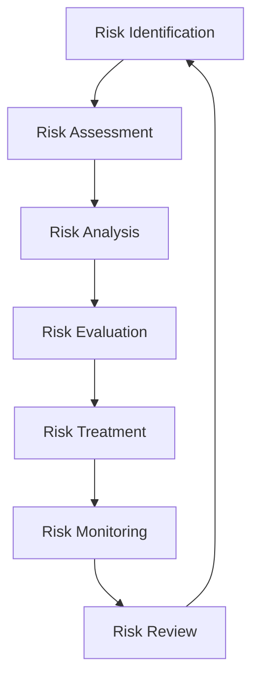

# Security Risk Documentation

## Executive Summary

This document provides comprehensive security risk documentation for the algorithmic trading system, complementing the STRIDE threat model analysis. It includes risk assessment methodologies, risk registers, mitigation strategies, and ongoing risk management procedures.

## Table of Contents

1. [Risk Management Framework](#risk-management-framework)
2. [Risk Assessment Methodology](#risk-assessment-methodology)
3. [Risk Register](#risk-register)
4. [Risk Categories](#risk-categories)
5. [Risk Mitigation Strategies](#risk-mitigation-strategies)
6. [Risk Monitoring and Reporting](#risk-monitoring-and-reporting)
7. [Business Continuity and Disaster Recovery](#business-continuity-and-disaster-recovery)
8. [Third-Party Risk Management](#third-party-risk-management)
9. [Regulatory and Compliance Risks](#regulatory-and-compliance-risks)
10. [Risk Governance](#risk-governance)

## Risk Management Framework

### Framework Overview

The security risk management framework is based on industry standards including:
- NIST Cybersecurity Framework
- ISO 27001/27002
- COSO Enterprise Risk Management
- FAIR (Factor Analysis of Information Risk)

### Risk Management Lifecycle



### Risk Appetite Statement

```yaml
Risk Appetite Levels:
  Financial Impact:
    - Acceptable: <$100K annual loss
    - Tolerable: $100K-$1M annual loss
    - Unacceptable: >$1M annual loss
  
  Operational Impact:
    - Acceptable: <1 hour downtime
    - Tolerable: 1-4 hours downtime
    - Unacceptable: >4 hours downtime
  
  Reputational Impact:
    - Acceptable: Minor media coverage
    - Tolerable: Regional media coverage
    - Unacceptable: National media coverage
  
  Regulatory Impact:
    - Acceptable: Minor compliance issues
    - Tolerable: Regulatory warnings
    - Unacceptable: License revocation
```

## Risk Assessment Methodology

### Quantitative Risk Assessment

#### Annual Loss Expectancy (ALE)
```
ALE = Single Loss Expectancy (SLE) × Annual Rate of Occurrence (ARO)

Where:
- SLE = Asset Value × Exposure Factor
- ARO = Frequency of threat occurrence per year
```

#### Risk Scoring Matrix

| Impact \ Likelihood | Very Low (1) | Low (2) | Medium (3) | High (4) | Very High (5) |
|---------------------|--------------|---------|------------|----------|---------------|
| **Minimal (1)**     | 1            | 2       | 3          | 4        | 5             |
| **Low (2)**         | 2            | 4       | 6          | 8        | 10            |
| **Medium (3)**      | 3            | 6       | 9          | 12       | 15            |
| **High (4)**        | 4            | 8       | 12         | 16       | 20            |
| **Critical (5)**    | 5            | 10      | 15         | 20       | 25            |

#### Risk Categories
- **Low Risk**: Score 1-6 (Green)
- **Medium Risk**: Score 8-12 (Yellow)
- **High Risk**: Score 15-16 (Orange)
- **Critical Risk**: Score 20-25 (Red)

### Qualitative Risk Assessment

#### Impact Assessment Criteria

**Financial Impact**
- Minimal (1): <$10K
- Low (2): $10K-$50K
- Medium (3): $50K-$250K
- High (4): $250K-$1M
- Critical (5): >$1M

**Operational Impact**
- Minimal (1): <15 minutes downtime
- Low (2): 15 minutes-1 hour downtime
- Medium (3): 1-4 hours downtime
- High (4): 4-24 hours downtime
- Critical (5): >24 hours downtime

**Reputational Impact**
- Minimal (1): No external impact
- Low (2): Limited client complaints
- Medium (3): Local media coverage
- High (4): Industry-wide attention
- Critical (5): National media coverage

**Regulatory Impact**
- Minimal (1): No regulatory attention
- Low (2): Informal regulatory inquiry
- Medium (3): Formal regulatory review
- High (4): Regulatory sanctions
- Critical (5): License suspension/revocation

#### Likelihood Assessment Criteria

**Very Low (1)**: Once in 10+ years
**Low (2)**: Once in 5-10 years
**Medium (3)**: Once in 2-5 years
**High (4)**: Once in 1-2 years
**Very High (5)**: Multiple times per year

## Risk Register

### Critical Risks (Score 20-25)

| Risk ID | Risk Description | Category | Impact | Likelihood | Score | Owner | Status |
|---------|------------------|----------|---------|------------|-------|-------|--------|
| CR-001 | Market data manipulation leading to incorrect trading decisions | Operational | 5 | 4 | 20 | CTO | Active |
| CR-002 | Unauthorized access to trading algorithms | Security | 5 | 4 | 20 | CISO | Active |
| CR-003 | System-wide outage during market hours | Operational | 5 | 4 | 20 | CTO | Active |
| CR-004 | Regulatory violation leading to license revocation | Compliance | 5 | 4 | 20 | CCO | Active |
| CR-005 | Large-scale data breach exposing client information | Security | 5 | 4 | 20 | CISO | Active |
| CR-006 | Rogue trading algorithm causing significant losses | Operational | 5 | 5 | 25 | CRO | Active |
| CR-007 | Cyber attack disrupting trading operations | Security | 5 | 4 | 20 | CISO | Active |
| CR-008 | Key personnel departure affecting critical operations | Operational | 4 | 5 | 20 | CHRO | Active |

### High Risks (Score 15-16)

| Risk ID | Risk Description | Category | Impact | Likelihood | Score | Owner | Status |
|---------|------------------|----------|---------|------------|-------|-------|--------|
| HR-001 | Third-party data provider failure | Operational | 4 | 4 | 16 | CTO | Active |
| HR-002 | Insider threat compromising system integrity | Security | 5 | 3 | 15 | CISO | Active |
| HR-003 | Broker connectivity issues affecting order execution | Operational | 4 | 4 | 16 | CTO | Active |
| HR-004 | Inadequate backup and recovery procedures | Operational | 5 | 3 | 15 | CTO | Active |
| HR-005 | Compliance monitoring system failure | Compliance | 4 | 4 | 16 | CCO | Active |
| HR-006 | API security vulnerabilities | Security | 4 | 4 | 16 | CISO | Active |
| HR-007 | Market volatility exceeding risk parameters | Market | 4 | 4 | 16 | CRO | Active |
| HR-008 | Cloud infrastructure security breach | Security | 5 | 3 | 15 | CISO | Active |

### Medium Risks (Score 8-12)

| Risk ID | Risk Description | Category | Impact | Likelihood | Score | Owner | Status |
|---------|------------------|----------|---------|------------|-------|-------|--------|
| MR-001 | Performance degradation during high-volume trading | Operational | 3 | 4 | 12 | CTO | Active |
| MR-002 | Inadequate user access controls | Security | 4 | 3 | 12 | CISO | Active |
| MR-003 | Data quality issues affecting analytics | Operational | 3 | 3 | 9 | CDO | Active |
| MR-004 | Vendor contract disputes | Legal | 3 | 3 | 9 | CLO | Active |
| MR-005 | Insufficient disaster recovery testing | Operational | 4 | 2 | 8 | CTO | Active |
| MR-006 | Mobile application security vulnerabilities | Security | 3 | 3 | 9 | CISO | Active |
| MR-007 | Inadequate change management processes | Operational | 3 | 4 | 12 | CTO | Active |
| MR-008 | Third-party integration security gaps | Security | 4 | 2 | 8 | CISO | Active |

## Risk Categories

### 1. Cybersecurity Risks

#### Data Breach Risks
```yaml
Risk Factors:
  - Inadequate encryption
  - Weak access controls
  - Insider threats
  - External attacks
  - Third-party vulnerabilities

Potential Impacts:
  - Financial losses
  - Regulatory penalties
  - Reputational damage
  - Client trust erosion
  - Competitive disadvantage

Mitigation Strategies:
  - Multi-layered security architecture
  - Zero-trust network model
  - Continuous monitoring
  - Incident response planning
  - Regular security assessments
```

#### System Compromise Risks
```yaml
Risk Factors:
  - Unpatched vulnerabilities
  - Malware infections
  - Advanced persistent threats
  - Supply chain attacks
  - Social engineering

Potential Impacts:
  - System downtime
  - Data corruption
  - Unauthorized transactions
  - Intellectual property theft
  - Operational disruption

Mitigation Strategies:
  - Endpoint detection and response
  - Network segmentation
  - Threat intelligence
  - Security awareness training
  - Vendor risk management
```

### 2. Operational Risks

#### Technology Risks
```yaml
Risk Factors:
  - System failures
  - Performance issues
  - Integration problems
  - Scalability limitations
  - Technology obsolescence

Potential Impacts:
  - Trading disruptions
  - Client dissatisfaction
  - Revenue loss
  - Competitive disadvantage
  - Regulatory scrutiny

Mitigation Strategies:
  - Redundant systems
  - Performance monitoring
  - Capacity planning
  - Technology roadmaps
  - Disaster recovery planning
```

#### Process Risks
```yaml
Risk Factors:
  - Inadequate procedures
  - Human error
  - Process gaps
  - Lack of automation
  - Poor documentation

Potential Impacts:
  - Operational errors
  - Compliance violations
  - Inefficiencies
  - Quality issues
  - Customer complaints

Mitigation Strategies:
  - Process standardization
  - Automation implementation
  - Training programs
  - Quality assurance
  - Continuous improvement
```

### 3. Financial Risks

#### Market Risks
```yaml
Risk Factors:
  - Price volatility
  - Liquidity constraints
  - Correlation changes
  - Model risks
  - Concentration risks

Potential Impacts:
  - Trading losses
  - Portfolio underperformance
  - Margin calls
  - Client redemptions
  - Capital erosion

Mitigation Strategies:
  - Risk limits and controls
  - Diversification strategies
  - Stress testing
  - Model validation
  - Real-time monitoring
```

#### Credit Risks
```yaml
Risk Factors:
  - Counterparty defaults
  - Settlement failures
  - Collateral inadequacy
  - Rating downgrades
  - Concentration risks

Potential Impacts:
  - Financial losses
  - Liquidity constraints
  - Operational disruptions
  - Regulatory violations
  - Reputational damage

Mitigation Strategies:
  - Credit assessments
  - Collateral management
  - Exposure limits
  - Netting agreements
  - Credit monitoring
```

### 4. Compliance and Regulatory Risks

#### Regulatory Compliance Risks
```yaml
Risk Factors:
  - Changing regulations
  - Interpretation uncertainties
  - Inadequate controls
  - Poor documentation
  - Insufficient training

Potential Impacts:
  - Regulatory penalties
  - License restrictions
  - Business limitations
  - Reputational damage
  - Legal costs

Mitigation Strategies:
  - Regulatory monitoring
  - Compliance programs
  - Regular assessments
  - Training programs
  - Legal consultation
```

#### Data Privacy Risks
```yaml
Risk Factors:
  - GDPR violations
  - Data misuse
  - Inadequate consent
  - Cross-border transfers
  - Third-party processing

Potential Impacts:
  - Regulatory fines
  - Legal actions
  - Reputational damage
  - Business restrictions
  - Client trust loss

Mitigation Strategies:
  - Privacy by design
  - Data governance
  - Consent management
  - Regular audits
  - Staff training
```

## Risk Mitigation Strategies

### 1. Preventive Controls

#### Access Controls
```yaml
Implementation:
  - Multi-factor authentication
  - Role-based access control
  - Privileged access management
  - Regular access reviews
  - Automated provisioning/deprovisioning

Effectiveness Metrics:
  - Access review completion rate: >95%
  - Privileged account monitoring: 100%
  - Authentication success rate: >99%
  - Access violation incidents: <5/month
```

#### Security Architecture
```yaml
Implementation:
  - Defense in depth
  - Zero-trust architecture
  - Network segmentation
  - Encryption everywhere
  - Secure development lifecycle

Effectiveness Metrics:
  - Security architecture compliance: >90%
  - Vulnerability remediation time: <30 days
  - Security testing coverage: >80%
  - Encryption coverage: 100%
```

### 2. Detective Controls

#### Monitoring and Alerting
```yaml
Implementation:
  - Security information and event management (SIEM)
  - User and entity behavior analytics (UEBA)
  - Network traffic analysis
  - Endpoint detection and response (EDR)
  - Threat intelligence integration

Effectiveness Metrics:
  - Mean time to detection (MTTD): <15 minutes
  - False positive rate: <5%
  - Alert response time: <1 hour
  - Threat detection accuracy: >95%
```

#### Vulnerability Management
```yaml
Implementation:
  - Regular vulnerability scanning
  - Penetration testing
  - Code security reviews
  - Third-party assessments
  - Continuous monitoring

Effectiveness Metrics:
  - Vulnerability scan coverage: >95%
  - Critical vulnerability remediation: <7 days
  - High vulnerability remediation: <30 days
  - Penetration test frequency: Quarterly
```

### 3. Corrective Controls

#### Incident Response
```yaml
Implementation:
  - Incident response plan
  - Response team structure
  - Communication procedures
  - Forensic capabilities
  - Recovery procedures

Effectiveness Metrics:
  - Mean time to response (MTTR): <1 hour
  - Incident containment time: <4 hours
  - Recovery time objective (RTO): <2 hours
  - Recovery point objective (RPO): <15 minutes
```

#### Business Continuity
```yaml
Implementation:
  - Business continuity plan
  - Disaster recovery procedures
  - Backup and recovery systems
  - Alternative processing sites
  - Communication plans

Effectiveness Metrics:
  - Backup success rate: >99%
  - Recovery test success rate: >95%
  - RTO achievement: >95%
  - RPO achievement: >95%
```

## Risk Monitoring and Reporting

### Key Risk Indicators (KRIs)

#### Cybersecurity KRIs
```yaml
Security Incidents:
  - Number of security incidents per month
  - Mean time to detection (MTTD)
  - Mean time to response (MTTR)
  - Incident severity distribution

Vulnerability Management:
  - Number of critical vulnerabilities
  - Vulnerability remediation time
  - Patch deployment success rate
  - Security scan coverage

Access Management:
  - Number of privileged accounts
  - Access review completion rate
  - Failed authentication attempts
  - Unauthorized access attempts
```

#### Operational KRIs
```yaml
System Performance:
  - System availability percentage
  - Response time metrics
  - Error rate trends
  - Capacity utilization

Process Efficiency:
  - Process automation rate
  - Error rates by process
  - Processing time metrics
  - Quality metrics

Third-Party Management:
  - Vendor risk assessment scores
  - SLA compliance rates
  - Vendor incident frequency
  - Contract renewal status
```

### Risk Reporting Framework

#### Executive Dashboard
```yaml
Frequency: Monthly
Audience: Executive Leadership
Content:
  - Risk heat map
  - Top 10 risks
  - Risk trend analysis
  - Mitigation progress
  - Regulatory updates

Format:
  - Visual dashboards
  - Executive summary
  - Action items
  - Recommendations
```

#### Operational Reports
```yaml
Frequency: Weekly
Audience: Risk Managers, Department Heads
Content:
  - Risk register updates
  - KRI performance
  - Incident summaries
  - Control effectiveness
  - Emerging risks

Format:
  - Detailed reports
  - Trend analysis
  - Action plans
  - Performance metrics
```

#### Regulatory Reports
```yaml
Frequency: As Required
Audience: Regulators, Auditors
Content:
  - Compliance status
  - Risk assessments
  - Control testing results
  - Incident reports
  - Remediation plans

Format:
  - Formal reports
  - Supporting documentation
  - Evidence packages
  - Certification letters
```

## Business Continuity and Disaster Recovery

### Business Impact Analysis

#### Critical Business Functions
```yaml
Trading Operations:
  - Maximum Tolerable Downtime (MTD): 15 minutes
  - Recovery Time Objective (RTO): 5 minutes
  - Recovery Point Objective (RPO): 1 minute
  - Minimum Staffing: 3 traders

Risk Management:
  - Maximum Tolerable Downtime (MTD): 30 minutes
  - Recovery Time Objective (RTO): 15 minutes
  - Recovery Point Objective (RPO): 5 minutes
  - Minimum Staffing: 2 risk managers

Client Services:
  - Maximum Tolerable Downtime (MTD): 2 hours
  - Recovery Time Objective (RTO): 1 hour
  - Recovery Point Objective (RPO): 15 minutes
  - Minimum Staffing: 5 service representatives
```

#### Recovery Strategies

**Technology Recovery**
```yaml
Primary Data Center:
  - Location: Primary facility
  - Capacity: 100% of production
  - Recovery Time: Immediate
  - Staffing: Full team

Secondary Data Center:
  - Location: 50+ miles from primary
  - Capacity: 80% of production
  - Recovery Time: <15 minutes
  - Staffing: Skeleton crew

Cloud Backup:
  - Provider: AWS/Azure
  - Capacity: 100% of production
  - Recovery Time: <30 minutes
  - Staffing: Remote access
```

**Personnel Recovery**
```yaml
Work from Home:
  - Capability: 80% of staff
  - Technology: VPN, laptops
  - Recovery Time: <2 hours
  - Duration: Indefinite

Alternate Site:
  - Location: Backup office
  - Capacity: 50% of staff
  - Recovery Time: <4 hours
  - Duration: 30 days

Third-Party Services:
  - Provider: Business continuity vendor
  - Capacity: 100% of critical functions
  - Recovery Time: <24 hours
  - Duration: 90 days
```

### Testing and Maintenance

#### Testing Schedule
```yaml
Tabletop Exercises:
  - Frequency: Quarterly
  - Participants: Key personnel
  - Duration: 2-4 hours
  - Scenarios: Various disruption types

Functional Tests:
  - Frequency: Semi-annually
  - Participants: Recovery teams
  - Duration: 4-8 hours
  - Scope: Specific systems/processes

Full-Scale Tests:
  - Frequency: Annually
  - Participants: All staff
  - Duration: 1-2 days
  - Scope: Complete business operations
```

## Third-Party Risk Management

### Vendor Risk Assessment

#### Risk Categories
```yaml
Critical Vendors:
  - Trading platforms
  - Market data providers
  - Cloud infrastructure
  - Payment processors
  - Regulatory reporting

High-Risk Vendors:
  - Software development
  - IT support services
  - Cybersecurity tools
  - Backup services
  - Legal services

Medium-Risk Vendors:
  - Office supplies
  - Facilities management
  - Marketing services
  - Training providers
  - Consulting services
```

#### Assessment Criteria
```yaml
Financial Stability:
  - Credit ratings
  - Financial statements
  - Business continuity
  - Insurance coverage

Security Posture:
  - Security certifications
  - Vulnerability assessments
  - Incident history
  - Data protection measures

Operational Capability:
  - Service level agreements
  - Performance metrics
  - Scalability
  - Geographic presence

Compliance Status:
  - Regulatory compliance
  - Industry certifications
  - Audit reports
  - Policy documentation
```

### Vendor Monitoring

#### Ongoing Monitoring
```yaml
Performance Monitoring:
  - SLA compliance tracking
  - Quality metrics
  - Incident reporting
  - Customer satisfaction

Risk Monitoring:
  - Financial health checks
  - Security assessments
  - Compliance reviews
  - News and media monitoring

Contract Management:
  - Contract renewals
  - Price negotiations
  - Service modifications
  - Termination planning
```

## Regulatory and Compliance Risks

### Regulatory Landscape

#### Financial Services Regulations
```yaml
United States:
  - SEC (Securities and Exchange Commission)
  - FINRA (Financial Industry Regulatory Authority)
  - CFTC (Commodity Futures Trading Commission)
  - OCC (Office of the Comptroller of the Currency)

European Union:
  - MiFID II (Markets in Financial Instruments Directive)
  - EMIR (European Market Infrastructure Regulation)
  - GDPR (General Data Protection Regulation)
  - PSD2 (Payment Services Directive)

Other Jurisdictions:
  - FCA (Financial Conduct Authority) - UK
  - ASIC (Australian Securities and Investments Commission)
  - FSA (Financial Services Agency) - Japan
  - CSRC (China Securities Regulatory Commission)
```

#### Compliance Requirements
```yaml
Reporting Obligations:
  - Transaction reporting
  - Position reporting
  - Risk reporting
  - Incident reporting

Record Keeping:
  - Trade records
  - Communication records
  - Client records
  - Compliance records

Capital Requirements:
  - Minimum capital
  - Risk-based capital
  - Liquidity requirements
  - Stress testing

Conduct Rules:
  - Best execution
  - Client protection
  - Market abuse prevention
  - Conflicts of interest
```

### Compliance Monitoring

#### Monitoring Framework
```yaml
Real-Time Monitoring:
  - Trade surveillance
  - Position monitoring
  - Risk limit monitoring
  - Market abuse detection

Periodic Reviews:
  - Compliance testing
  - Policy reviews
  - Training assessments
  - Audit findings

Reporting and Escalation:
  - Regulatory reporting
  - Internal reporting
  - Breach notifications
  - Remediation tracking
```

## Risk Governance

### Governance Structure

#### Board of Directors
```yaml
Responsibilities:
  - Risk appetite setting
  - Risk strategy approval
  - Risk oversight
  - Performance evaluation

Committees:
  - Risk Committee
  - Audit Committee
  - Technology Committee
  - Compensation Committee

Meetings:
  - Frequency: Quarterly
  - Risk reporting: Monthly
  - Special meetings: As needed
```

#### Executive Management
```yaml
Risk Management Committee:
  - Chair: Chief Risk Officer
  - Members: C-suite executives
  - Frequency: Monthly
  - Scope: Enterprise risk management

Operational Risk Committee:
  - Chair: Chief Operating Officer
  - Members: Department heads
  - Frequency: Weekly
  - Scope: Operational risk management

Security Committee:
  - Chair: Chief Information Security Officer
  - Members: IT and security leaders
  - Frequency: Weekly
  - Scope: Cybersecurity risk management
```

### Risk Culture

#### Culture Assessment
```yaml
Risk Awareness:
  - Training completion rates
  - Risk reporting frequency
  - Incident escalation timeliness
  - Risk discussion quality

Accountability:
  - Risk ownership clarity
  - Performance metrics
  - Incentive alignment
  - Consequence management

Communication:
  - Risk communication effectiveness
  - Feedback mechanisms
  - Transparency levels
  - Learning from incidents
```

#### Culture Enhancement
```yaml
Training Programs:
  - Risk awareness training
  - Role-specific training
  - Scenario-based exercises
  - Continuous learning

Communication:
  - Risk newsletters
  - Town hall meetings
  - Risk dashboards
  - Success stories

Incentives:
  - Risk-adjusted performance
  - Recognition programs
  - Career development
  - Knowledge sharing
```

---

**Document Version**: 1.0  
**Last Updated**: January 2024  
**Next Review**: April 2024  
**Owner**: Risk Management Team  
**Approver**: Chief Risk Officer  

**Classification**: Confidential  
**Distribution**: Risk Committee, Executive Team, Department Heads